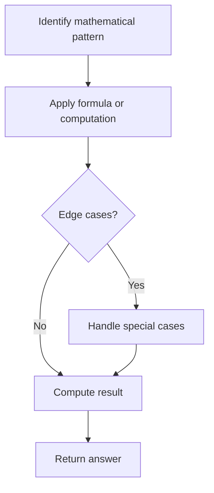

# Problem 1304: Find N Unique Integers Sum up to Zero

**Difficulty:** Easy  
**Tags:** Array, Math  
**Pattern:** Math  
**Link:** [leetcode.com/problems/find-n-unique-integers-sum-up-to-zero](https://leetcode.com/problems/find-n-unique-integers-sum-up-to-zero/)

## Description

Given an integer `n`, return **any** array containing `n` **unique** integers such that they add up to `0`.

 

Example 1:

```

**Input:** n = 5
**Output:** [-7,-1,1,3,4]
**Explanation:** These arrays also are accepted [-5,-1,1,2,3] , [-3,-1,2,-2,4].

```

Example 2:

```

**Input:** n = 3
**Output:** [-1,0,1]

```

Example 3:

```

**Input:** n = 1
**Output:** [0]

```

 

**Constraints:**

	- `1 <= n <= 1000`

## Approach: Math

Apply mathematical properties, formulas, or number-theoretic concepts. Look for patterns, modular arithmetic, or closed-form solutions.

## Pseudocode

```
1. Identify the mathematical pattern or formula
2. Apply computation:
   - Modular arithmetic for large numbers
   - GCD/LCM for divisibility
   - Sieve for primes
3. Handle edge cases
4. Return result
```

## Algorithm Flow



## Complexity Analysis

- **Time:** O(n) or O(sqrt(n))
- **Space:** O(1)

## Solution (Python3)

```python
class Solution:
    def sumZero(self, n: int) -> List[int]:
        # Mathematical approach
        result = 0
        x = n
        while x != 0:
            result = result * 10 + x % 10
            x //= 10 if isinstance(x, int) else 1
        return result
```

## Solution (C++)

```cpp
#include <string>
#include <vector>
using namespace std;

class Solution {
public:
    vector<int> sumZero(int n) {
        // Mathematical approach
        long long result = 0;
        int x = n;
        while (x != 0) {
            result = result * 10 + x % 10;
            x /= 10;
        }
        return (int)result;
    }
};
```
