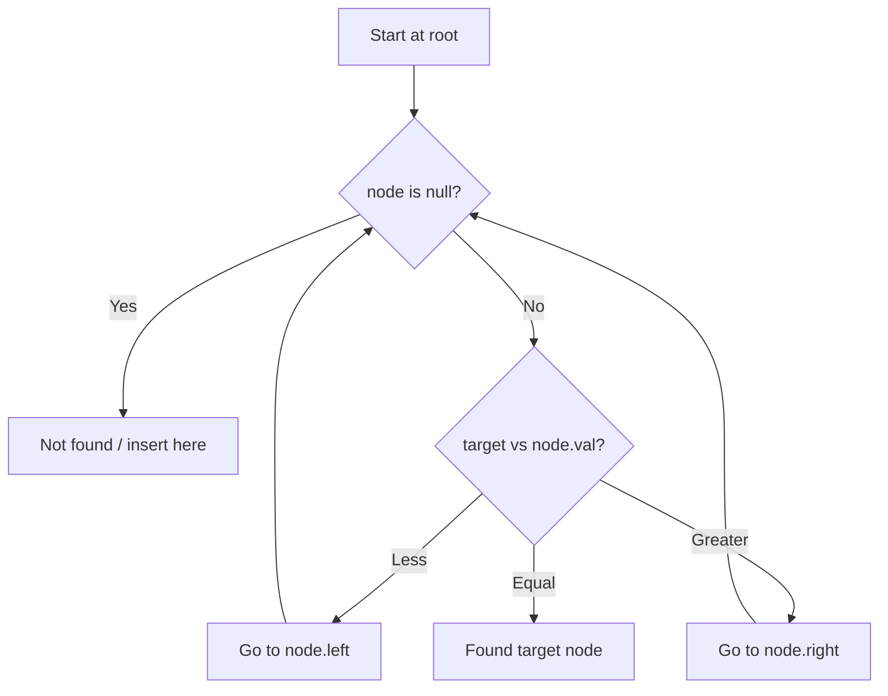

# Problem 1305: All Elements in Two Binary Search Trees

**Difficulty:** Medium  
**Tags:** Tree, Depth-First Search, Binary Search Tree, Sorting, Binary Tree  
**Pattern:** Binary Search Tree  
**Link:** [leetcode.com/problems/all-elements-in-two-binary-search-trees](https://leetcode.com/problems/all-elements-in-two-binary-search-trees/)

## Description

Given two binary search trees `root1` and `root2`, return *a list containing all the integers from both trees sorted in **ascending** order*.

 

Example 1:

```

**Input:** root1 = [2,1,4], root2 = [1,0,3]
**Output:** [0,1,1,2,3,4]

```

Example 2:

```

**Input:** root1 = [1,null,8], root2 = [8,1]
**Output:** [1,1,8,8]

```

 

**Constraints:**

	- The number of nodes in each tree is in the range `[0, 5000]`.
	- `-10^5 <= Node.val <= 10^5`

## Approach: Binary Search Tree

Leverage BST property: left < root < right. Navigate left for smaller values, right for larger values. Inorder traversal yields sorted order.

## Pseudocode

```
1. Start at root
2. Compare target with current node:
   a. If target < node.val: go left
   b. If target > node.val: go right
   c. If equal: found
3. Return result
```

## Algorithm Flow



## Complexity Analysis

- **Time:** O(h)
- **Space:** O(h)

## Solution (Python3)

```python
class Solution:
    def getAllElements(self, root1: Optional[TreeNode], root2: Optional[TreeNode]) -> List[int]:
        # BST search/insert - O(h) time
        def search(node, target):
            if not node:
                return None
            if target == node.val:
                return node
            elif target < node.val:
                return search(node.left, target)
            else:
                return search(node.right, target)
        return search(root1, root2 if 'root2' != 'root1' else 0)
```

## Solution (C++)

```cpp
#include <functional>
#include <string>
#include <vector>
using namespace std;

class Solution {
public:
    vector<int> getAllElements(TreeNode* root1, TreeNode* root2) {
        // BST search/insert - O(h) time
        function<TreeNode*(TreeNode*, int)> search = [&](TreeNode* node, int target) -> TreeNode* {
            if (!node) return nullptr;
            if (target == node->val) return node;
            else if (target < node->val) return search(node->left, target);
            else return search(node->right, target);
        };
        return search(root1, root2);
    }
};
```
