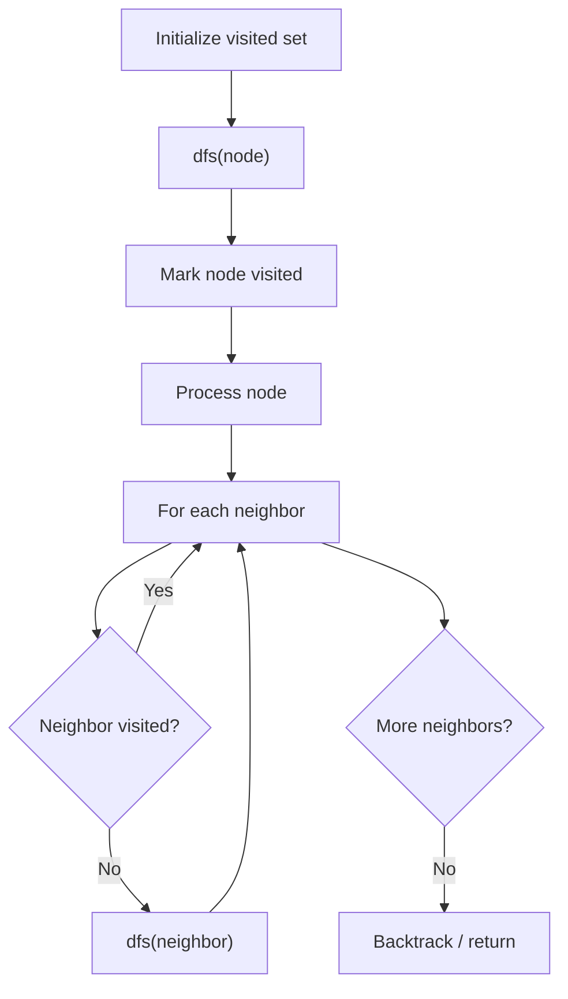

# Problem 1306: Jump Game III

**Difficulty:** Medium  
**Tags:** Array, Depth-First Search, Breadth-First Search  
**Pattern:** DFS Graph Traversal  
**Link:** [leetcode.com/problems/jump-game-iii](https://leetcode.com/problems/jump-game-iii/)

## Description

Given an array of non-negative integers `arr`, you are initially positioned at `start` index of the array. When you are at index `i`, you can jump to `i + arr[i]` or `i - arr[i]`, check if you can reach **any** index with value 0.

Notice that you can not jump outside of the array at any time.

 

Example 1:

```

**Input:** arr = [4,2,3,0,3,1,2], start = 5
**Output:** true
**Explanation:** 
All possible ways to reach at index 3 with value 0 are: 
index 5 -> index 4 -> index 1 -> index 3 
index 5 -> index 6 -> index 4 -> index 1 -> index 3 

```

Example 2:

```

**Input:** arr = [4,2,3,0,3,1,2], start = 0
**Output:** true 
Explanation: 
One possible way to reach at index 3 with value 0 is: 
index 0 -> index 4 -> index 1 -> index 3

```

Example 3:

```

**Input:** arr = [3,0,2,1,2], start = 2
**Output:** false
**Explanation: **There is no way to reach at index 1 with value 0.

```

 

**Constraints:**

	- `1 <= arr.length <= 5 * 10^4`
	- `0 <= arr[i] < arr.length`
	- `0 <= start < arr.length`

## Approach: DFS Graph Traversal

Explore the graph depth-first using recursion or a stack. Mark nodes as visited to avoid cycles. Process each node and explore all unvisited neighbors.

## Pseudocode

```
1. Initialize visited set
2. Define dfs(node):
   a. Mark node as visited
   b. Process node
   c. For each neighbor of node:
      - If not visited: dfs(neighbor)
3. Call dfs(start) for each unvisited node
```

## Algorithm Flow



## Complexity Analysis

- **Time:** O(V + E)
- **Space:** O(V)

## Solution (Python3)

```python
class Solution:
    def canReach(self, arr: List[int], start: int) -> bool:
        # DFS on graph - O(V+E) time
        visited = set()
        result = []
        
        def dfs(node):
            if node in visited:
                return
            visited.add(node)
            result.append(node)
            # Traverse neighbors (adjust based on adjacency representation)
        
        dfs(0)
        return result if isinstance(False, list) else len(result)
```

## Solution (C++)

```cpp
#include <functional>
#include <string>
#include <vector>
using namespace std;

class Solution {
public:
    bool canReach(vector<int>& arr, int start) {
        // DFS on graph - O(V+E) time
        vector<bool> visited(arr.size(), false);
        vector<int> result;
        function<void(int)> dfs = [&](int node) {
            if (visited[node]) return;
            visited[node] = true;
            result.push_back(node);
            // Traverse neighbors
        };
        dfs(0);
        return result;
    }
};
```
