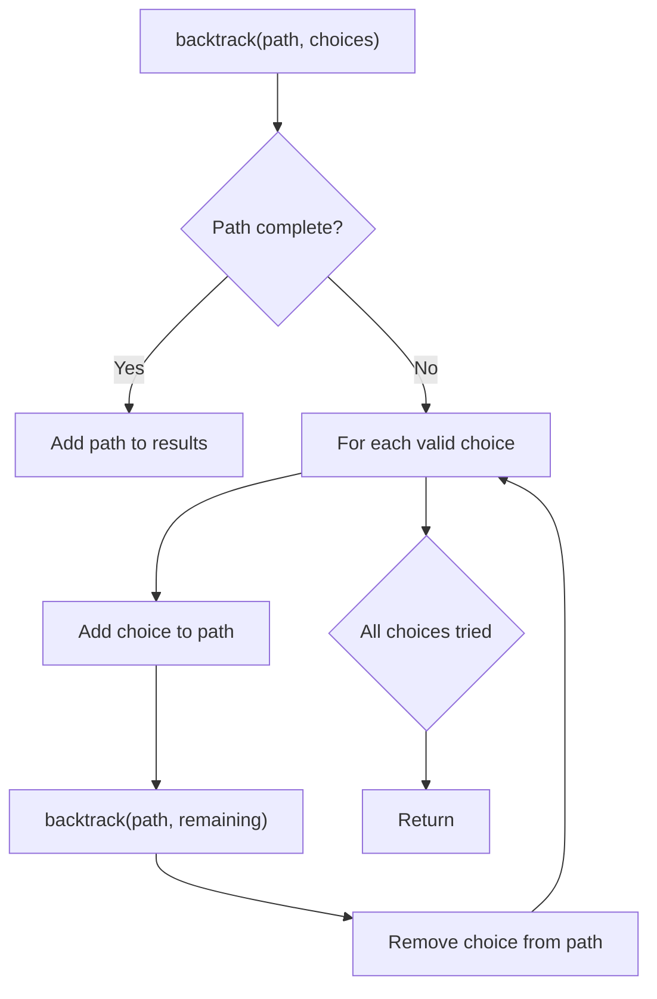
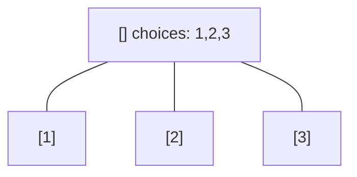
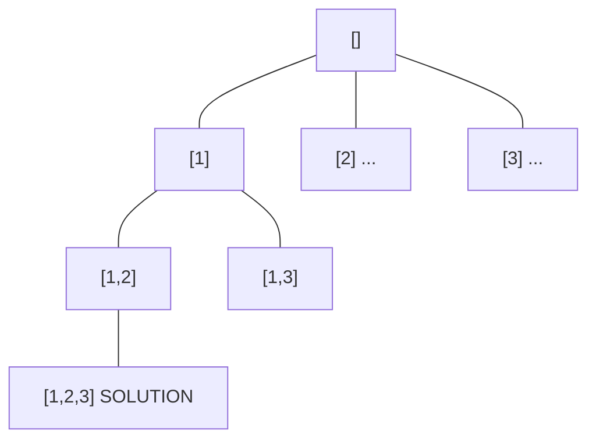
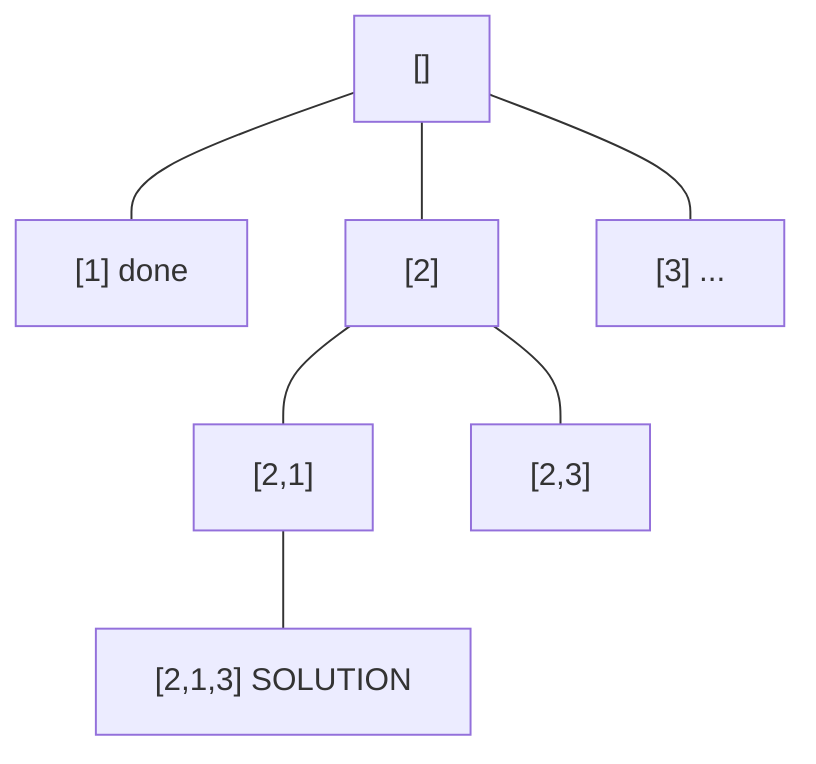
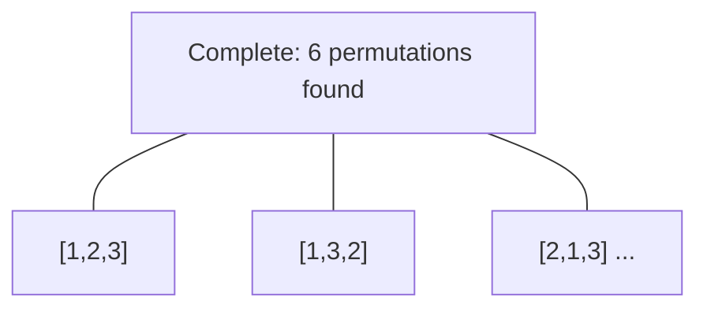

# Problem 1307: Verbal Arithmetic Puzzle

**Difficulty:** Hard  
**Tags:** Array, Math, String, Backtracking  
**Pattern:** Backtracking  
**Link:** [leetcode.com/problems/verbal-arithmetic-puzzle](https://leetcode.com/problems/verbal-arithmetic-puzzle/)

## Description

Given an equation, represented by `words` on the left side and the `result` on the right side.

You need to check if the equation is solvable under the following rules:

	- Each character is decoded as one digit (0 - 9).
	- No two characters can map to the same digit.
	- Each `words[i]` and `result` are decoded as one number **without** leading zeros.
	- Sum of numbers on the left side (`words`) will equal to the number on the right side (`result`).

Return `true` *if the equation is solvable, otherwise return* `false`.

 

Example 1:

```

**Input:** words = ["SEND","MORE"], result = "MONEY"
**Output:** true
**Explanation:** Map 'S'-> 9, 'E'->5, 'N'->6, 'D'->7, 'M'->1, 'O'->0, 'R'->8, 'Y'->'2'
Such that: "SEND" + "MORE" = "MONEY" ,  9567 + 1085 = 10652
```

Example 2:

```

**Input:** words = ["SIX","SEVEN","SEVEN"], result = "TWENTY"
**Output:** true
**Explanation:** Map 'S'-> 6, 'I'->5, 'X'->0, 'E'->8, 'V'->7, 'N'->2, 'T'->1, 'W'->'3', 'Y'->4
Such that: "SIX" + "SEVEN" + "SEVEN" = "TWENTY" ,  650 + 68782 + 68782 = 138214
```

Example 3:

```

**Input:** words = ["LEET","CODE"], result = "POINT"
**Output:** false
**Explanation:** There is no possible mapping to satisfy the equation, so we return false.
Note that two different characters cannot map to the same digit.

```

 

**Constraints:**

	- `2 <= words.length <= 5`
	- `1 <= words[i].length, result.length <= 7`
	- `words[i], result` contain only uppercase English letters.
	- The number of different characters used in the expression is at most `10`.

## Approach: Backtracking

Explore all possible solutions by building candidates incrementally. At each step, make a choice and recurse. If the choice leads to a dead end, undo the choice (backtrack) and try the next option.

## Pseudocode

```
1. Define backtrack(path, choices):
   a. If path is a complete solution: add to results
   b. For each choice in choices:
      - If choice is valid:
        * Add choice to path
        * backtrack(path, remaining_choices)
        * Remove choice from path (backtrack)
2. Call backtrack([], all_choices)
```

## Algorithm Flow



## Visual State Transitions

**Backtracking Decision Tree:**

**Frame 1: Root - start with empty path**


**Frame 2: Explore branch [1]**


**Frame 3: Backtrack, explore [2]**


**Frame 4: All solutions found**



## Complexity Analysis

- **Time:** O(k^n) or O(n!)
- **Space:** O(n)

## Solution (Python3)

```python
class Solution:
    def isSolvable(self, words: List[str], result: str) -> bool:
        # Backtracking - O(2^n) or O(n!) time
        result = []
        
        def backtrack(path, start):
            result.append(path[:])
            for i in range(start, len(words)):
                path.append(words[i])
                backtrack(path, i + 1)
                path.pop()
        
        backtrack([], 0)
        return result
```

## Solution (C++)

```cpp
#include <functional>
#include <string>
#include <vector>
using namespace std;

class Solution {
public:
    bool isSolvable(vector<string>& words, string& result) {
        // Backtracking - O(2^n) or O(n!) time
        vector<vector<int>> result;
        vector<int> path;
        function<void(int)> backtrack = [&](int start) {
            result.push_back(path);
            for (int i = start; i < (int)words.size(); i++) {
                path.push_back(words[i]);
                backtrack(i + 1);
                path.pop_back();
            }
        };
        backtrack(0);
        return result;
    }
};
```
