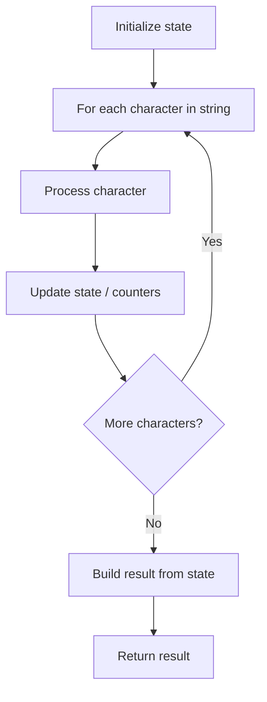

# Problem 1309: Decrypt String from Alphabet to Integer Mapping

**Difficulty:** Easy  
**Tags:** String  
**Pattern:** String Processing  
**Link:** [leetcode.com/problems/decrypt-string-from-alphabet-to-integer-mapping](https://leetcode.com/problems/decrypt-string-from-alphabet-to-integer-mapping/)

## Description

You are given a string `s` formed by digits and `'#'`. We want to map `s` to English lowercase characters as follows:

	- Characters (`'a'` to `'i'`) are represented by (`'1'` to `'9'`) respectively.
	- Characters (`'j'` to `'z'`) are represented by (`'10#'` to `'26#'`) respectively.

Return *the string formed after mapping*.

The test cases are generated so that a unique mapping will always exist.

 

Example 1:

```

**Input:** s = "10#11#12"
**Output:** "jkab"
**Explanation:** "j" -> "10#" , "k" -> "11#" , "a" -> "1" , "b" -> "2".

```

Example 2:

```

**Input:** s = "1326#"
**Output:** "acz"

```

 

**Constraints:**

	- `1 <= s.length <= 1000`
	- `s` consists of digits and the `'#'` letter.
	- `s` will be a valid string such that mapping is always possible.

## Approach: String Processing

Process the string character by character. Common techniques: two pointers, sliding window, hash map for frequencies, stack for matching.

## Pseudocode

```
1. Initialize result / tracking state
2. Iterate through string characters:
   a. Process character based on rules
   b. Update state (counters, pointers, stack)
3. Build and return result
```

## Algorithm Flow



## Complexity Analysis

- **Time:** O(n)
- **Space:** O(n)

## Solution (Python3)

```python
class Solution:
    def freqAlphabets(self, s: str) -> str:
        # String processing approach - O(n) time
        result = []
        for ch in s:
            if ch.isalnum():
                result.append(ch.lower())
        # Check palindrome or process
        processed = ''.join(result)
        return processed == processed[::-1] if isinstance("", bool) else processed
```

## Solution (C++)

```cpp
#include <algorithm>
#include <cctype>
#include <string>
#include <vector>
using namespace std;

class Solution {
public:
    string freqAlphabets(string& s) {
        // String processing approach - O(n) time
        string processed;
        for (char ch : s) {
            if (isalnum(ch)) {
                processed += tolower(ch);
            }
        }
        string rev = processed;
        reverse(rev.begin(), rev.end());
        return processed == rev;
    }
};
```
