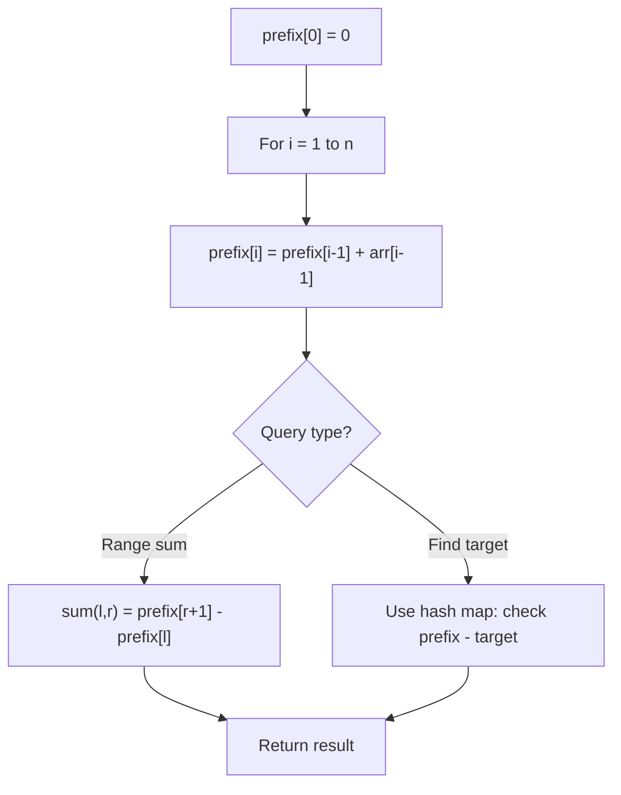

# Problem 1310: XOR Queries of a Subarray

**Difficulty:** Medium  
**Tags:** Array, Bit Manipulation, Prefix Sum  
**Pattern:** Prefix Sum  
**Link:** [leetcode.com/problems/xor-queries-of-a-subarray](https://leetcode.com/problems/xor-queries-of-a-subarray/)

## Description

You are given an array `arr` of positive integers. You are also given the array `queries` where `queries[i] = [lefti, righti]`.

For each query `i` compute the **XOR** of elements from `lefti` to `righti` (that is, `arr[lefti] XOR arr[lefti + 1] XOR ... XOR arr[righti]` ).

Return an array `answer` where `answer[i]` is the answer to the `i^th` query.

 

Example 1:

```

**Input:** arr = [1,3,4,8], queries = [[0,1],[1,2],[0,3],[3,3]]
**Output:** [2,7,14,8] 
**Explanation:** 
The binary representation of the elements in the array are:
1 = 0001 
3 = 0011 
4 = 0100 
8 = 1000 
The XOR values for queries are:
[0,1] = 1 xor 3 = 2 
[1,2] = 3 xor 4 = 7 
[0,3] = 1 xor 3 xor 4 xor 8 = 14 
[3,3] = 8

```

Example 2:

```

**Input:** arr = [4,8,2,10], queries = [[2,3],[1,3],[0,0],[0,3]]
**Output:** [8,0,4,4]

```

 

**Constraints:**

	- `1 <= arr.length, queries.length <= 3 * 10^4`
	- `1 <= arr[i] <= 10^9`
	- `queries[i].length == 2`
	- `0 <= lefti <= righti < arr.length`

## Approach: Prefix Sum

Build a prefix sum array where prefix[i] = sum of elements 0..i-1. Any subarray sum [l..r] = prefix[r+1] - prefix[l]. Combine with hash map for O(n) subarray sum queries.

## Pseudocode

```
1. Build prefix sum array: prefix[0]=0, prefix[i]=prefix[i-1]+arr[i-1]
2. Use prefix sums to answer queries:
   - Subarray sum [l..r] = prefix[r+1] - prefix[l]
   - Or use hash map to find prefix[j]-prefix[i] == target
3. Return result
```

## Algorithm Flow



## Complexity Analysis

- **Time:** O(n)
- **Space:** O(n)

## Solution (Python3)

```python
class Solution:
    def xorQueries(self, arr: List[int], queries: List[List[int]]) -> List[int]:
        # Prefix sum approach - O(n) time, O(n) space
        prefix = {0: -1}
        curr_sum = 0
        result = 0
        target = queries if isinstance(queries, int) else 0
        for i, val in enumerate(arr):
            curr_sum += val
            if curr_sum - target in prefix:
                result = max(result, i - prefix[curr_sum - target])
            if curr_sum not in prefix:
                prefix[curr_sum] = i
        return result
```

## Solution (C++)

```cpp
#include <algorithm>
#include <string>
#include <unordered_map>
#include <vector>
using namespace std;

class Solution {
public:
    vector<int> xorQueries(vector<int>& arr, vector<vector<int>>& queries) {
        // Prefix sum approach - O(n) time, O(n) space
        unordered_map<int, int> prefix;
        prefix[0] = -1;
        int curr_sum = 0, result = 0;
        int target = queries;
        for (int i = 0; i < (int)arr.size(); i++) {
            curr_sum += arr[i];
            if (prefix.count(curr_sum - target)) {
                result = max(result, i - prefix[curr_sum - target]);
            }
            if (!prefix.count(curr_sum)) {
                prefix[curr_sum] = i;
            }
        }
        return result;
    }
};
```
