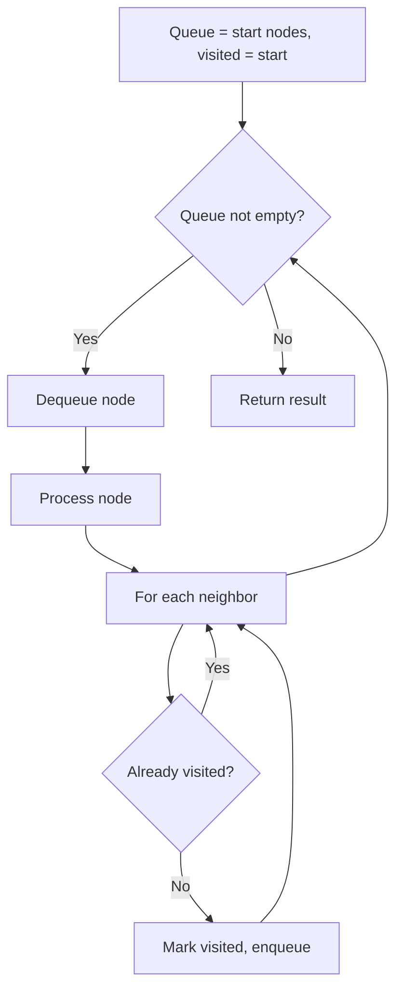
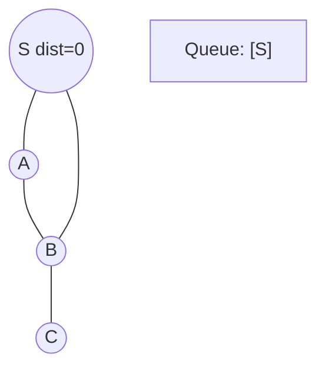
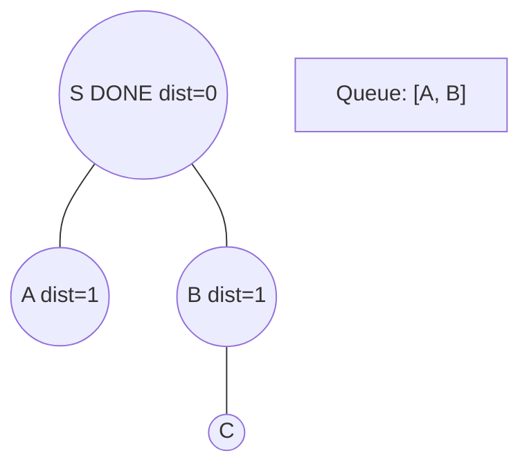
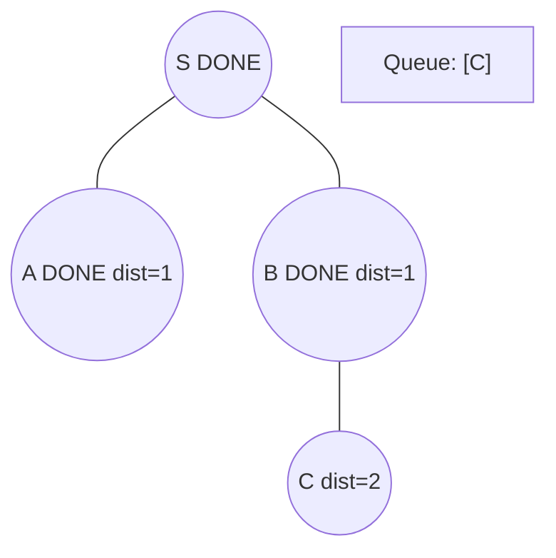
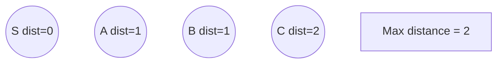

# Problem 1311: Get Watched Videos by Your Friends

**Difficulty:** Medium  
**Tags:** Array, Hash Table, Breadth-First Search, Graph Theory, Sorting  
**Pattern:** BFS Graph Traversal  
**Link:** [leetcode.com/problems/get-watched-videos-by-your-friends](https://leetcode.com/problems/get-watched-videos-by-your-friends/)

## Description

There are `n` people, each person has a unique *id* between `0` and `n-1`. Given the arrays `watchedVideos` and `friends`, where `watchedVideos[i]` and `friends[i]` contain the list of watched videos and the list of friends respectively for the person with `id = i`.

Level **1** of videos are all watched videos by your friends, level **2** of videos are all watched videos by the friends of your friends and so on. In general, the level `k` of videos are all watched videos by people with the shortest path **exactly** equal to `k` with you. Given your `id` and the `level` of videos, return the list of videos ordered by their frequencies (increasing). For videos with the same frequency order them alphabetically from least to greatest. 

 

Example 1:

****

```

**Input:** watchedVideos = [["A","B"],["C"],["B","C"],["D"]], friends = [[1,2],[0,3],[0,3],[1,2]], id = 0, level = 1
**Output:** ["B","C"] 
**Explanation:** 
You have id = 0 (green color in the figure) and your friends are (yellow color in the figure):
Person with id = 1 -> watchedVideos = ["C"] 
Person with id = 2 -> watchedVideos = ["B","C"] 
The frequencies of watchedVideos by your friends are: 
B -> 1 
C -> 2

```

Example 2:

****

```

**Input:** watchedVideos = [["A","B"],["C"],["B","C"],["D"]], friends = [[1,2],[0,3],[0,3],[1,2]], id = 0, level = 2
**Output:** ["D"]
**Explanation:** 
You have id = 0 (green color in the figure) and the only friend of your friends is the person with id = 3 (yellow color in the figure).

```

 

**Constraints:**

	- `n == watchedVideos.length == friends.length`
	- `2 <= n <= 100`
	- `1 <= watchedVideos[i].length <= 100`
	- `1 <= watchedVideos[i][j].length <= 8`
	- `0 <= friends[i].length < n`
	- `0 <= friends[i][j] < n`
	- `0 <= id < n`
	- `1 <= level < n`
	- if `friends[i]` contains `j`, then `friends[j]` contains `i`

## Approach: BFS Graph Traversal

Explore the graph breadth-first using a queue. Process nodes level by level; BFS finds shortest paths in unweighted graphs.

## Pseudocode

```
1. Initialize queue with start node(s), visited set
2. While queue not empty:
   a. Dequeue node
   b. Process node
   c. For each unvisited neighbor:
      - Mark visited, enqueue
3. Return result
```

## Algorithm Flow



## Visual State Transitions

**BFS Level-by-Level Traversal:**

**Frame 1: Start BFS from source**


**Frame 2: Process level 0, enqueue neighbors**


**Frame 3: Process level 1**


**Frame 4: All nodes reached**



## Complexity Analysis

- **Time:** O(V + E)
- **Space:** O(V)

## Solution (Python3)

```python
class Solution:
    def watchedVideosByFriends(self, watchedVideos: List[List[str]], friends: List[List[int]], id: int, level: int) -> List[str]:
        # BFS on graph - O(V+E) time
        from collections import deque
        if not watchedVideos:
            return []
        visited = set()
        queue = deque([0])
        visited.add(0)
        dist = 0
        while queue:
            for _ in range(len(queue)):
                node = queue.popleft()
                # Process node
            dist += 1
        return dist
```

## Solution (C++)

```cpp
#include <queue>
#include <string>
#include <unordered_set>
#include <vector>
using namespace std;

class Solution {
public:
    vector<string> watchedVideosByFriends(vector<vector<string>>& watchedVideos, vector<vector<int>>& friends, int id, int level) {
        // BFS on graph - O(V+E) time
        if (watchedVideos.empty()) return {};
        queue<int> q;
        unordered_set<int> visited;
        q.push(0);
        visited.insert(0);
        int dist = 0;
        while (!q.empty()) {
            int sz = q.size();
            for (int i = 0; i < sz; i++) {
                int node = q.front(); q.pop();
                // Process node
            }
            dist++;
        }
        return dist;
    }
};
```
