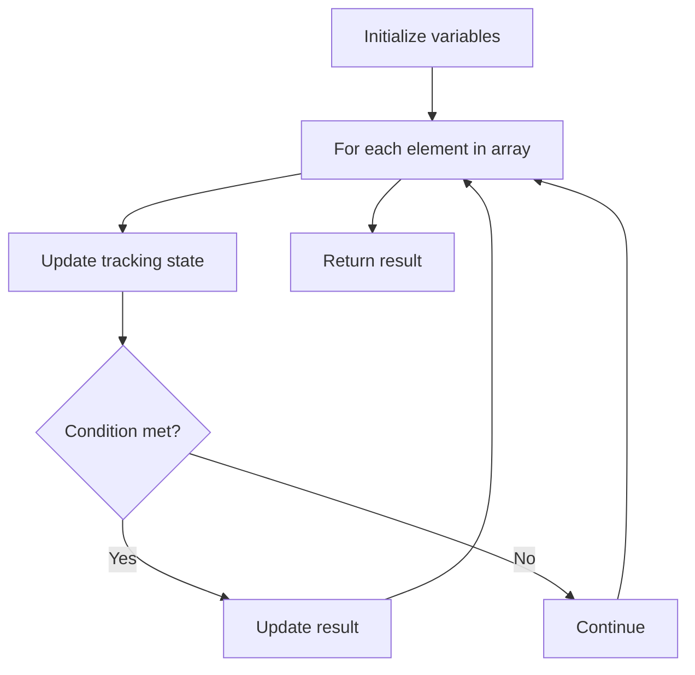

# Problem 1313: Decompress Run-Length Encoded List

**Difficulty:** Easy  
**Tags:** Array  
**Pattern:** Array Processing  
**Link:** [leetcode.com/problems/decompress-run-length-encoded-list](https://leetcode.com/problems/decompress-run-length-encoded-list/)

## Description

We are given a list `nums` of integers representing a list compressed with run-length encoding.

Consider each adjacent pair of elements `[freq, val] = [nums[2*i], nums[2*i+1]]` (with `i >= 0`).  For each such pair, there are `freq` elements with value `val` concatenated in a sublist. Concatenate all the sublists from left to right to generate the decompressed list.

Return the decompressed list.

 

Example 1:

```

**Input:** nums = [1,2,3,4]
**Output:** [2,4,4,4]
**Explanation:** The first pair [1,2] means we have freq = 1 and val = 2 so we generate the array [2].
The second pair [3,4] means we have freq = 3 and val = 4 so we generate [4,4,4].
At the end the concatenation [2] + [4,4,4] is [2,4,4,4].

```

Example 2:

```

**Input:** nums = [1,1,2,3]
**Output:** [1,3,3]

```

 

**Constraints:**

	- `2 <= nums.length <= 100`
	- `nums.length % 2 == 0`
	- `1 <= nums[i] <= 100`

## Approach: Array Processing

Process the array with a linear scan, tracking state variables. Look for patterns: running maximum/minimum, counting, or transformations.

## Pseudocode

```
1. Initialize tracking variables
2. Iterate through array:
   a. Update tracking state
   b. Check conditions
   c. Update result
3. Return result
```

## Algorithm Flow



## Complexity Analysis

- **Time:** O(n)
- **Space:** O(1)

## Solution (Python3)

```python
class Solution:
    def decompressRLElist(self, nums: List[int]) -> List[int]:
        # Array processing - O(n) time
        result = []
        for i in range(len(nums)):
            # Process element
            pass
        return result
```

## Solution (C++)

```cpp
#include <string>
#include <vector>
using namespace std;

class Solution {
public:
    vector<int> decompressRLElist(vector<int>& nums) {
        // Array processing - O(n) time
        for (int i = 0; i < (int)nums.size(); i++) {
            // Process element
        }
        return {};
    }
};
```
