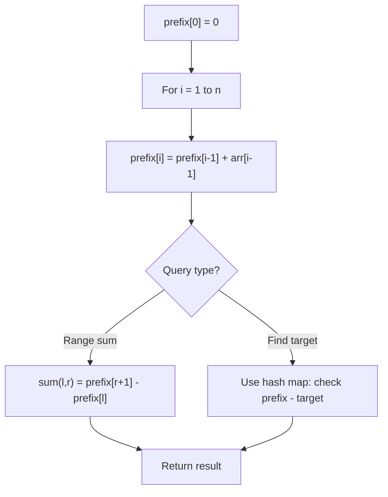

# Problem 1314: Matrix Block Sum

**Difficulty:** Medium  
**Tags:** Array, Matrix, Prefix Sum  
**Pattern:** Prefix Sum  
**Link:** [leetcode.com/problems/matrix-block-sum](https://leetcode.com/problems/matrix-block-sum/)

## Description

Given a `m x n` matrix `mat` and an integer `k`, return *a matrix* `answer` *where each* `answer[i][j]` *is the sum of all elements* `mat[r][c]` *for*:

	- `i - k <= r <= i + k,`
	- `j - k <= c <= j + k`, and
	- `(r, c)` is a valid position in the matrix.

 

Example 1:

```

**Input:** mat = [[1,2,3],[4,5,6],[7,8,9]], k = 1
**Output:** [[12,21,16],[27,45,33],[24,39,28]]

```

Example 2:

```

**Input:** mat = [[1,2,3],[4,5,6],[7,8,9]], k = 2
**Output:** [[45,45,45],[45,45,45],[45,45,45]]

```

 

**Constraints:**

	- `m == mat.length`
	- `n == mat[i].length`
	- `1 <= m, n, k <= 100`
	- `1 <= mat[i][j] <= 100`

## Approach: Prefix Sum

Build a prefix sum array where prefix[i] = sum of elements 0..i-1. Any subarray sum [l..r] = prefix[r+1] - prefix[l]. Combine with hash map for O(n) subarray sum queries.

## Pseudocode

```
1. Build prefix sum array: prefix[0]=0, prefix[i]=prefix[i-1]+arr[i-1]
2. Use prefix sums to answer queries:
   - Subarray sum [l..r] = prefix[r+1] - prefix[l]
   - Or use hash map to find prefix[j]-prefix[i] == target
3. Return result
```

## Algorithm Flow



## Complexity Analysis

- **Time:** O(n)
- **Space:** O(n)

## Solution (Python3)

```python
class Solution:
    def matrixBlockSum(self, mat: List[List[int]], k: int) -> List[List[int]]:
        # Prefix sum approach - O(n) time, O(n) space
        prefix = {0: -1}
        curr_sum = 0
        result = 0
        target = k if isinstance(k, int) else 0
        for i, val in enumerate(mat):
            curr_sum += val
            if curr_sum - target in prefix:
                result = max(result, i - prefix[curr_sum - target])
            if curr_sum not in prefix:
                prefix[curr_sum] = i
        return result
```

## Solution (C++)

```cpp
#include <algorithm>
#include <string>
#include <unordered_map>
#include <vector>
using namespace std;

class Solution {
public:
    vector<vector<int>> matrixBlockSum(vector<vector<int>>& mat, int k) {
        // Prefix sum approach - O(n) time, O(n) space
        unordered_map<int, int> prefix;
        prefix[0] = -1;
        int curr_sum = 0, result = 0;
        int target = k;
        for (int i = 0; i < (int)mat.size(); i++) {
            curr_sum += mat[i];
            if (prefix.count(curr_sum - target)) {
                result = max(result, i - prefix[curr_sum - target]);
            }
            if (!prefix.count(curr_sum)) {
                prefix[curr_sum] = i;
            }
        }
        return result;
    }
};
```
