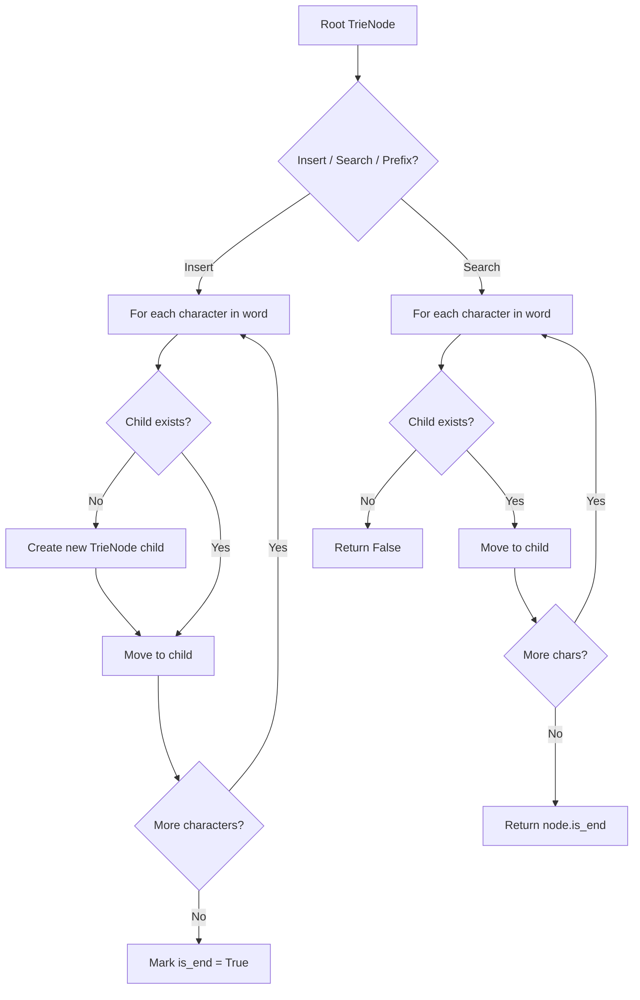
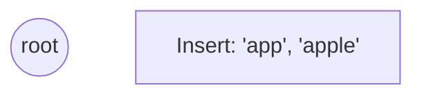
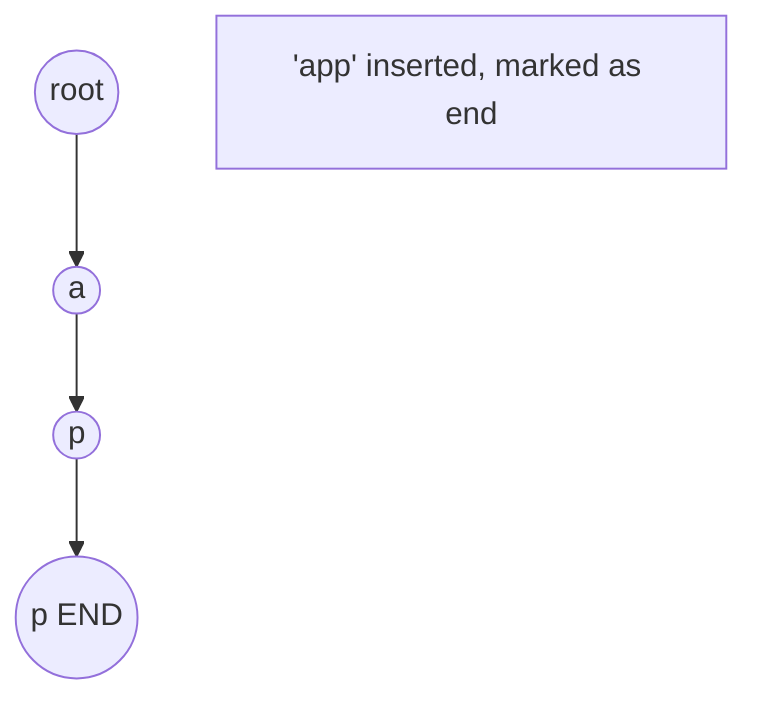
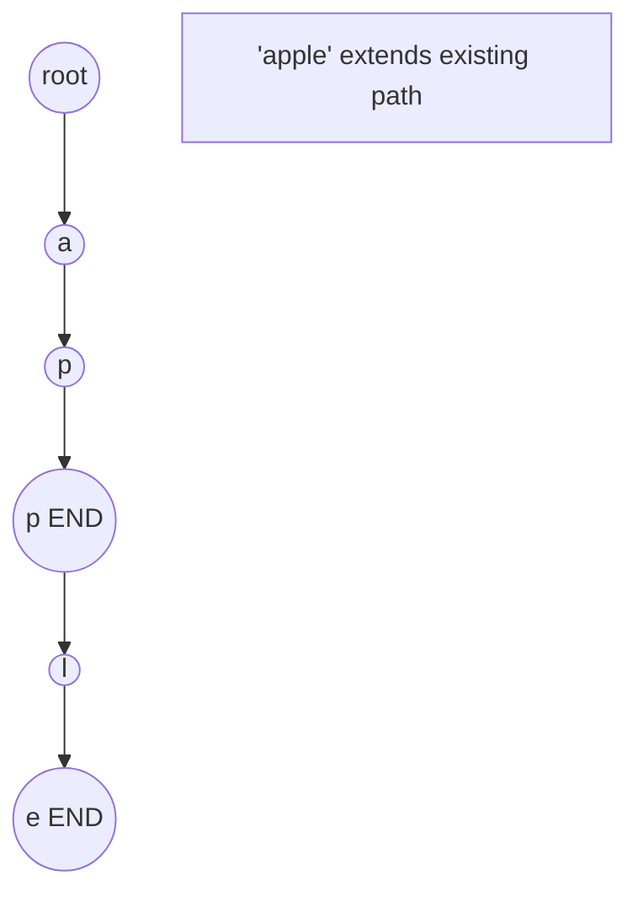
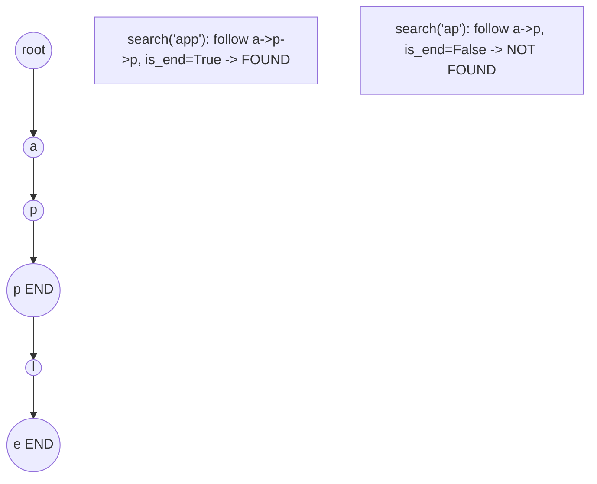

# Problem 1316: Distinct Echo Substrings

**Difficulty:** Hard  
**Tags:** String, Trie, Rolling Hash, Hash Function  
**Pattern:** Trie / Prefix Tree  
**Link:** [leetcode.com/problems/distinct-echo-substrings](https://leetcode.com/problems/distinct-echo-substrings/)

## Description

Return the number of **distinct** non-empty substrings of `text` that can be written as the concatenation of some string with itself (i.e. it can be written as `a + a` where `a` is some string).

 

Example 1:

```

**Input:** text = "abcabcabc"
**Output:** 3
**Explanation: **The 3 substrings are "abcabc", "bcabca" and "cabcab".

```

Example 2:

```

**Input:** text = "leetcodeleetcode"
**Output:** 2
**Explanation: **The 2 substrings are "ee" and "leetcodeleetcode".

```

 

**Constraints:**

	- `1 <= text.length <= 2000`
	- `text` has only lowercase English letters.

## Approach: Trie / Prefix Tree

Build a trie (prefix tree) where each node represents a character. Insert words character by character, and search by following child pointers. Supports efficient prefix matching.

## Pseudocode

```
1. TrieNode: children = {}, is_end = False
2. Insert(word):
   - For each char: create child if absent, move to child
   - Mark last node as end
3. Search(word):
   - For each char: if child absent return False, move to child
   - Return node.is_end
4. StartsWith(prefix): same as search but return True at end
```

## Algorithm Flow



## Visual State Transitions

**Trie Insert and Search:**

**Frame 1: Empty trie**


**Frame 2: Insert 'app'**


**Frame 3: Insert 'apple'**


**Frame 4: Search 'app' = True, 'ap' = False**



## Complexity Analysis

- **Time:** O(L) per operation
- **Space:** O(N * L)

## Solution (Python3)

```python
class Solution:
    def distinctEchoSubstrings(self, text: str) -> int:
        # Trie-based approach
        trie = {}
        # Build trie from word list
        words = text if isinstance(text, list) else [text]
        for word in words:
            node = trie
            for ch in word:
                if ch not in node:
                    node[ch] = {}
                node = node[ch]
            node['#'] = True
        
        # Search in trie
        def search(word):
            node = trie
            for ch in word:
                if ch not in node:
                    return False
                node = node[ch]
            return '#' in node
        
        return 0
```

## Solution (C++)

```cpp
#include <string>
#include <vector>
using namespace std;

class Solution {
public:
    int distinctEchoSubstrings(string& text) {
        // Trie-based approach
        struct TrieNode {
            TrieNode* children[26] = {};
            bool isEnd = false;
        };
        TrieNode* root = new TrieNode();
        // Build trie
        for (auto& word : text) {
            TrieNode* node = root;
            for (char ch : word) {
                int idx = ch - 'a';
                if (!node->children[idx])
                    node->children[idx] = new TrieNode();
                node = node->children[idx];
            }
            node->isEnd = true;
        }
        return 0;
    }
};
```
