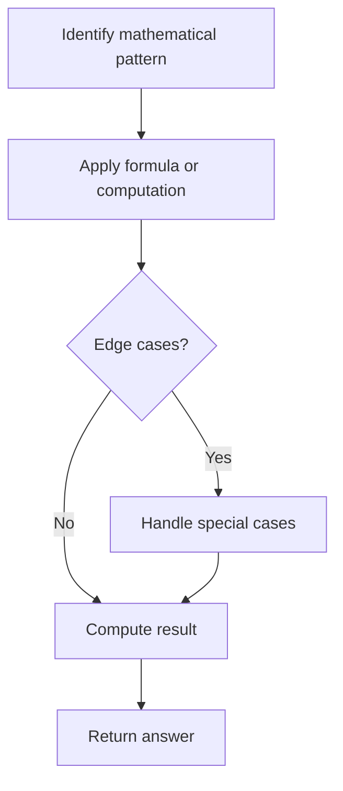

# Problem 1317: Convert Integer to the Sum of Two No-Zero Integers

**Difficulty:** Easy  
**Tags:** Math  
**Pattern:** Math  
**Link:** [leetcode.com/problems/convert-integer-to-the-sum-of-two-no-zero-integers](https://leetcode.com/problems/convert-integer-to-the-sum-of-two-no-zero-integers/)

## Description

**No-Zero integer** is a positive integer that **does not contain any `0`** in its decimal representation.

Given an integer `n`, return *a list of two integers* `[a, b]` *where*:

	- `a` and `b` are **No-Zero integers**.
	- `a + b = n`

The test cases are generated so that there is at least one valid solution. If there are many valid solutions, you can return any of them.

 

Example 1:

```

**Input:** n = 2
**Output:** [1,1]
**Explanation:** Let a = 1 and b = 1.
Both a and b are no-zero integers, and a + b = 2 = n.

```

Example 2:

```

**Input:** n = 11
**Output:** [2,9]
**Explanation:** Let a = 2 and b = 9.
Both a and b are no-zero integers, and a + b = 11 = n.
Note that there are other valid answers as [8, 3] that can be accepted.

```

 

**Constraints:**

	- `2 <= n <= 10^4`

## Approach: Math

Apply mathematical properties, formulas, or number-theoretic concepts. Look for patterns, modular arithmetic, or closed-form solutions.

## Pseudocode

```
1. Identify the mathematical pattern or formula
2. Apply computation:
   - Modular arithmetic for large numbers
   - GCD/LCM for divisibility
   - Sieve for primes
3. Handle edge cases
4. Return result
```

## Algorithm Flow



## Complexity Analysis

- **Time:** O(n) or O(sqrt(n))
- **Space:** O(1)

## Solution (Python3)

```python
class Solution:
    def getNoZeroIntegers(self, n: int) -> List[int]:
        # Mathematical approach
        result = 0
        x = n
        while x != 0:
            result = result * 10 + x % 10
            x //= 10 if isinstance(x, int) else 1
        return result
```

## Solution (C++)

```cpp
#include <string>
#include <vector>
using namespace std;

class Solution {
public:
    vector<int> getNoZeroIntegers(int n) {
        // Mathematical approach
        long long result = 0;
        int x = n;
        while (x != 0) {
            result = result * 10 + x % 10;
            x /= 10;
        }
        return (int)result;
    }
};
```
