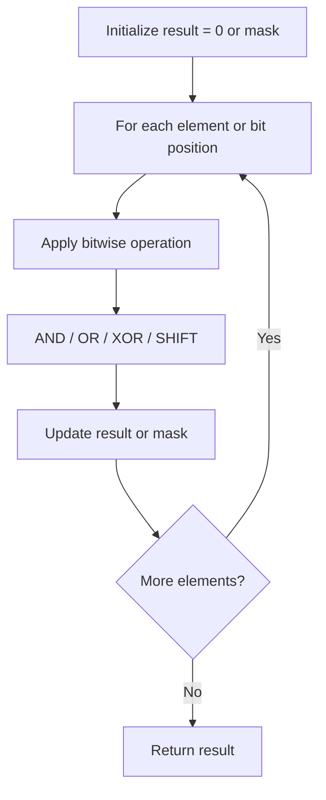

# Problem 1318: Minimum Flips to Make a OR b Equal to c

**Difficulty:** Medium  
**Tags:** Bit Manipulation  
**Pattern:** Bit Manipulation  
**Link:** [leetcode.com/problems/minimum-flips-to-make-a-or-b-equal-to-c](https://leetcode.com/problems/minimum-flips-to-make-a-or-b-equal-to-c/)

## Description

Given 3 positives numbers `a`, `b` and `c`. Return the minimum flips required in some bits of `a` and `b` to make ( `a` OR `b` == `c` ). (bitwise OR operation).

Flip operation consists of change **any** single bit 1 to 0 or change the bit 0 to 1 in their binary representation.


 

Example 1:


```

**Input:** a = 2, b = 6, c = 5
**Output:** 3
**Explanation: **After flips a = 1 , b = 4 , c = 5 such that (`a` OR `b` == `c`)
```


Example 2:


```

**Input:** a = 4, b = 2, c = 7
**Output:** 1

```


Example 3:


```

**Input:** a = 1, b = 2, c = 3
**Output:** 0

```


 

**Constraints:**


	- `1 <= a <= 10^9`
	- `1 <= b <= 10^9`
	- `1 <= c <= 10^9`

## Approach: Bit Manipulation

Operate on individual bits using bitwise operators (AND, OR, XOR, shift). Common tricks: x & (x-1) removes lowest set bit, x ^ x = 0, XOR all elements to find unique.

## Pseudocode

```
1. Apply bitwise operations:
   - XOR all elements to cancel paired bits
   - Use bitmask to track state
   - Shift and mask to extract/set individual bits
2. Return result
```

## Algorithm Flow



## Complexity Analysis

- **Time:** O(n) or O(log n)
- **Space:** O(1)

## Solution (Python3)

```python
class Solution:
    def minFlips(self, a: int, b: int, c: int) -> int:
        # Bit manipulation - O(n) time, O(1) space
        result = 0
        for val in a:
            result ^= val
        return result
```

## Solution (C++)

```cpp
#include <string>
#include <vector>
using namespace std;

class Solution {
public:
    int minFlips(int a, int b, int c) {
        // Bit manipulation - O(n) time, O(1) space
        int result = 0;
        for (int val : a) {
            result ^= val;
        }
        return result;
    }
};
```
