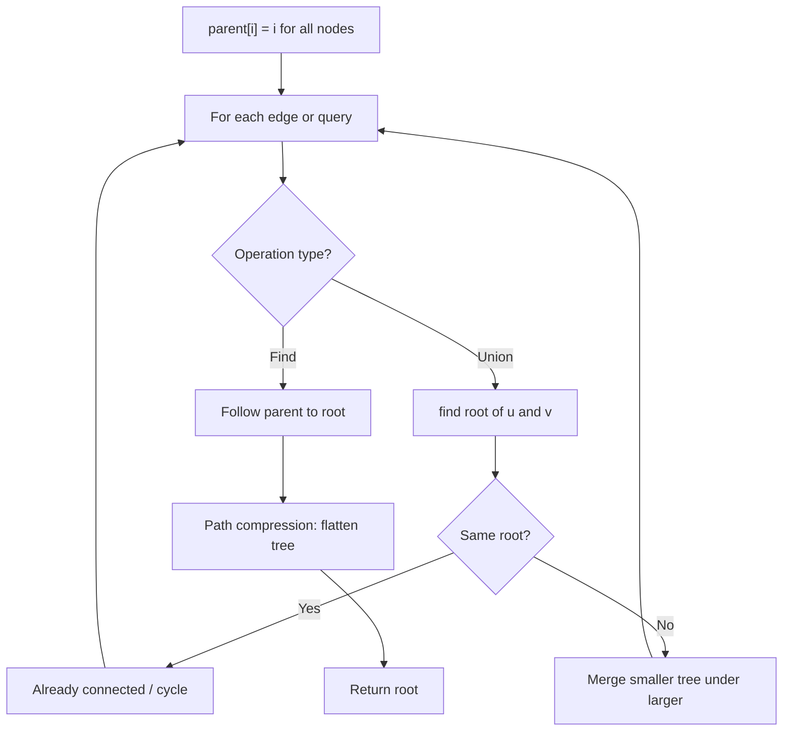
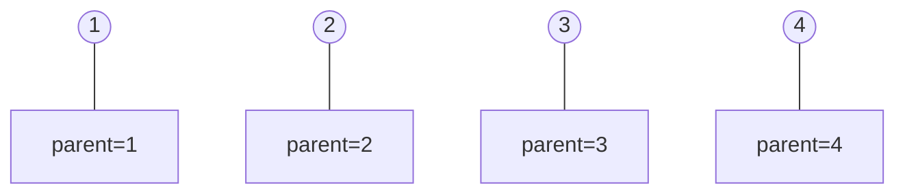
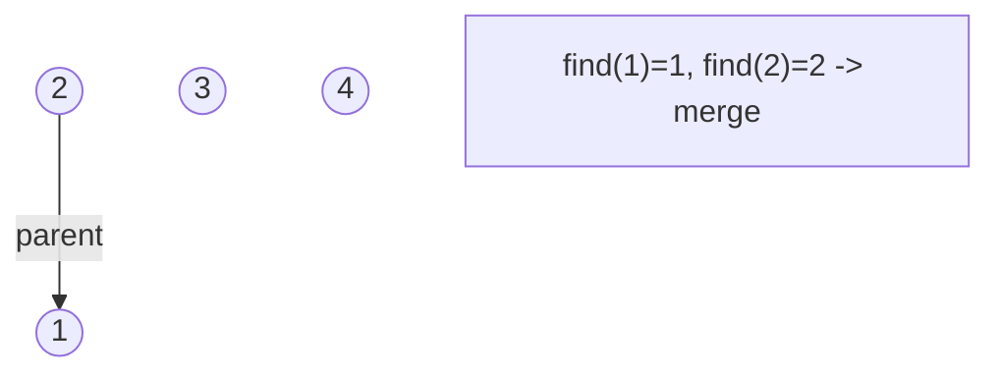
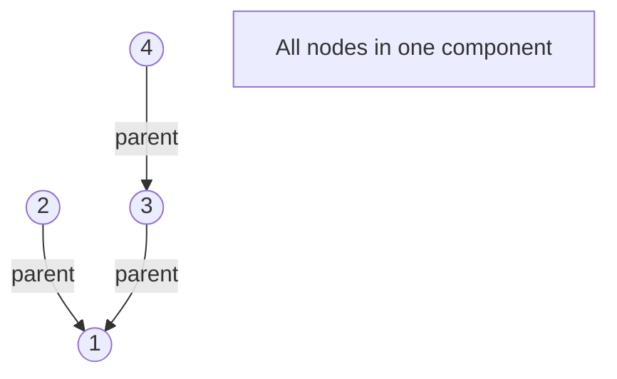
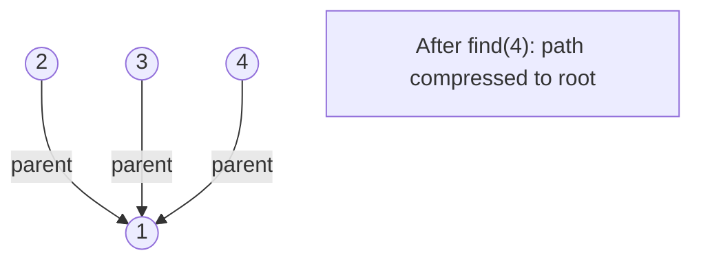

# Problem 1319: Number of Operations to Make Network Connected

**Difficulty:** Medium  
**Tags:** Depth-First Search, Breadth-First Search, Union-Find, Graph Theory  
**Pattern:** Union-Find  
**Link:** [leetcode.com/problems/number-of-operations-to-make-network-connected](https://leetcode.com/problems/number-of-operations-to-make-network-connected/)

## Description

There are `n` computers numbered from `0` to `n - 1` connected by ethernet cables `connections` forming a network where `connections[i] = [ai, bi]` represents a connection between computers `ai` and `bi`. Any computer can reach any other computer directly or indirectly through the network.

You are given an initial computer network `connections`. You can extract certain cables between two directly connected computers, and place them between any pair of disconnected computers to make them directly connected.

Return *the minimum number of times you need to do this in order to make all the computers connected*. If it is not possible, return `-1`.

 

Example 1:

```

**Input:** n = 4, connections = [[0,1],[0,2],[1,2]]
**Output:** 1
**Explanation:** Remove cable between computer 1 and 2 and place between computers 1 and 3.

```

Example 2:

```

**Input:** n = 6, connections = [[0,1],[0,2],[0,3],[1,2],[1,3]]
**Output:** 2

```

Example 3:

```

**Input:** n = 6, connections = [[0,1],[0,2],[0,3],[1,2]]
**Output:** -1
**Explanation:** There are not enough cables.

```

 

**Constraints:**

	- `1 <= n <= 10^5`
	- `1 <= connections.length <= min(n * (n - 1) / 2, 10^5)`
	- `connections[i].length == 2`
	- `0 <= ai, bi < n`
	- `ai != bi`
	- There are no repeated connections.
	- No two computers are connected by more than one cable.

## Approach: Union-Find

Need n-1 cables minimum. Count connected components with Union-Find. Answer = components - 1.

## Pseudocode

```
1. parent[i] = i for all nodes (each is its own set)
2. find(x): follow parent pointers to root (with path compression)
3. union(x, y): merge sets of x and y by rank
4. Process edges/operations:
   a. For each edge (u, v): union(u, v)
5. Answer queries using find()
```

## Algorithm Flow



## Visual State Transitions

**Union-Find Step-by-Step:**

**Frame 1: Initial - each node is own parent**


**Frame 2: Union(1,2) - merge components**


**Frame 3: Union(3,4) then Union(2,3)**


**Frame 4: Path compression on find(4)**



## Complexity Analysis

- **Time:** O(n + E * alpha(n))
- **Space:** O(n)

## Solution (Python3)

```python
class Solution:
    def makeConnected(self, n: int, connections) -> int:
        if len(connections) < n - 1:
            return -1
        parent = list(range(n))
        def find(x):
            while parent[x] != x:
                parent[x] = parent[parent[x]]
                x = parent[x]
            return x
        components = n
        for a, b in connections:
            pa, pb = find(a), find(b)
            if pa != pb:
                parent[pa] = pb
                components -= 1
        return components - 1
```

## Solution (C++)

```cpp
#include <functional>
#include <numeric>
#include <string>
#include <vector>
using namespace std;

class Solution {
public:
    int makeConnected(int n, vector<vector<int>>& connections) {
        // Union Find (DSU) - O(n * alpha(n))
        int n = n.size();
        vector<int> parent(n + 1), rnk(n + 1, 0);
        iota(parent.begin(), parent.end(), 0);
        function<int(int)> find = [&](int x) -> int {
            return parent[x] == x ? x : parent[x] = find(parent[x]);
        };
        auto unite = [&](int x, int y) -> bool {
            int px = find(x), py = find(y);
            if (px == py) return false;
            if (rnk[px] < rnk[py]) swap(px, py);
            parent[py] = px;
            if (rnk[px] == rnk[py]) rnk[px]++;
            return true;
        };
        int components = n;
        return components;
    }
};
```
