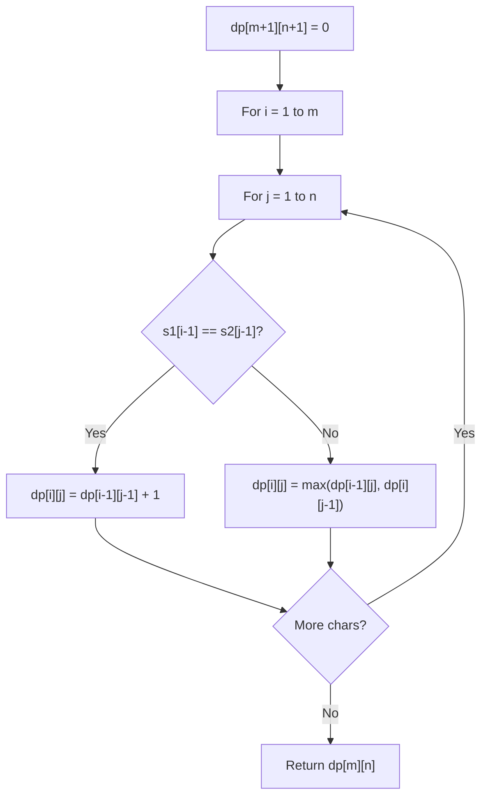

# Problem 1320: Minimum Distance to Type a Word Using Two Fingers

**Difficulty:** Hard  
**Tags:** String, Dynamic Programming  
**Pattern:** Dynamic Programming (String)  
**Link:** [leetcode.com/problems/minimum-distance-to-type-a-word-using-two-fingers](https://leetcode.com/problems/minimum-distance-to-type-a-word-using-two-fingers/)

## Description

You have a keyboard layout as shown above in the **X-Y** plane, where each English uppercase letter is located at some coordinate.

	- For example, the letter `'A'` is located at coordinate `(0, 0)`, the letter `'B'` is located at coordinate `(0, 1)`, the letter `'P'` is located at coordinate `(2, 3)` and the letter `'Z'` is located at coordinate `(4, 1)`.

Given the string `word`, return *the minimum total **distance** to type such string using only two fingers*.

The **distance** between coordinates `(x1, y1)` and `(x2, y2)` is `|x1 - x2| + |y1 - y2|`.

**Note** that the initial positions of your two fingers are considered free so do not count towards your total distance, also your two fingers do not have to start at the first letter or the first two letters.

 

Example 1:

```

**Input:** word = "CAKE"
**Output:** 3
**Explanation:** Using two fingers, one optimal way to type "CAKE" is: 
Finger 1 on letter 'C' -> cost = 0 
Finger 1 on letter 'A' -> cost = Distance from letter 'C' to letter 'A' = 2 
Finger 2 on letter 'K' -> cost = 0 
Finger 2 on letter 'E' -> cost = Distance from letter 'K' to letter 'E' = 1 
Total distance = 3

```

Example 2:

```

**Input:** word = "HAPPY"
**Output:** 6
**Explanation:** Using two fingers, one optimal way to type "HAPPY" is:
Finger 1 on letter 'H' -> cost = 0
Finger 1 on letter 'A' -> cost = Distance from letter 'H' to letter 'A' = 2
Finger 2 on letter 'P' -> cost = 0
Finger 2 on letter 'P' -> cost = Distance from letter 'P' to letter 'P' = 0
Finger 1 on letter 'Y' -> cost = Distance from letter 'A' to letter 'Y' = 4
Total distance = 6

```

 

**Constraints:**

	- `2 <= word.length <= 300`
	- `word` consists of uppercase English letters.

## Approach: Dynamic Programming (String)

Compare or match two strings using a 2D DP table. dp[i][j] represents the answer for substrings s1[0..i-1] and s2[0..j-1]. Common patterns: LCS, edit distance, regex matching.

## Pseudocode

```
1. Create dp[m+1][n+1]
2. Initialize base cases
3. For i from 1 to m:
   For j from 1 to n:
     If s1[i-1] == s2[j-1]: dp[i][j] = dp[i-1][j-1] + 1
     Else: dp[i][j] = best of (dp[i-1][j], dp[i][j-1], dp[i-1][j-1])
4. Return dp[m][n]
```

## Algorithm Flow



## Complexity Analysis

- **Time:** O(m * n)
- **Space:** O(m * n)

## Solution (Python3)

```python
class Solution:
    def minimumDistance(self, word: str) -> int:
        # String DP - O(m*n) time and space
        m, n = len(word), len(word)
        dp = [[0] * (n + 1) for _ in range(m + 1)]
        for i in range(1, m + 1):
            for j in range(1, n + 1):
                if word[i-1] == word[j-1]:
                    dp[i][j] = dp[i-1][j-1] + 1
                else:
                    dp[i][j] = max(dp[i-1][j], dp[i][j-1])
        return dp[m][n]
```

## Solution (C++)

```cpp
#include <algorithm>
#include <string>
#include <vector>
using namespace std;

class Solution {
public:
    int minimumDistance(string& word) {
        // String DP - O(m*n) time and space
        int m = word.size(), n = word.size();
        vector<vector<int>> dp(m + 1, vector<int>(n + 1, 0));
        for (int i = 1; i <= m; i++) {
            for (int j = 1; j <= n; j++) {
                if (word[i-1] == word[j-1])
                    dp[i][j] = dp[i-1][j-1] + 1;
                else
                    dp[i][j] = max(dp[i-1][j], dp[i][j-1]);
            }
        }
        return dp[m][n];
    }
};
```
