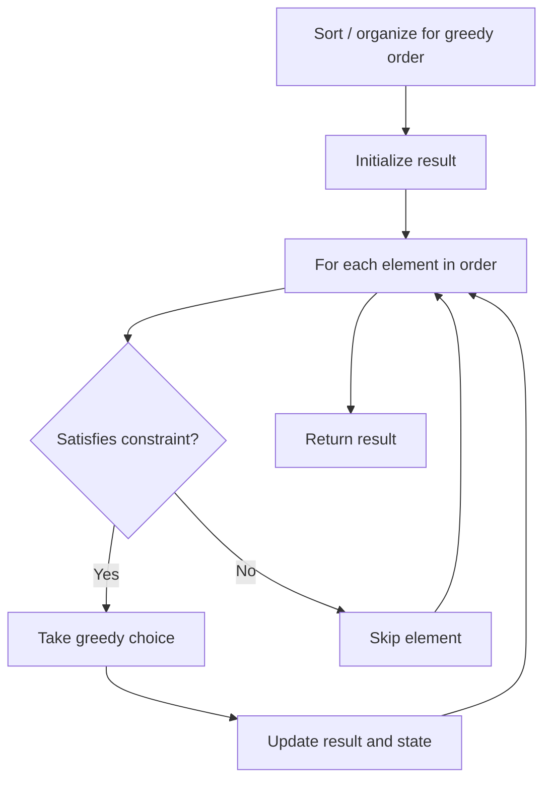

# Problem 1323: Maximum 69 Number

**Difficulty:** Easy  
**Tags:** Math, Greedy  
**Pattern:** Greedy  
**Link:** [leetcode.com/problems/maximum-69-number](https://leetcode.com/problems/maximum-69-number/)

## Description

You are given a positive integer `num` consisting only of digits `6` and `9`.

Return *the maximum number you can get by changing **at most** one digit (*`6`* becomes *`9`*, and *`9`* becomes *`6`*)*.

 

Example 1:

```

**Input:** num = 9669
**Output:** 9969
**Explanation:** 
Changing the first digit results in 6669.
Changing the second digit results in 9969.
Changing the third digit results in 9699.
Changing the fourth digit results in 9666.
The maximum number is 9969.

```

Example 2:

```

**Input:** num = 9996
**Output:** 9999
**Explanation:** Changing the last digit 6 to 9 results in the maximum number.

```

Example 3:

```

**Input:** num = 9999
**Output:** 9999
**Explanation:** It is better not to apply any change.

```

 

**Constraints:**

	- `1 <= num <= 10^4`
	- `num` consists of only `6` and `9` digits.

## Approach: Greedy

Make the locally optimal choice at each step, trusting it leads to a global optimum. Greedy works when the problem has the greedy-choice property and optimal substructure.

## Pseudocode

```
1. Sort or organize data for greedy ordering
2. Initialize result
3. For each element in greedy order:
   a. If element satisfies constraint:
      - Take the greedy choice
      - Update result and state
4. Return result
```

## Algorithm Flow



## Complexity Analysis

- **Time:** O(n log n)
- **Space:** O(1)

## Solution (Python3)

```python
class Solution:
    def maximum69Number(self, num: int) -> int:
        # Greedy approach - O(n) time
        result = 0
        curr_max = 0
        for i in range(len(num)):
            if isinstance(num[i], int):
                curr_max = max(curr_max, num[i])
                result = max(result, curr_max)
            else:
                result += 1
        return result
```

## Solution (C++)

```cpp
#include <algorithm>
#include <string>
#include <vector>
using namespace std;

class Solution {
public:
    int maximum69Number(int num) {
        // Greedy approach - O(n) time
        int result = 0, curr_max = 0;
        for (int i = 0; i < (int)num.size(); i++) {
            curr_max = max(curr_max, num[i]);
            result = max(result, curr_max);
        }
        return result;
    }
};
```
