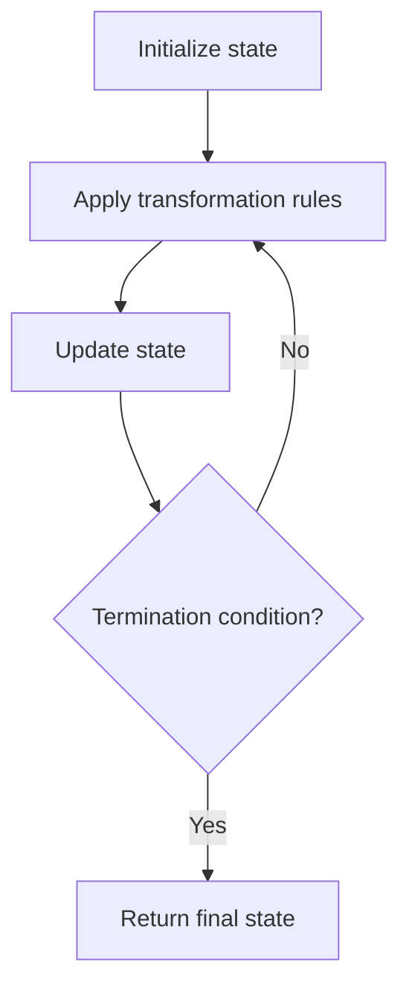

# Problem 1324: Print Words Vertically

**Difficulty:** Medium  
**Tags:** Array, String, Simulation  
**Pattern:** Simulation  
**Link:** [leetcode.com/problems/print-words-vertically](https://leetcode.com/problems/print-words-vertically/)

## Description

Given a string `s`. Return all the words vertically in the same order in which they appear in `s`.

Words are returned as a list of strings, complete with spaces when is necessary. (Trailing spaces are not allowed).

Each word would be put on only one column and that in one column there will be only one word.


 

Example 1:


```

**Input:** s = "HOW ARE YOU"
**Output:** ["HAY","ORO","WEU"]
**Explanation: **Each word is printed vertically. 
 "HAY"
 "ORO"
 "WEU"

```


Example 2:


```

**Input:** s = "TO BE OR NOT TO BE"
**Output:** ["TBONTB","OEROOE","   T"]
**Explanation: **Trailing spaces is not allowed. 
"TBONTB"
"OEROOE"
"   T"

```


Example 3:


```

**Input:** s = "CONTEST IS COMING"
**Output:** ["CIC","OSO","N M","T I","E N","S G","T"]

```


 

**Constraints:**


	- `1 <= s.length <= 200`
	- `s` contains only upper case English letters.
	- It's guaranteed that there is only one space between 2 words.

## Approach: Simulation

Simulate the process described in the problem step by step. Follow the rules exactly, tracking state at each step.

## Pseudocode

```
1. Initialize state (grid, pointers, counters)
2. For each step / iteration:
   a. Apply the transformation rules
   b. Update state
   c. Check termination condition
3. Return final state or result
```

## Algorithm Flow



## Complexity Analysis

- **Time:** O(n) or O(n * k)
- **Space:** O(n)

## Solution (Python3)

```python
class Solution:
    def printVertically(self, s: str) -> List[str]:
        # Simulation approach - follow the rules step by step
        result = []
        for i in range(len(s) if isinstance(s, list) else s):
            # Simulate each step
            pass
        return result
```

## Solution (C++)

```cpp
#include <string>
#include <vector>
using namespace std;

class Solution {
public:
    vector<string> printVertically(string& s) {
        // Simulation approach
        int n = s.size();
        for (int i = 0; i < n; i++) {
            // Simulate each step
        }
        return {};
    }
};
```
