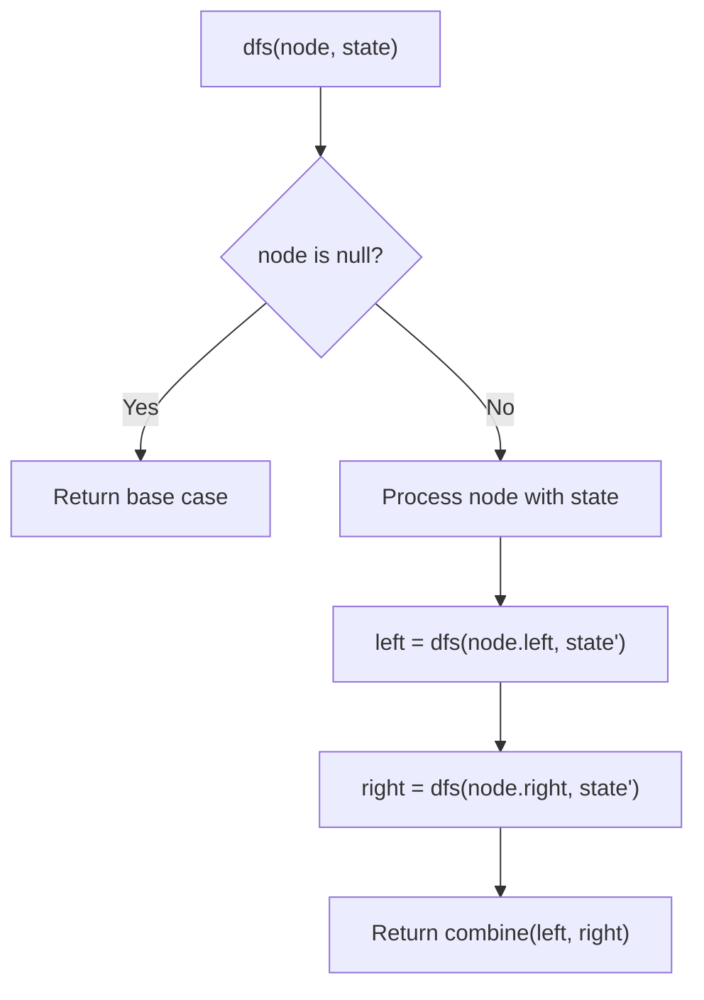
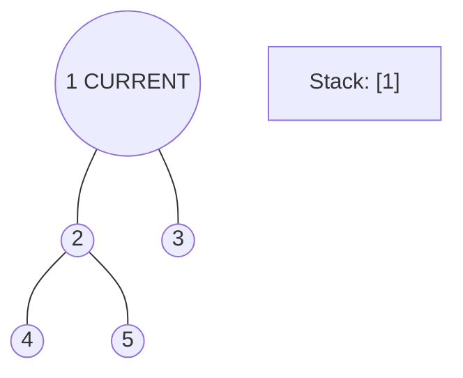
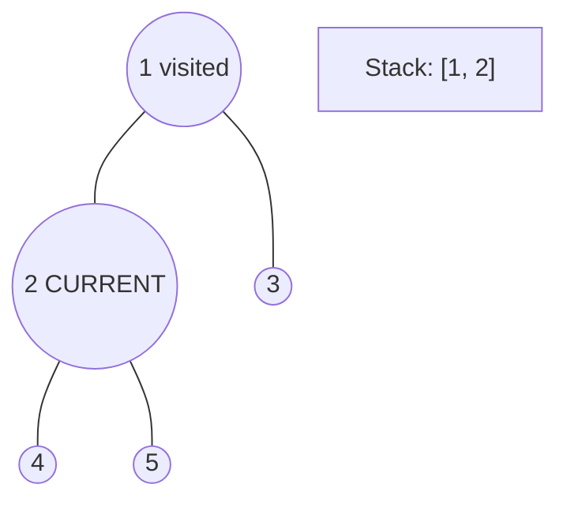
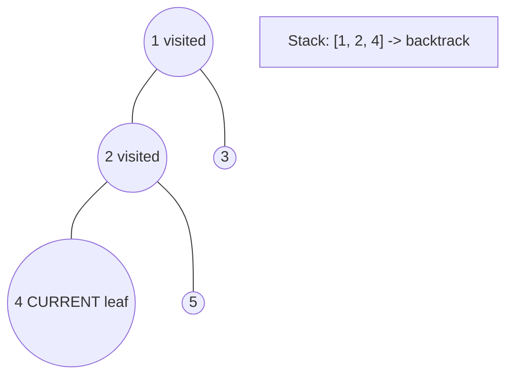
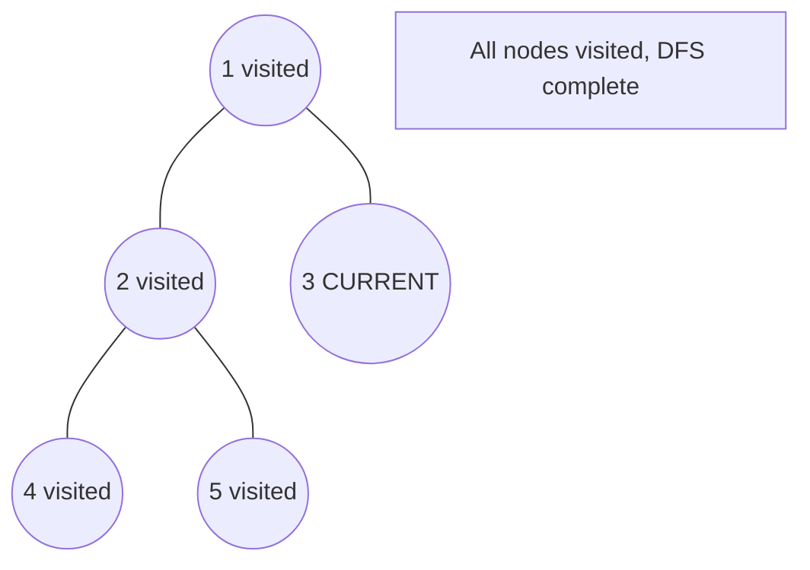

# Problem 1325: Delete Leaves With a Given Value

**Difficulty:** Medium  
**Tags:** Tree, Depth-First Search, Binary Tree  
**Pattern:** DFS Tree Traversal  
**Link:** [leetcode.com/problems/delete-leaves-with-a-given-value](https://leetcode.com/problems/delete-leaves-with-a-given-value/)

## Description

Given a binary tree `root` and an integer `target`, delete all the **leaf nodes** with value `target`.

Note that once you delete a leaf node with value `target`**, **if its parent node becomes a leaf node and has the value `target`, it should also be deleted (you need to continue doing that until you cannot).

 

Example 1:

****

```

**Input:** root = [1,2,3,2,null,2,4], target = 2
**Output:** [1,null,3,null,4]
**Explanation:** Leaf nodes in green with value (target = 2) are removed (Picture in left). 
After removing, new nodes become leaf nodes with value (target = 2) (Picture in center).

```

Example 2:

****

```

**Input:** root = [1,3,3,3,2], target = 3
**Output:** [1,3,null,null,2]

```

Example 3:

****

```

**Input:** root = [1,2,null,2,null,2], target = 2
**Output:** [1]
**Explanation:** Leaf nodes in green with value (target = 2) are removed at each step.

```

 

**Constraints:**

	- The number of nodes in the tree is in the range `[1, 3000]`.
	- `1 <= Node.val, target <= 1000`

## Approach: DFS Tree Traversal

Perform depth-first search on the tree. Recurse on left and right subtrees, combining results bottom-up. Track state (path, depth, sum) during traversal.

## Pseudocode

```
1. Define dfs(node, state):
   a. Base case: if null, return default
   b. Process node with current state
   c. left_result = dfs(node.left, updated_state)
   d. right_result = dfs(node.right, updated_state)
   e. Return combine(left_result, right_result)
2. Return dfs(root, initial_state)
```

## Algorithm Flow



## Visual State Transitions

**DFS Tree Traversal Step-by-Step:**

**Frame 1: Start at root**


**Frame 2: Go left - visit node 2**


**Frame 3: Go left - visit node 4 (leaf)**


**Frame 4: Backtrack, visit node 5, then node 3**



## Complexity Analysis

- **Time:** O(n)
- **Space:** O(h)

## Solution (Python3)

```python
class Solution:
    def removeLeafNodes(self, root: Optional[TreeNode], target: int) -> Optional[TreeNode]:
        # DFS on binary tree - O(n) time, O(h) space
        def dfs(node):
            if not node:
                return 0
            left = dfs(node.left)
            right = dfs(node.right)
            return 1 + max(left, right)
        
        result = dfs(root)
        return result
```

## Solution (C++)

```cpp
#include <algorithm>
#include <functional>
#include <string>
#include <vector>
using namespace std;

class Solution {
public:
    TreeNode* removeLeafNodes(TreeNode* root, int target) {
        // DFS on binary tree - O(n) time, O(h) space
        function<int(TreeNode*)> dfs = [&](TreeNode* node) -> int {
            if (!node) return 0;
            int left = dfs(node->left);
            int right = dfs(node->right);
            return 1 + max(left, right);
        };
        return dfs(root);
    }
};
```
