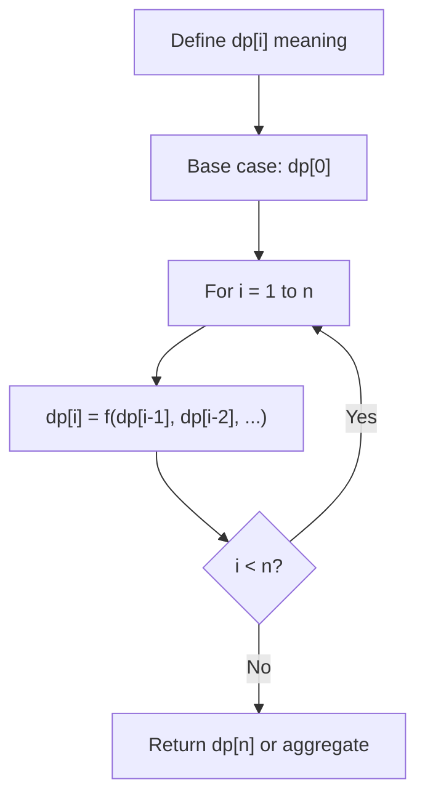
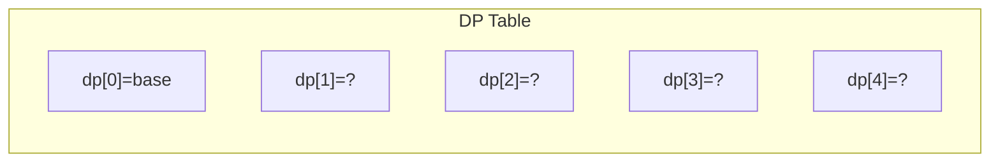
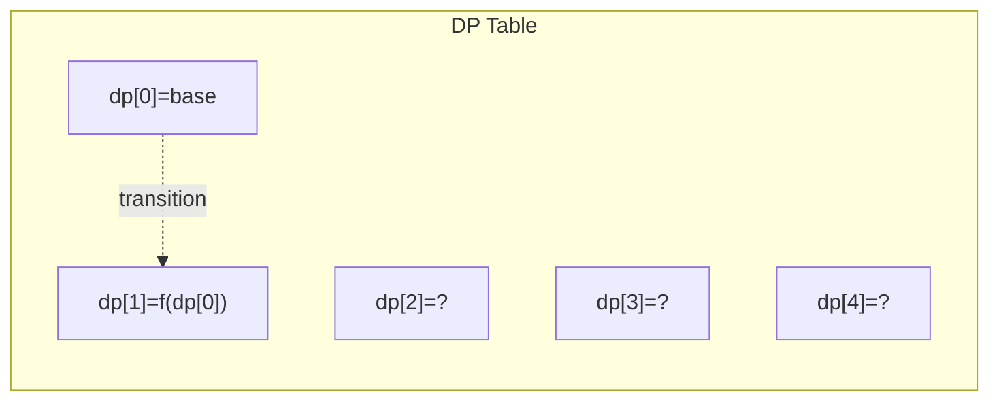
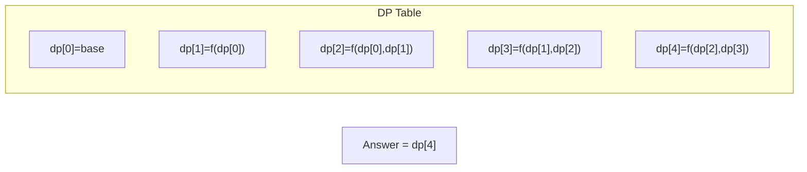

# Problem 1326: Minimum Number of Taps to Open to Water a Garden

**Difficulty:** Hard  
**Tags:** Array, Dynamic Programming, Greedy  
**Pattern:** Dynamic Programming (1D)  
**Link:** [leetcode.com/problems/minimum-number-of-taps-to-open-to-water-a-garden](https://leetcode.com/problems/minimum-number-of-taps-to-open-to-water-a-garden/)

## Description

There is a one-dimensional garden on the x-axis. The garden starts at the point `0` and ends at the point `n`. (i.e., the length of the garden is `n`).

There are `n + 1` taps located at points `[0, 1, ..., n]` in the garden.

Given an integer `n` and an integer array `ranges` of length `n + 1` where `ranges[i]` (0-indexed) means the `i-th` tap can water the area `[i - ranges[i], i + ranges[i]]` if it was open.

Return *the minimum number of taps* that should be open to water the whole garden, If the garden cannot be watered return **-1**.

 

Example 1:

```

**Input:** n = 5, ranges = [3,4,1,1,0,0]
**Output:** 1
**Explanation:** The tap at point 0 can cover the interval [-3,3]
The tap at point 1 can cover the interval [-3,5]
The tap at point 2 can cover the interval [1,3]
The tap at point 3 can cover the interval [2,4]
The tap at point 4 can cover the interval [4,4]
The tap at point 5 can cover the interval [5,5]
Opening Only the second tap will water the whole garden [0,5]

```

Example 2:

```

**Input:** n = 3, ranges = [0,0,0,0]
**Output:** -1
**Explanation:** Even if you activate all the four taps you cannot water the whole garden.

```

 

**Constraints:**

	- `1 <= n <= 10^4`
	- `ranges.length == n + 1`
	- `0 <= ranges[i] <= 100`

## Approach: Dynamic Programming (1D)

Break the problem into overlapping subproblems. Define dp[i] as the optimal value for the subproblem ending at or considering index i. Build the solution bottom-up, using previously computed dp values.

## Pseudocode

```
1. Define dp[i] = optimal value for subproblem i
2. Base case: dp[0] = initial value
3. For i from 1 to n:
   a. dp[i] = recurrence(dp[i-1], dp[i-2], ...)
4. Return dp[n] or max/min of dp
```

## Algorithm Flow



## Visual State Transitions

**1D Dynamic Programming Table Build:**

**Frame 1: Initialize base cases**


**Frame 2: Fill dp[1] from dp[0]**


**Frame 3: Fill remaining cells**



## Complexity Analysis

- **Time:** O(n)
- **Space:** O(n)

## Solution (Python3)

```python
class Solution:
    def minTaps(self, n: int, ranges: List[int]) -> int:
        # Dynamic programming (1D) - O(n) time, O(n) space
        if not n:
            return 0
        n = len(n) if isinstance(n, list) else n
        dp = [0] * (n + 1)
        dp[0] = 1  # base case
        for i in range(1, n + 1):
            dp[i] = dp[i-1]  # transition (customize per problem)
            if i >= 2:
                dp[i] += dp[i-2]
        return dp[n]
```

## Solution (C++)

```cpp
#include <string>
#include <vector>
using namespace std;

class Solution {
public:
    int minTaps(int n, vector<int>& ranges) {
        // Dynamic programming (1D) - O(n) time, O(n) space
        int n = n;
        if (n <= 0) return 0;
        vector<int> dp(n + 1, 0);
        dp[0] = 1;
        for (int i = 1; i <= n; i++) {
            dp[i] = dp[i-1];
            if (i >= 2) dp[i] += dp[i-2];
        }
        return dp[n];
    }
};
```
