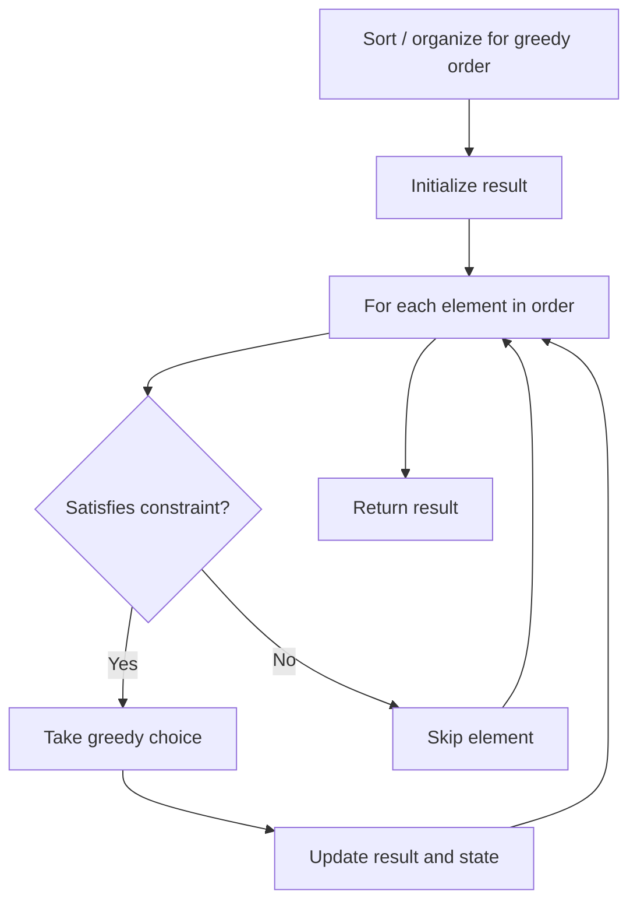

# Problem 1328: Break a Palindrome

**Difficulty:** Medium  
**Tags:** String, Greedy  
**Pattern:** Greedy  
**Link:** [leetcode.com/problems/break-a-palindrome](https://leetcode.com/problems/break-a-palindrome/)

## Description

Given a palindromic string of lowercase English letters `palindrome`, replace **exactly one** character with any lowercase English letter so that the resulting string is **not** a palindrome and that it is the **lexicographically smallest** one possible.

Return *the resulting string. If there is no way to replace a character to make it not a palindrome, return an **empty string**.*

A string `a` is lexicographically smaller than a string `b` (of the same length) if in the first position where `a` and `b` differ, `a` has a character strictly smaller than the corresponding character in `b`. For example, `"abcc"` is lexicographically smaller than `"abcd"` because the first position they differ is at the fourth character, and `'c'` is smaller than `'d'`.

 

Example 1:

```

**Input:** palindrome = "abccba"
**Output:** "aaccba"
**Explanation:** There are many ways to make "abccba" not a palindrome, such as "zbccba", "aaccba", and "abacba".
Of all the ways, "aaccba" is the lexicographically smallest.

```

Example 2:

```

**Input:** palindrome = "a"
**Output:** ""
**Explanation:** There is no way to replace a single character to make "a" not a palindrome, so return an empty string.

```

 

**Constraints:**

	- `1 <= palindrome.length <= 1000`
	- `palindrome` consists of only lowercase English letters.

## Approach: Greedy

Make the locally optimal choice at each step, trusting it leads to a global optimum. Greedy works when the problem has the greedy-choice property and optimal substructure.

## Pseudocode

```
1. Sort or organize data for greedy ordering
2. Initialize result
3. For each element in greedy order:
   a. If element satisfies constraint:
      - Take the greedy choice
      - Update result and state
4. Return result
```

## Algorithm Flow



## Complexity Analysis

- **Time:** O(n log n)
- **Space:** O(1)

## Solution (Python3)

```python
class Solution:
    def breakPalindrome(self, palindrome: str) -> str:
        # Greedy approach - O(n) time
        result = 0
        curr_max = 0
        for i in range(len(palindrome)):
            if isinstance(palindrome[i], int):
                curr_max = max(curr_max, palindrome[i])
                result = max(result, curr_max)
            else:
                result += 1
        return result
```

## Solution (C++)

```cpp
#include <algorithm>
#include <string>
#include <vector>
using namespace std;

class Solution {
public:
    string breakPalindrome(string& palindrome) {
        // Greedy approach - O(n) time
        int result = 0, curr_max = 0;
        for (int i = 0; i < (int)palindrome.size(); i++) {
            curr_max = max(curr_max, palindrome[i]);
            result = max(result, curr_max);
        }
        return result;
    }
};
```
