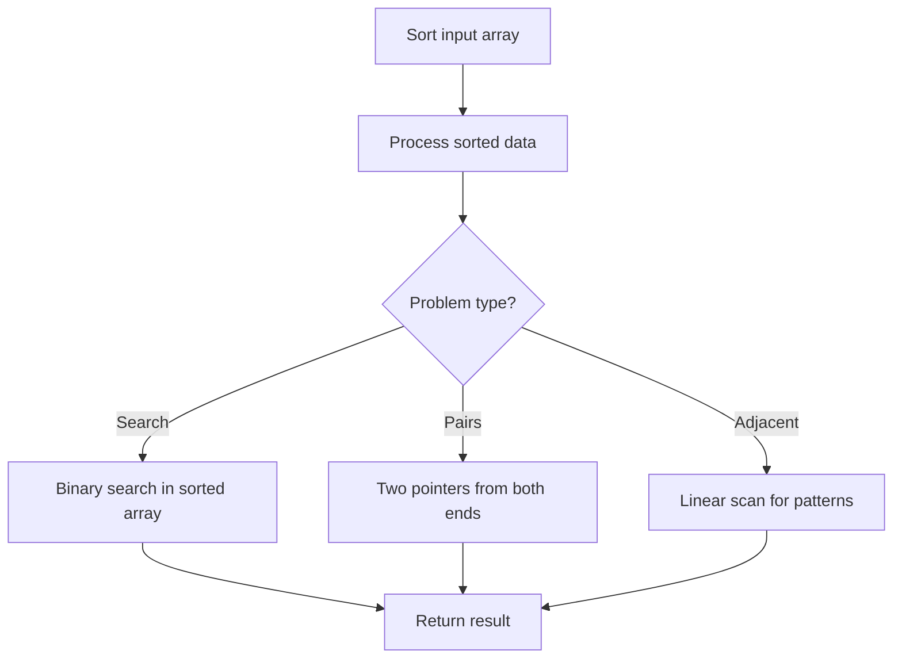

# Problem 1329: Sort the Matrix Diagonally

**Difficulty:** Medium  
**Tags:** Array, Sorting, Matrix  
**Pattern:** Sorting  
**Link:** [leetcode.com/problems/sort-the-matrix-diagonally](https://leetcode.com/problems/sort-the-matrix-diagonally/)

## Description

A **matrix diagonal** is a diagonal line of cells starting from some cell in either the topmost row or leftmost column and going in the bottom-right direction until reaching the matrix's end. For example, the **matrix diagonal** starting from `mat[2][0]`, where `mat` is a `6 x 3` matrix, includes cells `mat[2][0]`, `mat[3][1]`, and `mat[4][2]`.

Given an `m x n` matrix `mat` of integers, sort each **matrix diagonal** in ascending order and return *the resulting matrix*.

 

Example 1:

```

**Input:** mat = [[3,3,1,1],[2,2,1,2],[1,1,1,2]]
**Output:** [[1,1,1,1],[1,2,2,2],[1,2,3,3]]

```

Example 2:

```

**Input:** mat = [[11,25,66,1,69,7],[23,55,17,45,15,52],[75,31,36,44,58,8],[22,27,33,25,68,4],[84,28,14,11,5,50]]
**Output:** [[5,17,4,1,52,7],[11,11,25,45,8,69],[14,23,25,44,58,15],[22,27,31,36,50,66],[84,28,75,33,55,68]]

```

 

**Constraints:**

	- `m == mat.length`
	- `n == mat[i].length`
	- `1 <= m, n <= 100`
	- `1 <= mat[i][j] <= 100`

## Approach: Sorting

Sort the data to enable efficient processing. After sorting, use techniques like binary search, two pointers, or linear scan to solve the problem.

## Pseudocode

```
1. Sort the input array
2. Process sorted data:
   - Use binary search for lookups
   - Use two pointers for pair finding
   - Scan for adjacent patterns
3. Return result
```

## Algorithm Flow



## Complexity Analysis

- **Time:** O(n log n)
- **Space:** O(n)

## Solution (Python3)

```python
class Solution:
    def diagonalSort(self, mat: List[List[int]]) -> List[List[int]]:
        # Sort-based approach - O(n log n) time
        mat.sort(key=lambda x: x[0] if isinstance(x, (list, tuple)) else x)
        result = [mat[0]]
        for i in range(1, len(mat)):
            curr = mat[i]
            if isinstance(curr, (list, tuple)) and isinstance(result[-1], (list, tuple)):
                if curr[0] <= result[-1][1]:
                    result[-1] = [result[-1][0], max(result[-1][1], curr[1])]
                else:
                    result.append(curr)
            else:
                result.append(curr)
        return result
```

## Solution (C++)

```cpp
#include <algorithm>
#include <string>
#include <vector>
using namespace std;

class Solution {
public:
    vector<vector<int>> diagonalSort(vector<vector<int>>& mat) {
        // Sort-based approach - O(n log n) time
        sort(mat.begin(), mat.end());
        vector<vector<int>> result;
        result.push_back(mat[0]);
        for (int i = 1; i < (int)mat.size(); i++) {
            if (mat[i][0] <= result.back()[1]) {
                result.back()[1] = max(result.back()[1], mat[i][1]);
            } else {
                result.push_back(mat[i]);
            }
        }
        return result;
    }
};
```
