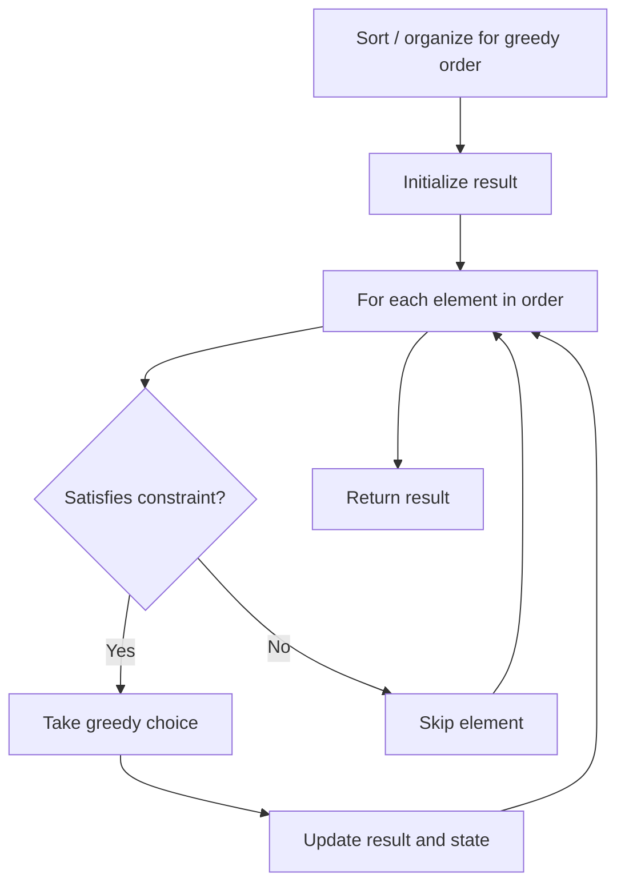

# Problem 1330: Reverse Subarray To Maximize Array Value

**Difficulty:** Hard  
**Tags:** Array, Math, Greedy  
**Pattern:** Greedy  
**Link:** [leetcode.com/problems/reverse-subarray-to-maximize-array-value](https://leetcode.com/problems/reverse-subarray-to-maximize-array-value/)

## Description

You are given an integer array `nums`. The *value* of this array is defined as the sum of `|nums[i] - nums[i + 1]|` for all `0 <= i < nums.length - 1`.

You are allowed to select any subarray of the given array and reverse it. You can perform this operation **only once**.

Find maximum possible value of the final array.

 

Example 1:

```

**Input:** nums = [2,3,1,5,4]
**Output:** 10
**Explanation: **By reversing the subarray [3,1,5] the array becomes [2,5,1,3,4] whose value is 10.

```

Example 2:

```

**Input:** nums = [2,4,9,24,2,1,10]
**Output:** 68

```

 

**Constraints:**

	- `2 <= nums.length <= 3 * 10^4`
	- `-10^5 <= nums[i] <= 10^5`
	- The answer is guaranteed to fit in a 32-bit integer.

## Approach: Greedy

Make the locally optimal choice at each step, trusting it leads to a global optimum. Greedy works when the problem has the greedy-choice property and optimal substructure.

## Pseudocode

```
1. Sort or organize data for greedy ordering
2. Initialize result
3. For each element in greedy order:
   a. If element satisfies constraint:
      - Take the greedy choice
      - Update result and state
4. Return result
```

## Algorithm Flow



## Complexity Analysis

- **Time:** O(n log n)
- **Space:** O(1)

## Solution (Python3)

```python
class Solution:
    def maxValueAfterReverse(self, nums: List[int]) -> int:
        # Greedy approach - O(n) time
        result = 0
        curr_max = 0
        for i in range(len(nums)):
            if isinstance(nums[i], int):
                curr_max = max(curr_max, nums[i])
                result = max(result, curr_max)
            else:
                result += 1
        return result
```

## Solution (C++)

```cpp
#include <algorithm>
#include <string>
#include <vector>
using namespace std;

class Solution {
public:
    int maxValueAfterReverse(vector<int>& nums) {
        // Greedy approach - O(n) time
        int result = 0, curr_max = 0;
        for (int i = 0; i < (int)nums.size(); i++) {
            curr_max = max(curr_max, nums[i]);
            result = max(result, curr_max);
        }
        return result;
    }
};
```
