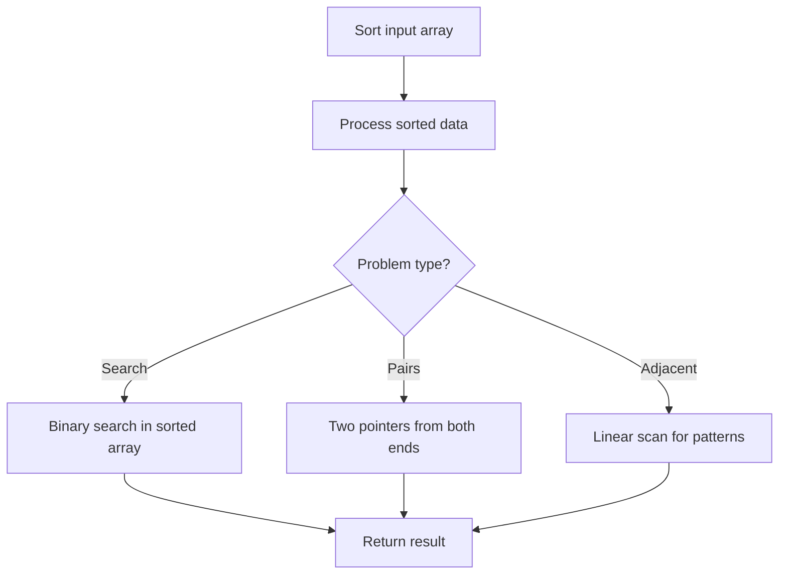

# Problem 1331: Rank Transform of an Array

**Difficulty:** Easy  
**Tags:** Array, Hash Table, Sorting  
**Pattern:** Sorting  
**Link:** [leetcode.com/problems/rank-transform-of-an-array](https://leetcode.com/problems/rank-transform-of-an-array/)

## Description

Given an array of integers `arr`, replace each element with its rank.

The rank represents how large the element is. The rank has the following rules:

	- Rank is an integer starting from 1.
	- The larger the element, the larger the rank. If two elements are equal, their rank must be the same.
	- Rank should be as small as possible.

 

Example 1:

```

**Input:** arr = [40,10,20,30]
**Output:** [4,1,2,3]
**Explanation**: 40 is the largest element. 10 is the smallest. 20 is the second smallest. 30 is the third smallest.
```

Example 2:

```

**Input:** arr = [100,100,100]
**Output:** [1,1,1]
**Explanation**: Same elements share the same rank.

```

Example 3:

```

**Input:** arr = [37,12,28,9,100,56,80,5,12]
**Output:** [5,3,4,2,8,6,7,1,3]

```

 

**Constraints:**

	- `0 <= arr.length <= 10^5`
	- `-10^9 <= arr[i] <= 10^9`

## Approach: Sorting

Sort the data to enable efficient processing. After sorting, use techniques like binary search, two pointers, or linear scan to solve the problem.

## Pseudocode

```
1. Sort the input array
2. Process sorted data:
   - Use binary search for lookups
   - Use two pointers for pair finding
   - Scan for adjacent patterns
3. Return result
```

## Algorithm Flow



## Complexity Analysis

- **Time:** O(n log n)
- **Space:** O(n)

## Solution (Python3)

```python
class Solution:
    def arrayRankTransform(self, arr: List[int]) -> List[int]:
        # Sort-based approach - O(n log n) time
        arr.sort(key=lambda x: x[0] if isinstance(x, (list, tuple)) else x)
        result = [arr[0]]
        for i in range(1, len(arr)):
            curr = arr[i]
            if isinstance(curr, (list, tuple)) and isinstance(result[-1], (list, tuple)):
                if curr[0] <= result[-1][1]:
                    result[-1] = [result[-1][0], max(result[-1][1], curr[1])]
                else:
                    result.append(curr)
            else:
                result.append(curr)
        return result
```

## Solution (C++)

```cpp
#include <algorithm>
#include <string>
#include <vector>
using namespace std;

class Solution {
public:
    vector<int> arrayRankTransform(vector<int>& arr) {
        // Sort-based approach - O(n log n) time
        sort(arr.begin(), arr.end());
        vector<vector<int>> result;
        result.push_back(arr[0]);
        for (int i = 1; i < (int)arr.size(); i++) {
            if (arr[i][0] <= result.back()[1]) {
                result.back()[1] = max(result.back()[1], arr[i][1]);
            } else {
                result.push_back(arr[i]);
            }
        }
        return result;
    }
};
```
