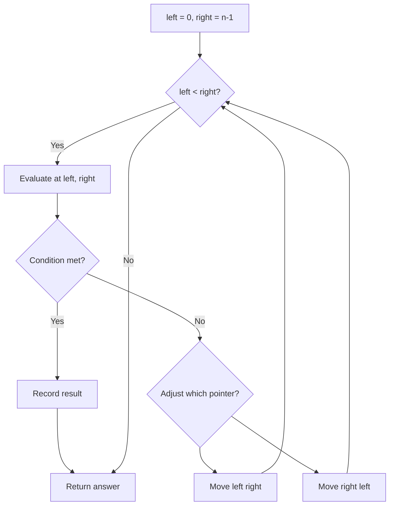
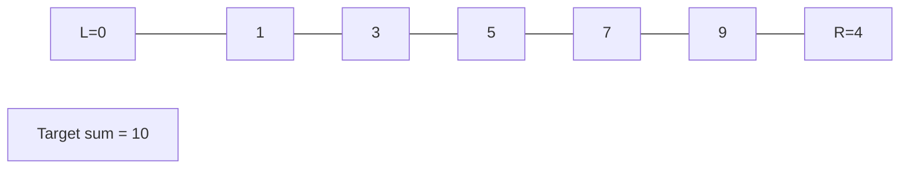
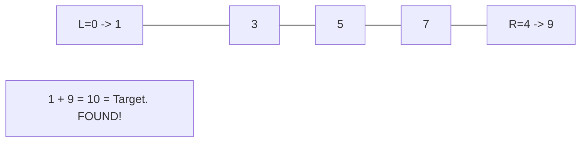

# Problem 1332: Remove Palindromic Subsequences

**Difficulty:** Easy  
**Tags:** Two Pointers, String  
**Pattern:** Two Pointers  
**Link:** [leetcode.com/problems/remove-palindromic-subsequences](https://leetcode.com/problems/remove-palindromic-subsequences/)

## Description

You are given a string `s` consisting **only** of letters `'a'` and `'b'`. In a single step you can remove one **palindromic subsequence** from `s`.

Return *the **minimum** number of steps to make the given string empty*.

A string is a **subsequence** of a given string if it is generated by deleting some characters of a given string without changing its order. Note that a subsequence does **not** necessarily need to be contiguous.

A string is called **palindrome** if is one that reads the same backward as well as forward.

 

Example 1:

```

**Input:** s = "ababa"
**Output:** 1
**Explanation:** s is already a palindrome, so its entirety can be removed in a single step.

```

Example 2:

```

**Input:** s = "abb"
**Output:** 2
**Explanation:** "abb" -> "bb" -> "". 
Remove palindromic subsequence "a" then "bb".

```

Example 3:

```

**Input:** s = "baabb"
**Output:** 2
**Explanation:** "baabb" -> "b" -> "". 
Remove palindromic subsequence "baab" then "b".

```

 

**Constraints:**

	- `1 <= s.length <= 1000`
	- `s[i]` is either `'a'` or `'b'`.

## Approach: Two Pointers

Use two pointers moving through the data structure. Depending on the problem, pointers may move toward each other (converging), in the same direction (fast/slow), or independently.

## Pseudocode

```
1. Initialize left = 0, right = n-1 (or two independent pointers)
2. While pointers haven't crossed:
   a. Evaluate condition at pointer positions
   b. Move left pointer right or right pointer left
3. Return result
```

## Algorithm Flow



## Visual State Transitions

**Two Pointer Convergence:**

**Frame 1: Initialize pointers**


**Frame 2: Sum = 1+9 = 10, found!**



## Complexity Analysis

- **Time:** O(n)
- **Space:** O(1)

## Solution (Python3)

```python
class Solution:
    def removePalindromeSub(self, s: str) -> int:
        # Two pointer approach - O(n) time, O(1) space
        left, right = 0, len(s) - 1
        while left < right:
            curr = s[left] + s[right]
            if curr == s:
                return [left, right]
            elif curr < s:
                left += 1
            else:
                right -= 1
        return 0
```

## Solution (C++)

```cpp
#include <string>
#include <vector>
using namespace std;

class Solution {
public:
    int removePalindromeSub(string& s) {
        // Two pointer approach - O(n) time, O(1) space
        int left = 0, right = s.size() - 1;
        while (left < right) {
            int curr = s[left] + s[right];
            if (curr == s) {
                return {left, right};
            } else if (curr < s) {
                left++;
            } else {
                right--;
            }
        }
        return 0;
    }
};
```
