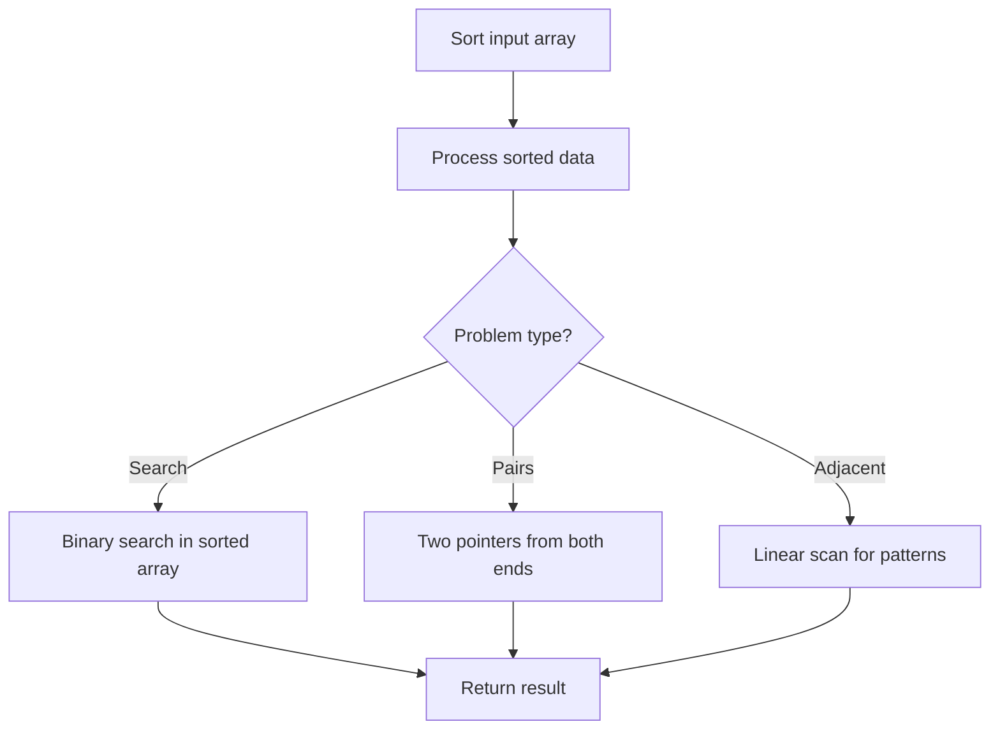

# Problem 1333: Filter Restaurants by Vegan-Friendly, Price and Distance

**Difficulty:** Medium  
**Tags:** Array, Sorting  
**Pattern:** Sorting  
**Link:** [leetcode.com/problems/filter-restaurants-by-vegan-friendly-price-and-distance](https://leetcode.com/problems/filter-restaurants-by-vegan-friendly-price-and-distance/)

## Description

Given the array `restaurants` where  `restaurants[i] = [idi, ratingi, veganFriendlyi, pricei, distancei]`. You have to filter the restaurants using three filters.

The `veganFriendly` filter will be either *true* (meaning you should only include restaurants with `veganFriendlyi` set to true) or *false* (meaning you can include any restaurant). In addition, you have the filters `maxPrice` and `maxDistance` which are the maximum value for price and distance of restaurants you should consider respectively.

Return the array of restaurant ***IDs*** after filtering, ordered by **rating** from highest to lowest. For restaurants with the same rating, order them by ***id*** from highest to lowest. For simplicity `veganFriendlyi` and `veganFriendly` take value *1* when it is *true*, and *0* when it is *false*.

 

Example 1:

```

**Input:** restaurants = [[1,4,1,40,10],[2,8,0,50,5],[3,8,1,30,4],[4,10,0,10,3],[5,1,1,15,1]], veganFriendly = 1, maxPrice = 50, maxDistance = 10
**Output:** [3,1,5] 
Explanation: 
The restaurants are:
Restaurant 1 [id=1, rating=4, veganFriendly=1, price=40, distance=10]
Restaurant 2 [id=2, rating=8, veganFriendly=0, price=50, distance=5]
Restaurant 3 [id=3, rating=8, veganFriendly=1, price=30, distance=4]
Restaurant 4 [id=4, rating=10, veganFriendly=0, price=10, distance=3]
Restaurant 5 [id=5, rating=1, veganFriendly=1, price=15, distance=1] 
After filter restaurants with veganFriendly = 1, maxPrice = 50 and maxDistance = 10 we have restaurant 3, restaurant 1 and restaurant 5 (ordered by rating from highest to lowest). 

```

Example 2:

```

**Input:** restaurants = [[1,4,1,40,10],[2,8,0,50,5],[3,8,1,30,4],[4,10,0,10,3],[5,1,1,15,1]], veganFriendly = 0, maxPrice = 50, maxDistance = 10
**Output:** [4,3,2,1,5]
**Explanation:** The restaurants are the same as in example 1, but in this case the filter veganFriendly = 0, therefore all restaurants are considered.

```

Example 3:

```

**Input:** restaurants = [[1,4,1,40,10],[2,8,0,50,5],[3,8,1,30,4],[4,10,0,10,3],[5,1,1,15,1]], veganFriendly = 0, maxPrice = 30, maxDistance = 3
**Output:** [4,5]

```

 

**Constraints:**

	- `1 <= restaurants.length <= 10^4`
	- `restaurants[i].length == 5`
	- `1 <= idi, ratingi, pricei, distancei <= 10^5`
	- `1 <= maxPrice, maxDistance <= 10^5`
	- `veganFriendlyi` and `veganFriendly` are 0 or 1.
	- All `idi` are distinct.

## Approach: Sorting

Sort the data to enable efficient processing. After sorting, use techniques like binary search, two pointers, or linear scan to solve the problem.

## Pseudocode

```
1. Sort the input array
2. Process sorted data:
   - Use binary search for lookups
   - Use two pointers for pair finding
   - Scan for adjacent patterns
3. Return result
```

## Algorithm Flow



## Complexity Analysis

- **Time:** O(n log n)
- **Space:** O(n)

## Solution (Python3)

```python
class Solution:
    def filterRestaurants(self, restaurants: List[List[int]], veganFriendly: int, maxPrice: int, maxDistance: int) -> List[int]:
        # Sort-based approach - O(n log n) time
        restaurants.sort(key=lambda x: x[0] if isinstance(x, (list, tuple)) else x)
        result = [restaurants[0]]
        for i in range(1, len(restaurants)):
            curr = restaurants[i]
            if isinstance(curr, (list, tuple)) and isinstance(result[-1], (list, tuple)):
                if curr[0] <= result[-1][1]:
                    result[-1] = [result[-1][0], max(result[-1][1], curr[1])]
                else:
                    result.append(curr)
            else:
                result.append(curr)
        return result
```

## Solution (C++)

```cpp
#include <algorithm>
#include <string>
#include <vector>
using namespace std;

class Solution {
public:
    vector<int> filterRestaurants(vector<vector<int>>& restaurants, int veganFriendly, int maxPrice, int maxDistance) {
        // Sort-based approach - O(n log n) time
        sort(restaurants.begin(), restaurants.end());
        vector<vector<int>> result;
        result.push_back(restaurants[0]);
        for (int i = 1; i < (int)restaurants.size(); i++) {
            if (restaurants[i][0] <= result.back()[1]) {
                result.back()[1] = max(result.back()[1], restaurants[i][1]);
            } else {
                result.push_back(restaurants[i]);
            }
        }
        return result;
    }
};
```
