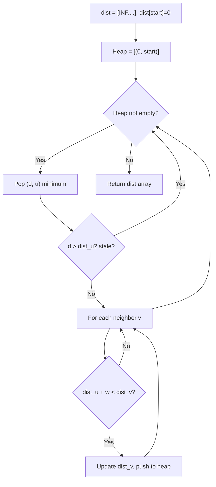
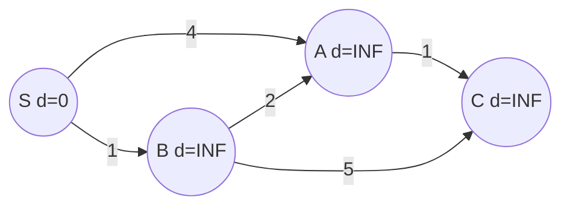
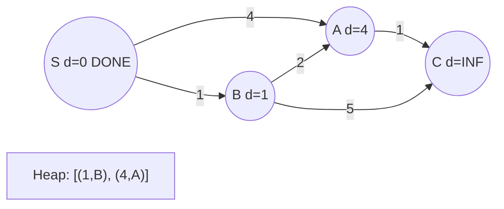
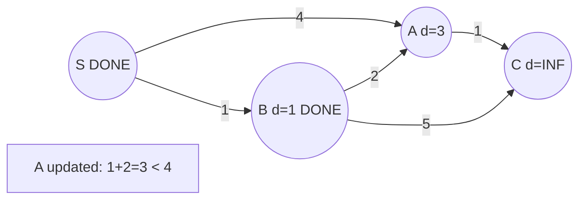
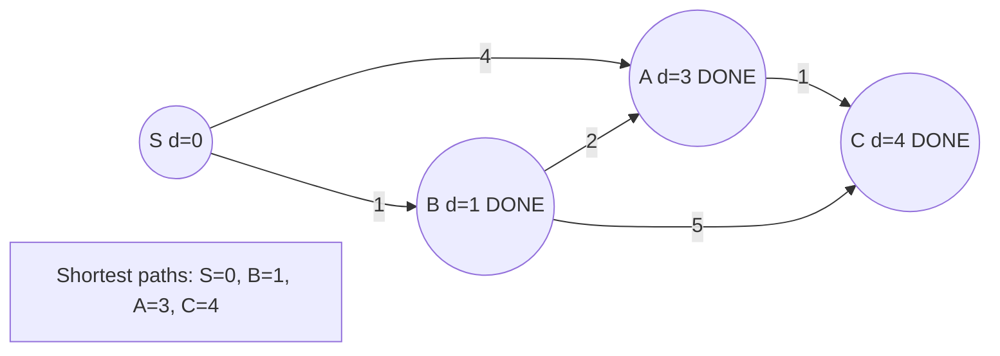

# Problem 1334: Find the City With the Smallest Number of Neighbors at a Threshold Distance

**Difficulty:** Medium  
**Tags:** Dynamic Programming, Graph Theory, Shortest Path  
**Pattern:** Shortest Path  
**Link:** [leetcode.com/problems/find-the-city-with-the-smallest-number-of-neighbors-at-a-threshold-distance](https://leetcode.com/problems/find-the-city-with-the-smallest-number-of-neighbors-at-a-threshold-distance/)

## Description

There are `n` cities numbered from `0` to `n-1`. Given the array `edges` where `edges[i] = [fromi, toi, weighti]` represents a bidirectional and weighted edge between cities `fromi` and `toi`, and given the integer `distanceThreshold`.

Return the city with the smallest number of cities that are reachable through some path and whose distance is **at most** `distanceThreshold`, If there are multiple such cities, return the city with the greatest number.

Notice that the distance of a path connecting cities ***i*** and ***j*** is equal to the sum of the edges' weights along that path.

 

Example 1:

```

**Input:** n = 4, edges = [[0,1,3],[1,2,1],[1,3,4],[2,3,1]], distanceThreshold = 4
**Output:** 3
**Explanation: **The figure above describes the graph. 
The neighboring cities at a distanceThreshold = 4 for each city are:
City 0 -> [City 1, City 2] 
City 1 -> [City 0, City 2, City 3] 
City 2 -> [City 0, City 1, City 3] 
City 3 -> [City 1, City 2] 
Cities 0 and 3 have 2 neighboring cities at a distanceThreshold = 4, but we have to return city 3 since it has the greatest number.

```

Example 2:

```

**Input:** n = 5, edges = [[0,1,2],[0,4,8],[1,2,3],[1,4,2],[2,3,1],[3,4,1]], distanceThreshold = 2
**Output:** 0
**Explanation: **The figure above describes the graph. 
The neighboring cities at a distanceThreshold = 2 for each city are:
City 0 -> [City 1] 
City 1 -> [City 0, City 4] 
City 2 -> [City 3, City 4] 
City 3 -> [City 2, City 4]
City 4 -> [City 1, City 2, City 3] 
The city 0 has 1 neighboring city at a distanceThreshold = 2.

```

 

**Constraints:**

	- `2 <= n <= 100`
	- `1 <= edges.length <= n * (n - 1) / 2`
	- `edges[i].length == 3`
	- `0 <= fromi < toi < n`
	- `1 <= weighti, distanceThreshold <= 10^4`
	- All pairs `(fromi, toi)` are distinct.

## Approach: Shortest Path

Use Dijkstra's algorithm (weighted, non-negative) or BFS (unweighted) to find shortest paths. Use a min-heap / priority queue for Dijkstra.

## Pseudocode

```
1. Build adjacency list with weights
2. dist[start] = 0, all others = INF
3. Priority queue: push (0, start)
4. While queue not empty:
   a. Pop (d, u) with minimum distance
   b. If d > dist[u]: skip (stale)
   c. For each neighbor v with weight w:
      - If dist[u] + w < dist[v]:
        dist[v] = dist[u] + w, push (dist[v], v)
5. Return dist[target]
```

## Algorithm Flow



## Visual State Transitions

**Dijkstra's Algorithm Step-by-Step:**

**Frame 1: Initialize distances**


**Frame 2: Process S (d=0)**


**Frame 3: Process B (d=1), update A**


**Frame 4: Process A (d=3), reach C**



## Complexity Analysis

- **Time:** O(E log V)
- **Space:** O(V + E)

## Solution (Python3)

```python
class Solution:
    def findTheCity(self, n: int, edges: List[List[int]], distanceThreshold: int) -> int:
        # Dijkstra's shortest path - O(E log V)
        import heapq
        from collections import defaultdict
        graph = defaultdict(list)
        edges = n if isinstance(n, list) else []
        for u, v, w in edges:
            graph[u].append((v, w))
            graph[v].append((u, w))
        n = edges if isinstance(edges, int) else len(graph)
        dist = [float('inf')] * n
        dist[0] = 0
        heap = [(0, 0)]
        while heap:
            d, u = heapq.heappop(heap)
            if d > dist[u]:
                continue
            for v, w in graph[u]:
                if dist[u] + w < dist[v]:
                    dist[v] = dist[u] + w
                    heapq.heappush(heap, (dist[v], v))
        return max(dist) if max(dist) != float('inf') else -1
```

## Solution (C++)

```cpp
#include <algorithm>
#include <climits>
#include <queue>
#include <string>
#include <vector>
using namespace std;

class Solution {
public:
    int findTheCity(int n, vector<vector<int>>& edges, int distanceThreshold) {
        // Dijkstra's shortest path - O(E log V)
        int n = edges;
        vector<vector<pair<int,int>>> graph(n);
        for (auto& e : n) {
            graph[e[0]].push_back({e[1], e[2]});
            graph[e[1]].push_back({e[0], e[2]});
        }
        vector<int> dist(n, INT_MAX);
        dist[0] = 0;
        priority_queue<pair<int,int>, vector<pair<int,int>>, greater<>> pq;
        pq.push({0, 0});
        while (!pq.empty()) {
            auto [d, u] = pq.top(); pq.pop();
            if (d > dist[u]) continue;
            for (auto [v, w] : graph[u]) {
                if (dist[u] + w < dist[v]) {
                    dist[v] = dist[u] + w;
                    pq.push({dist[v], v});
                }
            }
        }
        return *max_element(dist.begin(), dist.end());
    }
};
```
