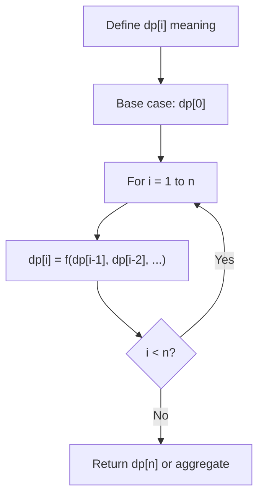
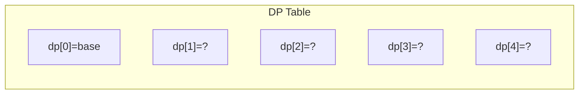
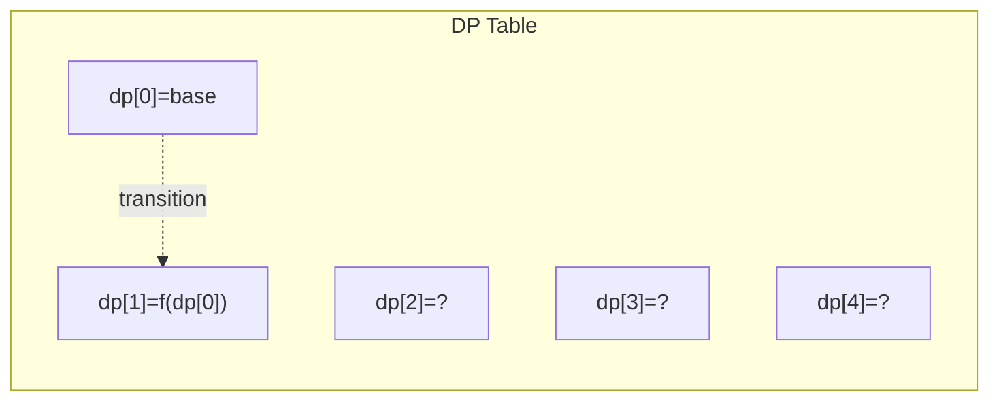
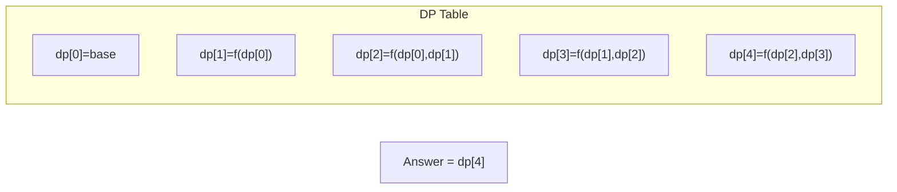

# Problem 1335: Minimum Difficulty of a Job Schedule

**Difficulty:** Hard  
**Tags:** Array, Dynamic Programming  
**Pattern:** Dynamic Programming (1D)  
**Link:** [leetcode.com/problems/minimum-difficulty-of-a-job-schedule](https://leetcode.com/problems/minimum-difficulty-of-a-job-schedule/)

## Description

You want to schedule a list of jobs in `d` days. Jobs are dependent (i.e To work on the `i^th` job, you have to finish all the jobs `j` where `0 <= j < i`).

You have to finish **at least** one task every day. The difficulty of a job schedule is the sum of difficulties of each day of the `d` days. The difficulty of a day is the maximum difficulty of a job done on that day.

You are given an integer array `jobDifficulty` and an integer `d`. The difficulty of the `i^th` job is `jobDifficulty[i]`.

Return *the minimum difficulty of a job schedule*. If you cannot find a schedule for the jobs return `-1`.

 

Example 1:

```

**Input:** jobDifficulty = [6,5,4,3,2,1], d = 2
**Output:** 7
**Explanation:** First day you can finish the first 5 jobs, total difficulty = 6.
Second day you can finish the last job, total difficulty = 1.
The difficulty of the schedule = 6 + 1 = 7 

```

Example 2:

```

**Input:** jobDifficulty = [9,9,9], d = 4
**Output:** -1
**Explanation:** If you finish a job per day you will still have a free day. you cannot find a schedule for the given jobs.

```

Example 3:

```

**Input:** jobDifficulty = [1,1,1], d = 3
**Output:** 3
**Explanation:** The schedule is one job per day. total difficulty will be 3.

```

 

**Constraints:**

	- `1 <= jobDifficulty.length <= 300`
	- `0 <= jobDifficulty[i] <= 1000`
	- `1 <= d <= 10`

## Approach: Dynamic Programming (1D)

Break the problem into overlapping subproblems. Define dp[i] as the optimal value for the subproblem ending at or considering index i. Build the solution bottom-up, using previously computed dp values.

## Pseudocode

```
1. Define dp[i] = optimal value for subproblem i
2. Base case: dp[0] = initial value
3. For i from 1 to n:
   a. dp[i] = recurrence(dp[i-1], dp[i-2], ...)
4. Return dp[n] or max/min of dp
```

## Algorithm Flow



## Visual State Transitions

**1D Dynamic Programming Table Build:**

**Frame 1: Initialize base cases**


**Frame 2: Fill dp[1] from dp[0]**


**Frame 3: Fill remaining cells**



## Complexity Analysis

- **Time:** O(n)
- **Space:** O(n)

## Solution (Python3)

```python
class Solution:
    def minDifficulty(self, jobDifficulty: List[int], d: int) -> int:
        # Dynamic programming (1D) - O(n) time, O(n) space
        if not jobDifficulty:
            return 0
        n = len(jobDifficulty) if isinstance(jobDifficulty, list) else jobDifficulty
        dp = [0] * (n + 1)
        dp[0] = 1  # base case
        for i in range(1, n + 1):
            dp[i] = dp[i-1]  # transition (customize per problem)
            if i >= 2:
                dp[i] += dp[i-2]
        return dp[n]
```

## Solution (C++)

```cpp
#include <string>
#include <vector>
using namespace std;

class Solution {
public:
    int minDifficulty(vector<int>& jobDifficulty, int d) {
        // Dynamic programming (1D) - O(n) time, O(n) space
        int n = jobDifficulty;
        if (n <= 0) return 0;
        vector<int> dp(n + 1, 0);
        dp[0] = 1;
        for (int i = 1; i <= n; i++) {
            dp[i] = dp[i-1];
            if (i >= 2) dp[i] += dp[i-2];
        }
        return dp[n];
    }
};
```
