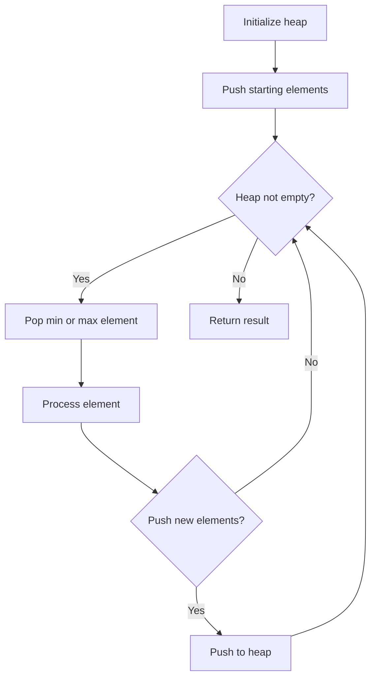
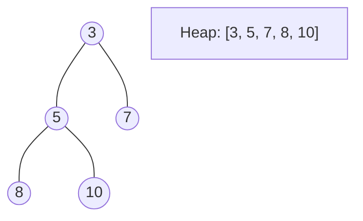
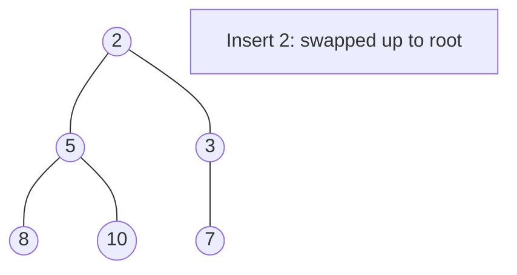
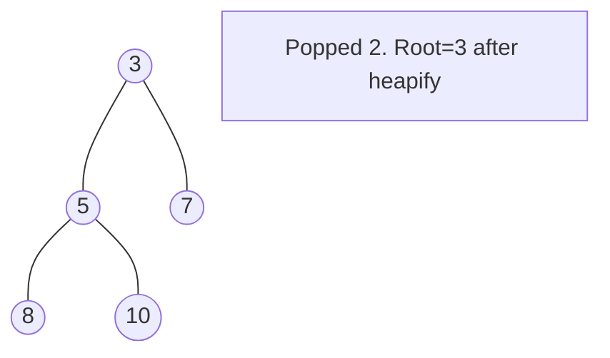

# Problem 1337: The K Weakest Rows in a Matrix

**Difficulty:** Easy  
**Tags:** Array, Binary Search, Sorting, Heap (Priority Queue), Matrix  
**Pattern:** Heap / Sorting  
**Link:** [leetcode.com/problems/the-k-weakest-rows-in-a-matrix](https://leetcode.com/problems/the-k-weakest-rows-in-a-matrix/)

## Description

You are given an `m x n` binary matrix `mat` of `1`'s (representing soldiers) and `0`'s (representing civilians). The soldiers are positioned **in front** of the civilians. That is, all the `1`'s will appear to the **left** of all the `0`'s in each row.

A row `i` is **weaker** than a row `j` if one of the following is true:

	- The number of soldiers in row `i` is less than the number of soldiers in row `j`.
	- Both rows have the same number of soldiers and `i < j`.

Return *the indices of the *`k`* **weakest** rows in the matrix ordered from weakest to strongest*.

 

Example 1:

```

**Input:** mat = 
[[1,1,0,0,0],
 [1,1,1,1,0],
 [1,0,0,0,0],
 [1,1,0,0,0],
 [1,1,1,1,1]], 
k = 3
**Output:** [2,0,3]
**Explanation:** 
The number of soldiers in each row is: 
- Row 0: 2 
- Row 1: 4 
- Row 2: 1 
- Row 3: 2 
- Row 4: 5 
The rows ordered from weakest to strongest are [2,0,3,1,4].

```

Example 2:

```

**Input:** mat = 
[[1,0,0,0],
 [1,1,1,1],
 [1,0,0,0],
 [1,0,0,0]], 
k = 2
**Output:** [0,2]
**Explanation:** 
The number of soldiers in each row is: 
- Row 0: 1 
- Row 1: 4 
- Row 2: 1 
- Row 3: 1 
The rows ordered from weakest to strongest are [0,2,3,1].

```

 

**Constraints:**

	- `m == mat.length`
	- `n == mat[i].length`
	- `2 <= n, m <= 100`
	- `1 <= k <= m`
	- `matrix[i][j]` is either 0 or 1.

## Approach: Heap / Sorting

Calculate strength per row, use min-heap to get k weakest.

## Pseudocode

```
1. Initialize heap (min or max)
2. Push initial elements onto heap
3. While heap not empty and condition:
   a. Pop top element (min or max)
   b. Process element
   c. Push new elements if needed
4. Return result
```

## Algorithm Flow



## Visual State Transitions

**Heap Operations (Min-Heap):**

**Frame 1: Initial heap**


**Frame 2: Insert 2 - bubble up**


**Frame 3: Pop minimum (2) - heapify down**



## Complexity Analysis

- **Time:** O(m*n + k*log m)
- **Space:** O(m)

## Solution (Python3)

```python
import heapq

class Solution:
    def kWeakestRows(self, mat: list[list[int]], k: int) -> list[int]:
        strengths = [(sum(row), i) for i, row in enumerate(mat)]
        heapq.heapify(strengths)
        return [heapq.heappop(strengths)[1] for _ in range(k)]
```

## Solution (C++)

```cpp
#include <queue>
#include <string>
#include <vector>
using namespace std;

class Solution {
public:
    vector<int> kWeakestRows(vector<vector<int>>& mat, int k) {
        // Heap/Priority Queue - O(n log k) time
        priority_queue<int, vector<int>, greater<int>> pq;
        for (int val : mat) {
            pq.push(val);
            if ((int)pq.size() > k)
                pq.pop();
        }
        return pq.empty() ? {} : pq.top();
    }
};
```
