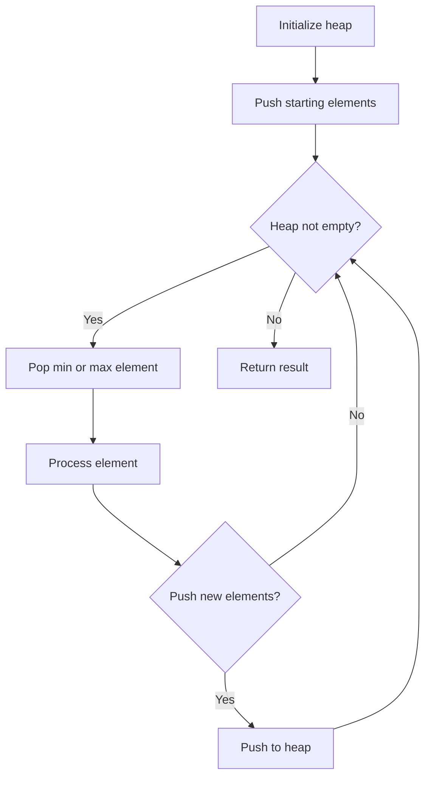
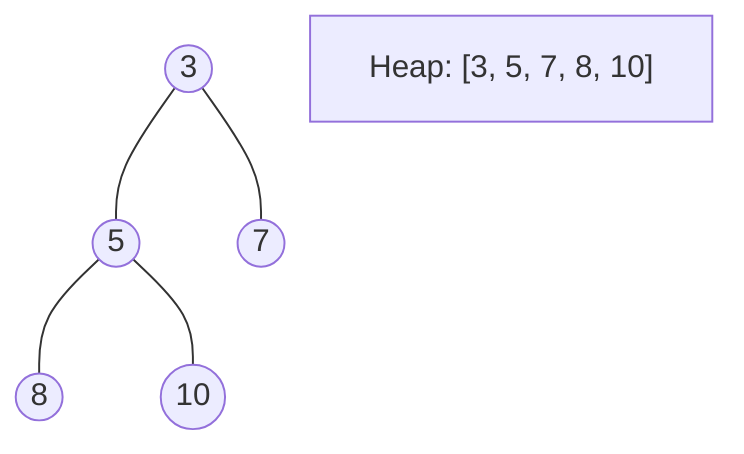
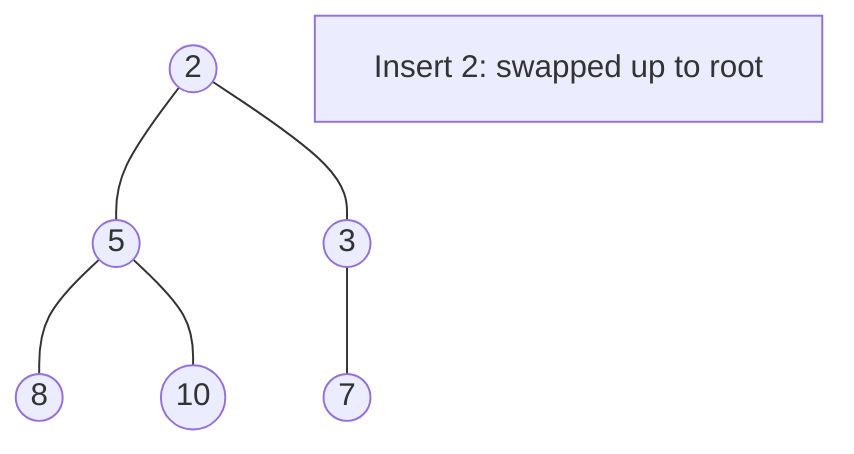
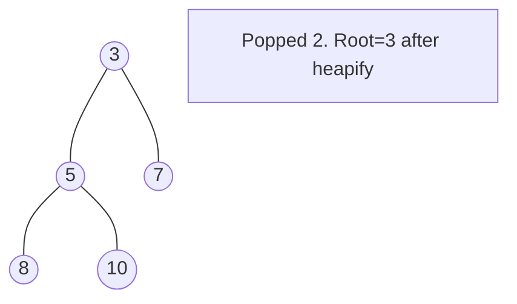

# Problem 1338: Reduce Array Size to The Half

**Difficulty:** Medium  
**Tags:** Array, Hash Table, Greedy, Sorting, Heap (Priority Queue)  
**Pattern:** Heap / Priority Queue  
**Link:** [leetcode.com/problems/reduce-array-size-to-the-half](https://leetcode.com/problems/reduce-array-size-to-the-half/)

## Description

You are given an integer array `arr`. You can choose a set of integers and remove all the occurrences of these integers in the array.

Return *the minimum size of the set so that **at least** half of the integers of the array are removed*.

 

Example 1:

```

**Input:** arr = [3,3,3,3,5,5,5,2,2,7]
**Output:** 2
**Explanation:** Choosing {3,7} will make the new array [5,5,5,2,2] which has size 5 (i.e equal to half of the size of the old array).
Possible sets of size 2 are {3,5},{3,2},{5,2}.
Choosing set {2,7} is not possible as it will make the new array [3,3,3,3,5,5,5] which has a size greater than half of the size of the old array.

```

Example 2:

```

**Input:** arr = [7,7,7,7,7,7]
**Output:** 1
**Explanation:** The only possible set you can choose is {7}. This will make the new array empty.

```

 

**Constraints:**

	- `2 <= arr.length <= 10^5`
	- `arr.length` is even.
	- `1 <= arr[i] <= 10^5`

## Approach: Heap / Priority Queue

Use a min-heap or max-heap to efficiently access the smallest/largest element. Push elements and pop the top to process in priority order.

## Pseudocode

```
1. Initialize heap (min or max)
2. Push initial elements onto heap
3. While heap not empty and condition:
   a. Pop top element (min or max)
   b. Process element
   c. Push new elements if needed
4. Return result
```

## Algorithm Flow



## Visual State Transitions

**Heap Operations (Min-Heap):**

**Frame 1: Initial heap**


**Frame 2: Insert 2 - bubble up**


**Frame 3: Pop minimum (2) - heapify down**



## Complexity Analysis

- **Time:** O(n log n)
- **Space:** O(n)

## Solution (Python3)

```python
class Solution:
    def minSetSize(self, arr: List[int]) -> int:
        # Heap/Priority Queue - O(n log k) time
        import heapq
        if not arr:
            return 0
        # Min heap (negate for max heap)
        heap = []
        for val in arr:
            heapq.heappush(heap, val)
            if len(heap) > (arr if isinstance(arr, int) else len(arr)):
                heapq.heappop(heap)
        return heap[0] if heap else 0
```

## Solution (C++)

```cpp
#include <queue>
#include <string>
#include <vector>
using namespace std;

class Solution {
public:
    int minSetSize(vector<int>& arr) {
        // Heap/Priority Queue - O(n log k) time
        priority_queue<int, vector<int>, greater<int>> pq;
        for (int val : arr) {
            pq.push(val);
            if ((int)pq.size() > arr)
                pq.pop();
        }
        return pq.empty() ? 0 : pq.top();
    }
};
```
