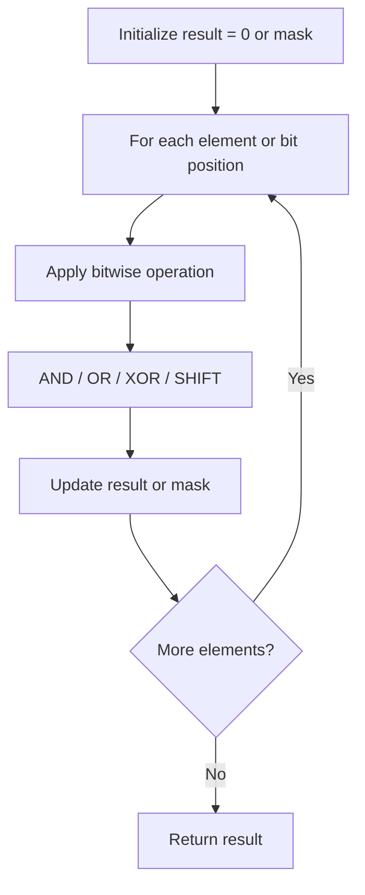

# Problem 1342: Number of Steps to Reduce a Number to Zero

**Difficulty:** Easy  
**Tags:** Math, Bit Manipulation  
**Pattern:** Bit Manipulation  
**Link:** [leetcode.com/problems/number-of-steps-to-reduce-a-number-to-zero](https://leetcode.com/problems/number-of-steps-to-reduce-a-number-to-zero/)

## Description

Given an integer `num`, return *the number of steps to reduce it to zero*.

In one step, if the current number is even, you have to divide it by `2`, otherwise, you have to subtract `1` from it.

 

Example 1:

```

**Input:** num = 14
**Output:** 6
**Explanation:** 
Step 1) 14 is even; divide by 2 and obtain 7. 
Step 2) 7 is odd; subtract 1 and obtain 6.
Step 3) 6 is even; divide by 2 and obtain 3. 
Step 4) 3 is odd; subtract 1 and obtain 2. 
Step 5) 2 is even; divide by 2 and obtain 1. 
Step 6) 1 is odd; subtract 1 and obtain 0.

```

Example 2:

```

**Input:** num = 8
**Output:** 4
**Explanation:** 
Step 1) 8 is even; divide by 2 and obtain 4. 
Step 2) 4 is even; divide by 2 and obtain 2. 
Step 3) 2 is even; divide by 2 and obtain 1. 
Step 4) 1 is odd; subtract 1 and obtain 0.

```

Example 3:

```

**Input:** num = 123
**Output:** 12

```

 

**Constraints:**

	- `0 <= num <= 10^6`

## Approach: Bit Manipulation

Operate on individual bits using bitwise operators (AND, OR, XOR, shift). Common tricks: x & (x-1) removes lowest set bit, x ^ x = 0, XOR all elements to find unique.

## Pseudocode

```
1. Apply bitwise operations:
   - XOR all elements to cancel paired bits
   - Use bitmask to track state
   - Shift and mask to extract/set individual bits
2. Return result
```

## Algorithm Flow



## Complexity Analysis

- **Time:** O(n) or O(log n)
- **Space:** O(1)

## Solution (Python3)

```python
class Solution:
    def numberOfSteps(self, num: int) -> int:
        # Bit manipulation - O(n) time, O(1) space
        result = 0
        for val in num:
            result ^= val
        return result
```

## Solution (C++)

```cpp
#include <string>
#include <vector>
using namespace std;

class Solution {
public:
    int numberOfSteps(int num) {
        // Bit manipulation - O(n) time, O(1) space
        int result = 0;
        for (int val : num) {
            result ^= val;
        }
        return result;
    }
};
```
