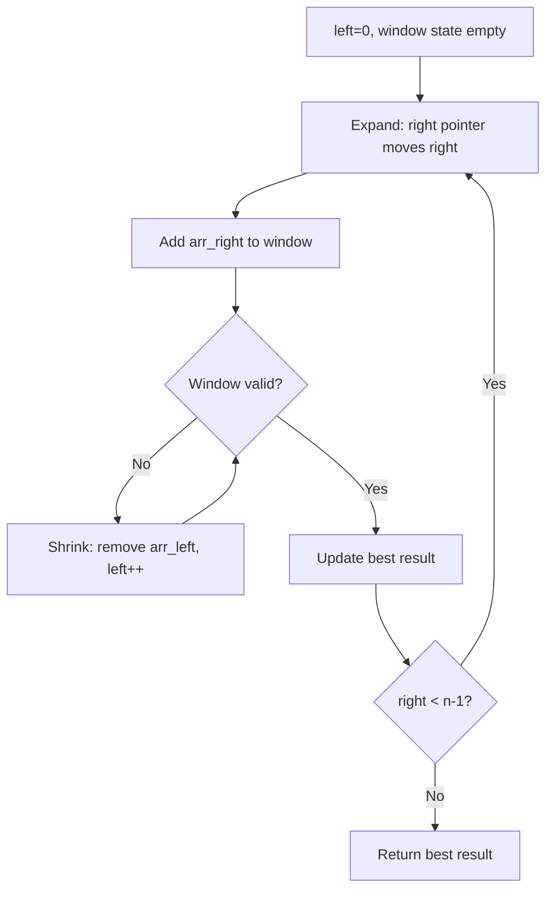
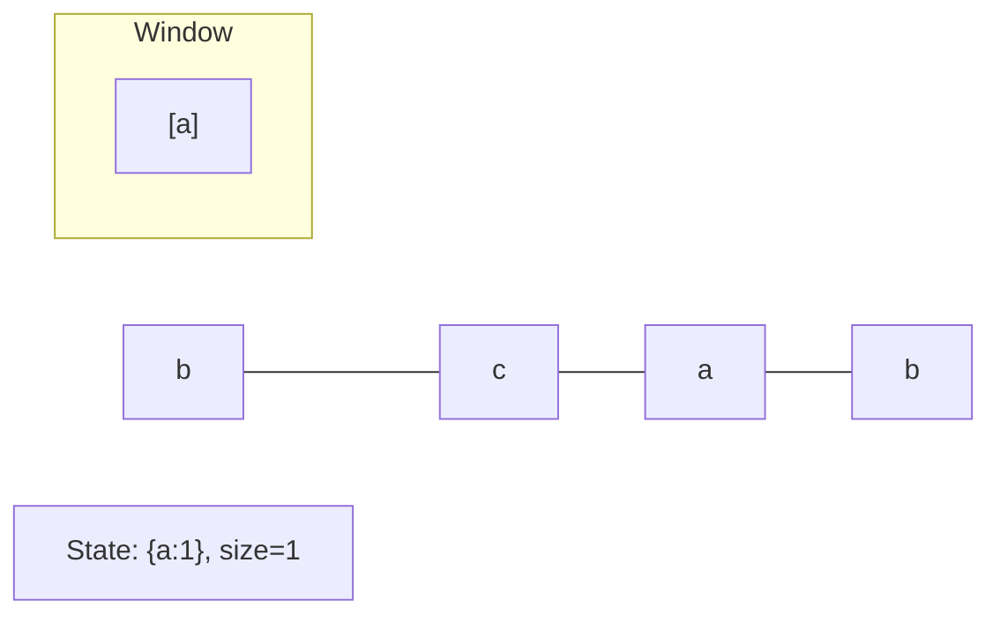
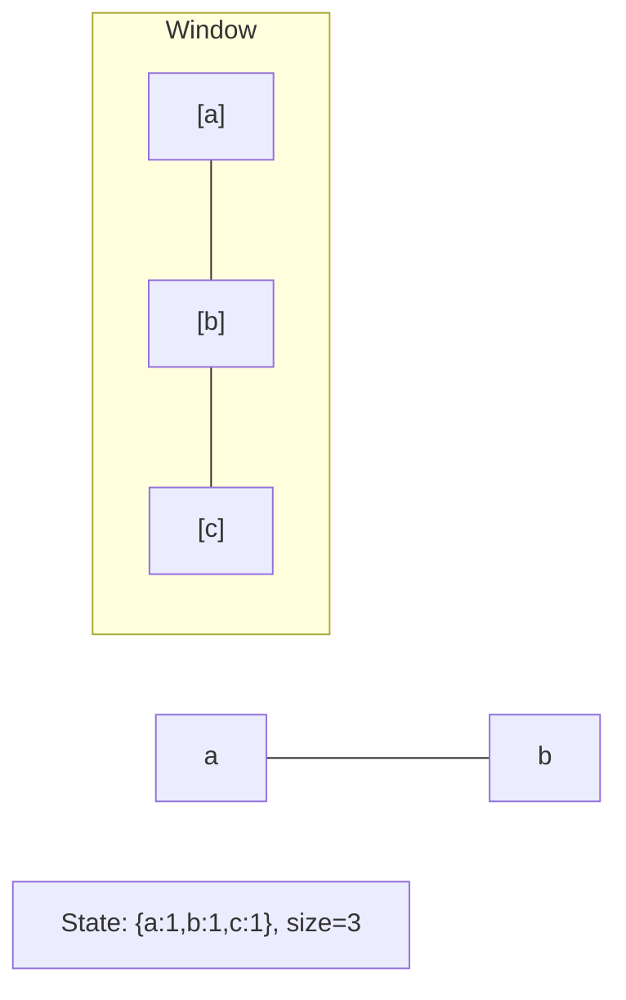
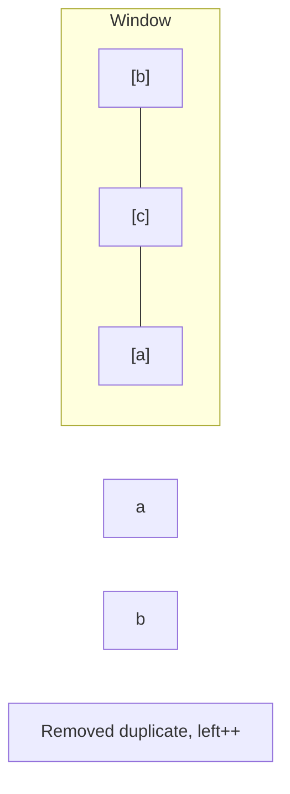
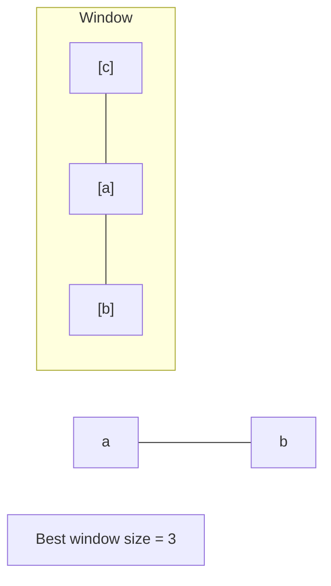

# Problem 1343: Number of Sub-arrays of Size K and Average Greater than or Equal to Threshold

**Difficulty:** Medium  
**Tags:** Array, Sliding Window  
**Pattern:** Sliding Window  
**Link:** [leetcode.com/problems/number-of-sub-arrays-of-size-k-and-average-greater-than-or-equal-to-threshold](https://leetcode.com/problems/number-of-sub-arrays-of-size-k-and-average-greater-than-or-equal-to-threshold/)

## Description

Given an array of integers `arr` and two integers `k` and `threshold`, return *the number of sub-arrays of size *`k`* and average greater than or equal to *`threshold`.

 

Example 1:

```

**Input:** arr = [2,2,2,2,5,5,5,8], k = 3, threshold = 4
**Output:** 3
**Explanation:** Sub-arrays [2,5,5],[5,5,5] and [5,5,8] have averages 4, 5 and 6 respectively. All other sub-arrays of size 3 have averages less than 4 (the threshold).

```

Example 2:

```

**Input:** arr = [11,13,17,23,29,31,7,5,2,3], k = 3, threshold = 5
**Output:** 6
**Explanation:** The first 6 sub-arrays of size 3 have averages greater than 5. Note that averages are not integers.

```

 

**Constraints:**

	- `1 <= arr.length <= 10^5`
	- `1 <= arr[i] <= 10^4`
	- `1 <= k <= arr.length`
	- `0 <= threshold <= 10^4`

## Approach: Sliding Window

Maintain a window over the data using two pointers. Expand the right boundary to include new elements, and shrink the left boundary when the window constraint is violated. Track the optimal window.

## Pseudocode

```
1. Initialize left = 0, result = initial_value
2. For right in range(n):
   a. Add element at right to window state
   b. While window is invalid:
      - Remove element at left from window state
      - left++
   c. Update result = best of (result, window size/value)
3. Return result
```

## Algorithm Flow



## Visual State Transitions

**Sliding Window Step-by-Step:**

**Frame 1: Initial window (left=0, right=0)**


**Frame 2: Expand right (right=2)**


**Frame 3: Violation - shrink left**


**Frame 4: Continue expanding**



## Complexity Analysis

- **Time:** O(n)
- **Space:** O(k)

## Solution (Python3)

```python
class Solution:
    def numOfSubarrays(self, arr: List[int], k: int, threshold: int) -> int:
        # Sliding window approach - O(n) time, O(k) space
        from collections import defaultdict
        window = defaultdict(int)
        left = 0
        result = 0
        for right in range(len(arr)):
            window[arr[right]] += 1
            while len(window) > (k if isinstance(k, int) else len(arr)):
                window[arr[left]] -= 1
                if window[arr[left]] == 0:
                    del window[arr[left]]
                left += 1
            result = max(result, right - left + 1)
        return result
```

## Solution (C++)

```cpp
#include <algorithm>
#include <string>
#include <unordered_map>
#include <vector>
using namespace std;

class Solution {
public:
    int numOfSubarrays(vector<int>& arr, int k, int threshold) {
        // Sliding window approach - O(n) time, O(k) space
        unordered_map<char, int> window;
        int left = 0, result = 0;
        for (int right = 0; right < arr.size(); right++) {
            window[arr[right]]++;
            while ((int)window.size() > k) {
                window[arr[left]]--;
                if (window[arr[left]] == 0)
                    window.erase(arr[left]);
                left++;
            }
            result = max(result, right - left + 1);
        }
        return result;
    }
};
```
