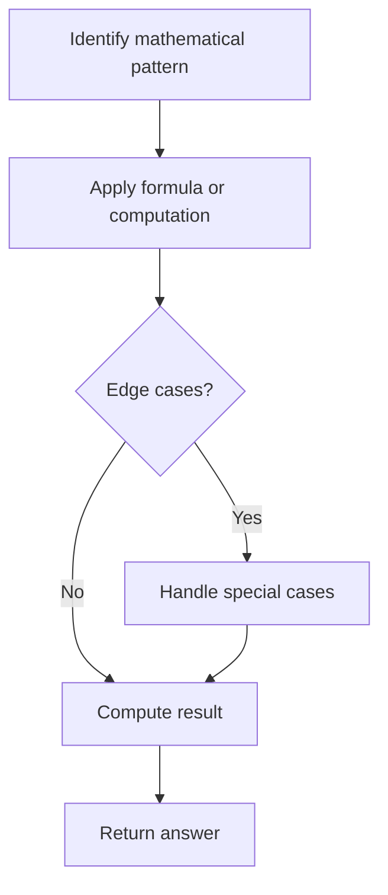

# Problem 1344: Angle Between Hands of a Clock

**Difficulty:** Medium  
**Tags:** Math  
**Pattern:** Math  
**Link:** [leetcode.com/problems/angle-between-hands-of-a-clock](https://leetcode.com/problems/angle-between-hands-of-a-clock/)

## Description

Given two numbers, `hour` and `minutes`, return *the smaller angle (in degrees) formed between the *`hour`* and the *`minute`* hand*.

Answers within `10^-5` of the actual value will be accepted as correct.

 

Example 1:

```

**Input:** hour = 12, minutes = 30
**Output:** 165

```

Example 2:

```

**Input:** hour = 3, minutes = 30
**Output:** 75

```

Example 3:

```

**Input:** hour = 3, minutes = 15
**Output:** 7.5

```

 

**Constraints:**

	- `1 <= hour <= 12`
	- `0 <= minutes <= 59`

## Approach: Math

Apply mathematical properties, formulas, or number-theoretic concepts. Look for patterns, modular arithmetic, or closed-form solutions.

## Pseudocode

```
1. Identify the mathematical pattern or formula
2. Apply computation:
   - Modular arithmetic for large numbers
   - GCD/LCM for divisibility
   - Sieve for primes
3. Handle edge cases
4. Return result
```

## Algorithm Flow



## Complexity Analysis

- **Time:** O(n) or O(sqrt(n))
- **Space:** O(1)

## Solution (Python3)

```python
class Solution:
    def angleClock(self, hour: int, minutes: int) -> float:
        # Mathematical approach
        result = 0
        x = hour
        while x != 0:
            result = result * 10 + x % 10
            x //= 10 if isinstance(x, int) else 1
        return result
```

## Solution (C++)

```cpp
#include <string>
#include <vector>
using namespace std;

class Solution {
public:
    double angleClock(int hour, int minutes) {
        // Mathematical approach
        long long result = 0;
        int x = hour;
        while (x != 0) {
            result = result * 10 + x % 10;
            x /= 10;
        }
        return (int)result;
    }
};
```
