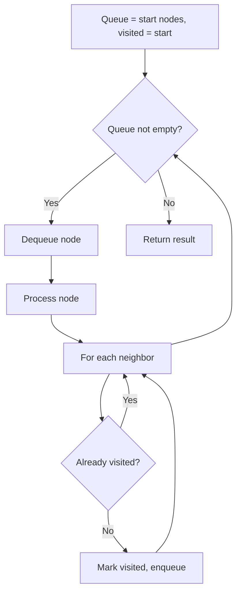
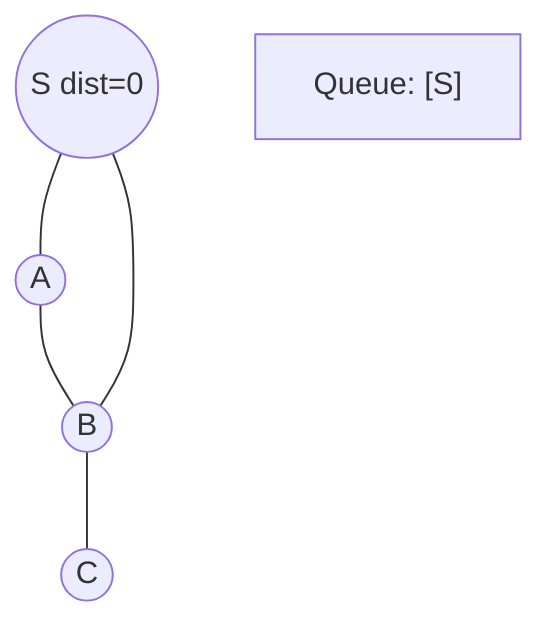
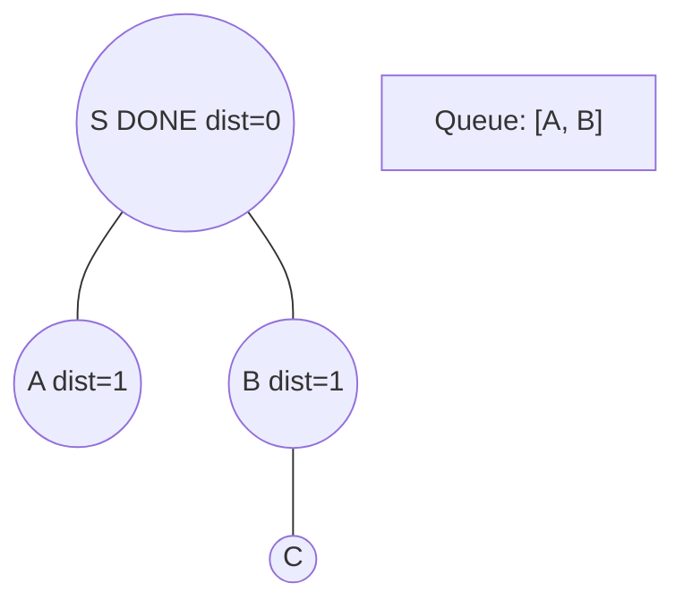
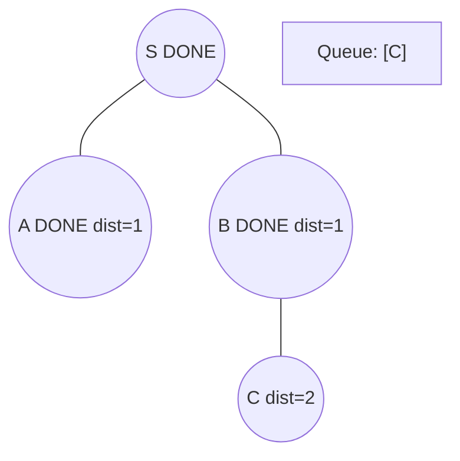
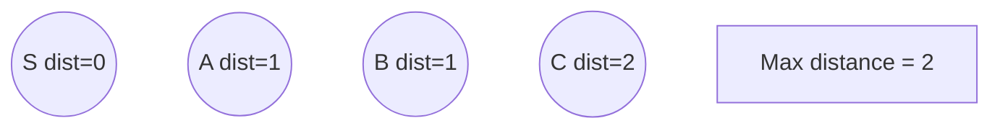

# Problem 1345: Jump Game IV

**Difficulty:** Hard  
**Tags:** Array, Hash Table, Breadth-First Search  
**Pattern:** BFS Graph Traversal  
**Link:** [leetcode.com/problems/jump-game-iv](https://leetcode.com/problems/jump-game-iv/)

## Description

Given an array of integers `arr`, you are initially positioned at the first index of the array.

In one step you can jump from index `i` to index:

	- `i + 1` where: `i + 1 < arr.length`.
	- `i - 1` where: `i - 1 >= 0`.
	- `j` where: `arr[i] == arr[j]` and `i != j`.

Return *the minimum number of steps* to reach the **last index** of the array.

Notice that you can not jump outside of the array at any time.

 

Example 1:

```

**Input:** arr = [100,-23,-23,404,100,23,23,23,3,404]
**Output:** 3
**Explanation:** You need three jumps from index 0 --> 4 --> 3 --> 9. Note that index 9 is the last index of the array.

```

Example 2:

```

**Input:** arr = [7]
**Output:** 0
**Explanation:** Start index is the last index. You do not need to jump.

```

Example 3:

```

**Input:** arr = [7,6,9,6,9,6,9,7]
**Output:** 1
**Explanation:** You can jump directly from index 0 to index 7 which is last index of the array.

```

 

**Constraints:**

	- `1 <= arr.length <= 5 * 10^4`
	- `-10^8 <= arr[i] <= 10^8`

## Approach: BFS Graph Traversal

Explore the graph breadth-first using a queue. Process nodes level by level; BFS finds shortest paths in unweighted graphs.

## Pseudocode

```
1. Initialize queue with start node(s), visited set
2. While queue not empty:
   a. Dequeue node
   b. Process node
   c. For each unvisited neighbor:
      - Mark visited, enqueue
3. Return result
```

## Algorithm Flow



## Visual State Transitions

**BFS Level-by-Level Traversal:**

**Frame 1: Start BFS from source**


**Frame 2: Process level 0, enqueue neighbors**


**Frame 3: Process level 1**


**Frame 4: All nodes reached**



## Complexity Analysis

- **Time:** O(V + E)
- **Space:** O(V)

## Solution (Python3)

```python
class Solution:
    def minJumps(self, arr: List[int]) -> int:
        # BFS on graph - O(V+E) time
        from collections import deque
        if not arr:
            return 0
        visited = set()
        queue = deque([0])
        visited.add(0)
        dist = 0
        while queue:
            for _ in range(len(queue)):
                node = queue.popleft()
                # Process node
            dist += 1
        return dist
```

## Solution (C++)

```cpp
#include <queue>
#include <string>
#include <unordered_set>
#include <vector>
using namespace std;

class Solution {
public:
    int minJumps(vector<int>& arr) {
        // BFS on graph - O(V+E) time
        if (arr.empty()) return 0;
        queue<int> q;
        unordered_set<int> visited;
        q.push(0);
        visited.insert(0);
        int dist = 0;
        while (!q.empty()) {
            int sz = q.size();
            for (int i = 0; i < sz; i++) {
                int node = q.front(); q.pop();
                // Process node
            }
            dist++;
        }
        return dist;
    }
};
```
