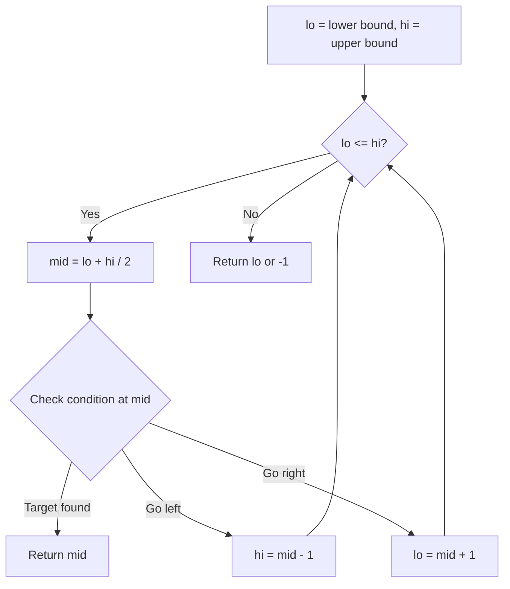
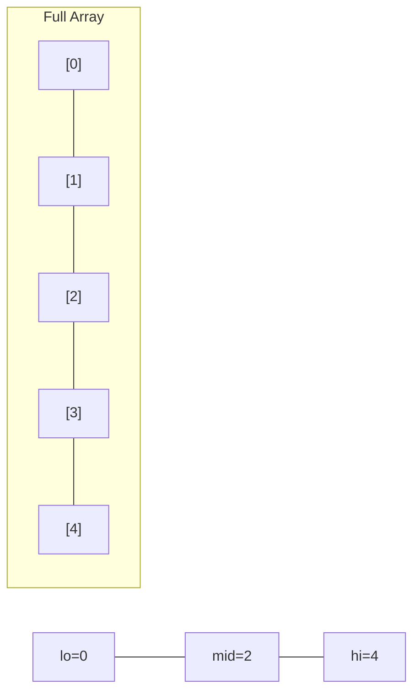
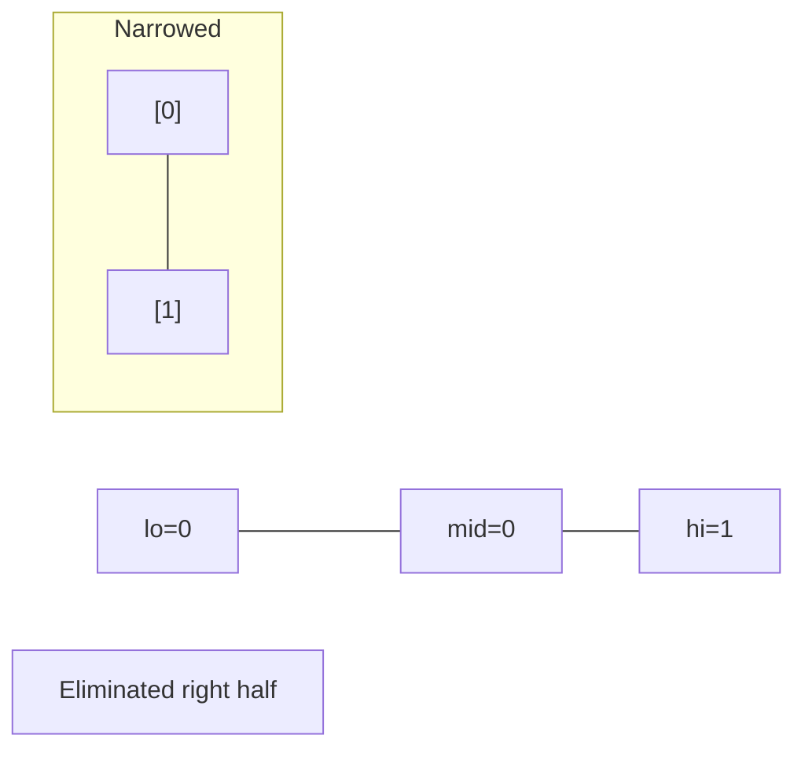
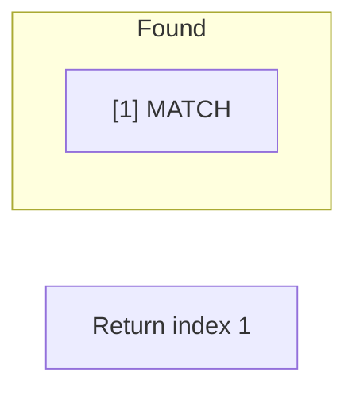

# Problem 1346: Check If N and Its Double Exist

**Difficulty:** Easy  
**Tags:** Array, Hash Table, Two Pointers, Binary Search, Sorting  
**Pattern:** Binary Search  
**Link:** [leetcode.com/problems/check-if-n-and-its-double-exist](https://leetcode.com/problems/check-if-n-and-its-double-exist/)

## Description

Given an array `arr` of integers, check if there exist two indices `i` and `j` such that :

	- `i != j`
	- `0 <= i, j < arr.length`
	- `arr[i] == 2 * arr[j]`

 

Example 1:

```

**Input:** arr = [10,2,5,3]
**Output:** true
**Explanation:** For i = 0 and j = 2, arr[i] == 10 == 2 * 5 == 2 * arr[j]

```

Example 2:

```

**Input:** arr = [3,1,7,11]
**Output:** false
**Explanation:** There is no i and j that satisfy the conditions.

```

 

**Constraints:**

	- `2 <= arr.length <= 500`
	- `-10^3 <= arr[i] <= 10^3`

## Approach: Binary Search

Use binary search to halve the search space each iteration. Define the search range [lo, hi], compute mid, and decide which half to keep based on the problem's monotonic condition.

## Pseudocode

```
1. lo = lower_bound, hi = upper_bound
2. While lo <= hi (or lo < hi):
   a. mid = (lo + hi) // 2
   b. If condition(mid) is satisfied: record answer, search left half
   c. Else: search right half
3. Return answer
```

## Algorithm Flow



## Visual State Transitions

**Binary Search Step-by-Step:**

**Frame 1: Initial search space**


**Frame 2: Compare mid, narrow search**


**Frame 3: Found target**



## Complexity Analysis

- **Time:** O(log n)
- **Space:** O(1)

## Solution (Python3)

```python
class Solution:
    def checkIfExist(self, arr: List[int]) -> bool:
        # Binary search - O(log n) time, O(1) space
        lo, hi = 0, len(arr) - 1
        while lo <= hi:
            mid = lo + (hi - lo) // 2
            if arr[mid] == arr:
                return mid
            elif arr[mid] < arr:
                lo = mid + 1
            else:
                hi = mid - 1
        return False
```

## Solution (C++)

```cpp
#include <string>
#include <vector>
using namespace std;

class Solution {
public:
    bool checkIfExist(vector<int>& arr) {
        // Binary search - O(log n) time, O(1) space
        int lo = 0, hi = arr.size() - 1;
        while (lo <= hi) {
            int mid = lo + (hi - lo) / 2;
            if (arr[mid] == arr) {
                return mid;
            } else if (arr[mid] < arr) {
                lo = mid + 1;
            } else {
                hi = mid - 1;
            }
        }
        return false;
    }
};
```
