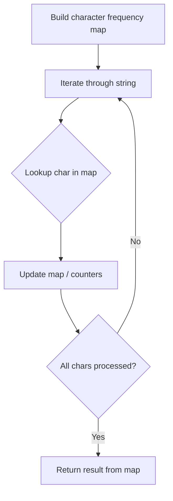

# Problem 1347: Minimum Number of Steps to Make Two Strings Anagram

**Difficulty:** Medium  
**Tags:** Hash Table, String, Counting  
**Pattern:** Hash Map String Processing  
**Link:** [leetcode.com/problems/minimum-number-of-steps-to-make-two-strings-anagram](https://leetcode.com/problems/minimum-number-of-steps-to-make-two-strings-anagram/)

## Description

You are given two strings of the same length `s` and `t`. In one step you can choose **any character** of `t` and replace it with **another character**.

Return *the minimum number of steps* to make `t` an anagram of `s`.

An **Anagram** of a string is a string that contains the same characters with a different (or the same) ordering.

 

Example 1:

```

**Input:** s = "bab", t = "aba"
**Output:** 1
**Explanation:** Replace the first 'a' in t with b, t = "bba" which is anagram of s.

```

Example 2:

```

**Input:** s = "leetcode", t = "practice"
**Output:** 5
**Explanation:** Replace 'p', 'r', 'a', 'i' and 'c' from t with proper characters to make t anagram of s.

```

Example 3:

```

**Input:** s = "anagram", t = "mangaar"
**Output:** 0
**Explanation:** "anagram" and "mangaar" are anagrams. 

```

 

**Constraints:**

	- `1 <= s.length <= 5 * 10^4`
	- `s.length == t.length`
	- `s` and `t` consist of lowercase English letters only.

## Approach: Hash Map String Processing

Use a hash map to count character frequencies or map characters/strings for O(1) lookups. Process the string in one or two passes.

## Pseudocode

```
1. Build frequency map / char-to-index map
2. Iterate through string:
   a. Look up character in map
   b. Update counts or mappings
3. Return result based on map state
```

## Algorithm Flow



## Complexity Analysis

- **Time:** O(n)
- **Space:** O(n)

## Solution (Python3)

```python
class Solution:
    def minSteps(self, s: str, t: str) -> int:
        # Hash map for string/character frequency - O(n) time
        freq = {}
        for ch in s:
            freq[ch] = freq.get(ch, 0) + 1
        # Process frequency map
        for ch, cnt in freq.items():
            if cnt == 1:
                return s.index(ch)
        return 0
```

## Solution (C++)

```cpp
#include <string>
#include <unordered_map>
#include <vector>
using namespace std;

class Solution {
public:
    int minSteps(string& s, string& t) {
        // Hash map for string/character frequency - O(n) time
        unordered_map<char, int> freq;
        for (char ch : s) {
            freq[ch]++;
        }
        // Process frequency map
        for (int i = 0; i < s.size(); i++) {
            if (freq[s[i]] == 1) return i;
        }
        return 0;
    }
};
```
