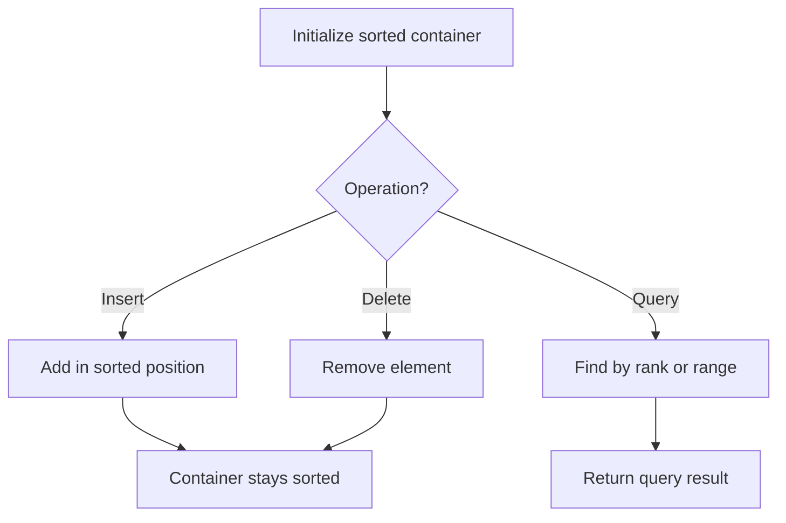

# Problem 1348: Tweet Counts Per Frequency

**Difficulty:** Medium  
**Tags:** Hash Table, String, Binary Search, Design, Sorting, Ordered Set  
**Pattern:** Ordered Set / SortedList  
**Link:** [leetcode.com/problems/tweet-counts-per-frequency](https://leetcode.com/problems/tweet-counts-per-frequency/)

## Description

A social media company is trying to monitor activity on their site by analyzing the number of tweets that occur in select periods of time. These periods can be partitioned into smaller **time chunks** based on a certain frequency (every **minute**, **hour**, or **day**).

For example, the period `[10, 10000]` (in **seconds**) would be partitioned into the following **time chunks** with these frequencies:

	- Every **minute** (60-second chunks): `[10,69]`, `[70,129]`, `[130,189]`, `...`, `[9970,10000]`
	- Every **hour** (3600-second chunks): `[10,3609]`, `[3610,7209]`, `[7210,10000]`
	- Every **day** (86400-second chunks): `[10,10000]`

Notice that the last chunk may be shorter than the specified frequency's chunk size and will always end with the end time of the period (`10000` in the above example).

Design and implement an API to help the company with their analysis.

Implement the `TweetCounts` class:

	- `TweetCounts()` Initializes the `TweetCounts` object.
	- `void recordTweet(String tweetName, int time)` Stores the `tweetName` at the recorded `time` (in **seconds**).
	- `List<Integer> getTweetCountsPerFrequency(String freq, String tweetName, int startTime, int endTime)` Returns a list of integers representing the number of tweets with `tweetName` in each **time chunk** for the given period of time `[startTime, endTime]` (in **seconds**) and frequency `freq`.
	
		`freq` is one of `"minute"`, `"hour"`, or `"day"` representing a frequency of every **minute**, **hour**, or **day** respectively.
	
	

 

Example:

```

**Input**
["TweetCounts","recordTweet","recordTweet","recordTweet","getTweetCountsPerFrequency","getTweetCountsPerFrequency","recordTweet","getTweetCountsPerFrequency"]
[[],["tweet3",0],["tweet3",60],["tweet3",10],["minute","tweet3",0,59],["minute","tweet3",0,60],["tweet3",120],["hour","tweet3",0,210]]

**Output**
[null,null,null,null,[2],[2,1],null,[4]]

**Explanation**
TweetCounts tweetCounts = new TweetCounts();
tweetCounts.recordTweet("tweet3", 0);                              // New tweet "tweet3" at time 0
tweetCounts.recordTweet("tweet3", 60);                             // New tweet "tweet3" at time 60
tweetCounts.recordTweet("tweet3", 10);                             // New tweet "tweet3" at time 10
tweetCounts.getTweetCountsPerFrequency("minute", "tweet3", 0, 59); // return [2]; chunk [0,59] had 2 tweets
tweetCounts.getTweetCountsPerFrequency("minute", "tweet3", 0, 60); // return [2,1]; chunk [0,59] had 2 tweets, chunk [60,60] had 1 tweet
tweetCounts.recordTweet("tweet3", 120);                            // New tweet "tweet3" at time 120
tweetCounts.getTweetCountsPerFrequency("hour", "tweet3", 0, 210);  // return [4]; chunk [0,210] had 4 tweets

```

 

**Constraints:**

	- `0 <= time, startTime, endTime <= 10^9`
	- `0 <= endTime - startTime <= 10^4`
	- There will be at most `10^4` calls **in total** to `recordTweet` and `getTweetCountsPerFrequency`.

## Approach: Ordered Set / SortedList

Maintain elements in sorted order for efficient insertion, deletion, and rank queries. Use balanced BST, skip list, or sorted container.

## Pseudocode

```
1. Initialize sorted container
2. For each operation:
   - Insert: add element in sorted position O(log n)
   - Delete: remove element O(log n)
   - Query: find kth element, count, or range O(log n)
3. Return results
```

## Algorithm Flow



## Complexity Analysis

- **Time:** O(n log n)
- **Space:** O(n)

## Solution (Python3)

```python
class TweetCounts:
    def __init__(self):
        # Initialize data structure
        pass

    def recordTweet(self, tweetName: str, time: int) -> None:
        return None

    def getTweetCountsPerFrequency(self, freq: str, tweetName: str, startTime: int, endTime: int) -> List[int]:
        return []

```

## Solution (C++)

```cpp
#include <algorithm>
#include <set>
#include <string>
#include <vector>
using namespace std;

class TweetCounts {
public:
    TweetCounts() {
        // Initialize
    }

    void recordTweet(string& tweetName, int time) {
        return ;
    }

    vector<int> getTweetCountsPerFrequency(string& freq, string& tweetName, int startTime, int endTime) {
        return {};
    }

};
```
