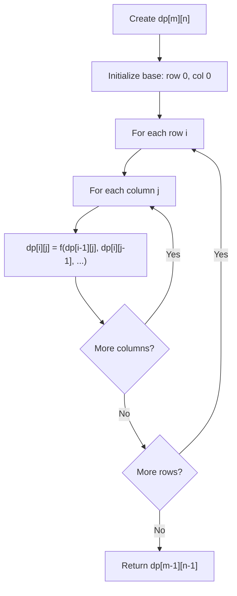
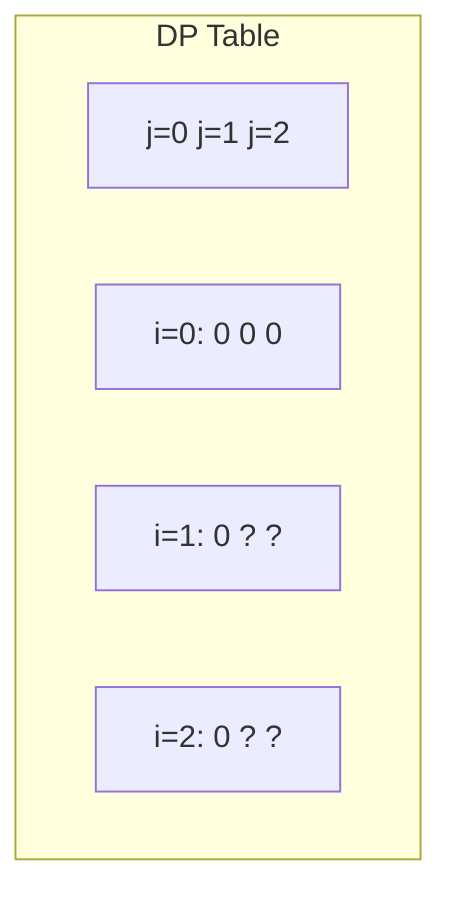
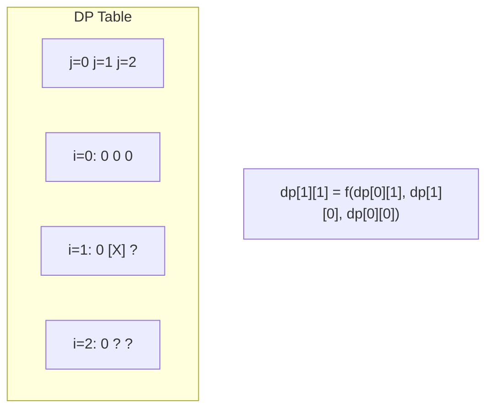
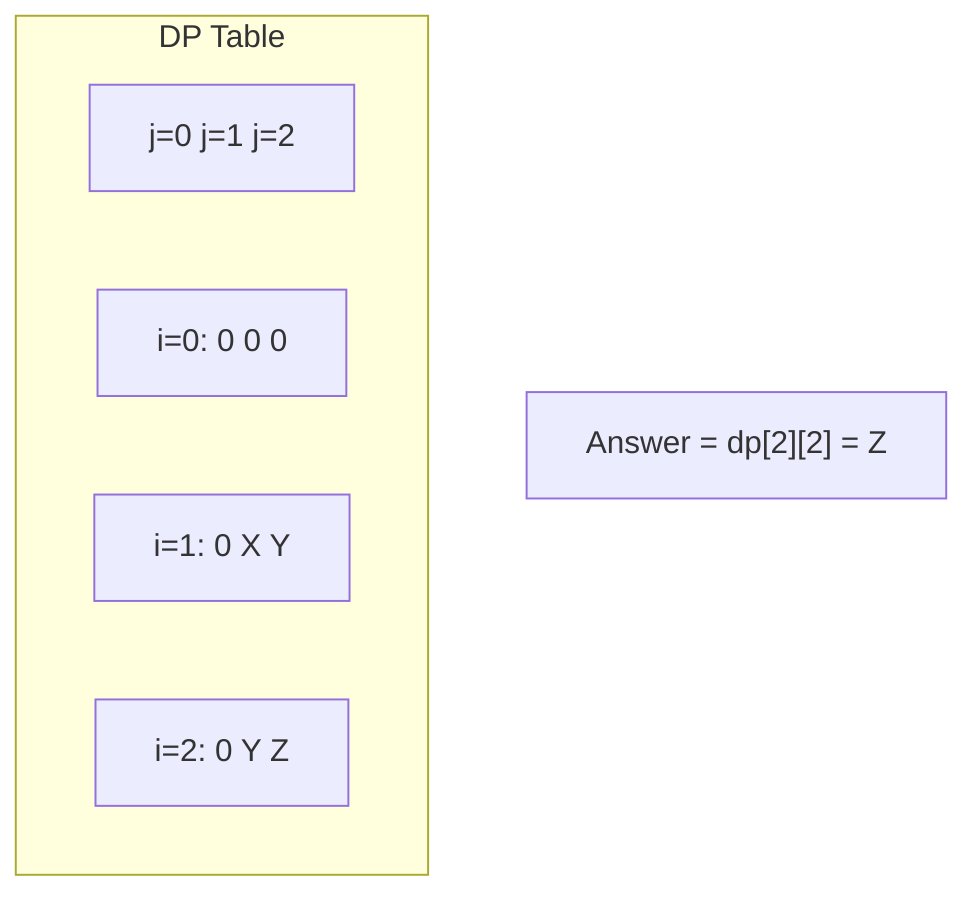

# Problem 1349: Maximum Students Taking Exam

**Difficulty:** Hard  
**Tags:** Array, Dynamic Programming, Bit Manipulation, Matrix, Bitmask  
**Pattern:** Dynamic Programming (2D Grid/Matrix)  
**Link:** [leetcode.com/problems/maximum-students-taking-exam](https://leetcode.com/problems/maximum-students-taking-exam/)

## Description

Given a `m * n` matrix `seats`  that represent seats distributions in a classroom. If a seat is broken, it is denoted by `'#'` character otherwise it is denoted by a `'.'` character.

Students can see the answers of those sitting next to the left, right, upper left and upper right, but he cannot see the answers of the student sitting directly in front or behind him. Return the **maximum **number of students that can take the exam together without any cheating being possible.

Students must be placed in seats in good condition.

 

Example 1:

```

**Input:** seats = [["#",".","#","#",".","#"],
                [".","#","#","#","#","."],
                ["#",".","#","#",".","#"]]
**Output:** 4
**Explanation:** Teacher can place 4 students in available seats so they don't cheat on the exam. 

```

Example 2:

```

**Input:** seats = [[".","#"],
                ["#","#"],
                ["#","."],
                ["#","#"],
                [".","#"]]
**Output:** 3
**Explanation:** Place all students in available seats. 

```

Example 3:

```

**Input:** seats = [["#",".","**.**",".","#"],
                ["**.**","#","**.**","#","**.**"],
                ["**.**",".","#",".","**.**"],
                ["**.**","#","**.**","#","**.**"],
                ["#",".","**.**",".","#"]]
**Output:** 10
**Explanation:** Place students in available seats in column 1, 3 and 5.

```

 

**Constraints:**

	- `seats` contains only characters `'.' and``'#'.`
	- `m == seats.length`
	- `n == seats[i].length`
	- `1 <= m <= 8`
	- `1 <= n <= 8`

## Approach: Dynamic Programming (2D Grid/Matrix)

Use a 2D DP table where dp[i][j] represents the optimal value for the subproblem defined by rows 0..i and columns 0..j. Fill row by row or column by column.

## Pseudocode

```
1. Create dp[m][n] table
2. Initialize base cases (first row, first column)
3. For i from 1 to m-1:
   For j from 1 to n-1:
     dp[i][j] = recurrence(dp[i-1][j], dp[i][j-1], dp[i-1][j-1])
4. Return dp[m-1][n-1]
```

## Algorithm Flow



## Visual State Transitions

**2D DP Table Build:**

**Frame 1: Initialize borders**


**Frame 2: Fill cell by cell**


**Frame 3: Table complete**



## Complexity Analysis

- **Time:** O(m * n)
- **Space:** O(m * n)

## Solution (Python3)

```python
class Solution:
    def maxStudents(self, seats: List[List[str]]) -> int:
        # Dynamic programming (2D) - O(m*n) time and space
        if not seats:
            return 0
        m, n = len(seats), len(seats[0])
        dp = [[0] * (n + 1) for _ in range(m + 1)]
        for i in range(1, m + 1):
            for j in range(1, n + 1):
                dp[i][j] = max(dp[i-1][j], dp[i][j-1])
                # Add problem-specific transition
        return dp[m][n]
```

## Solution (C++)

```cpp
#include <algorithm>
#include <string>
#include <vector>
using namespace std;

class Solution {
public:
    int maxStudents(vector<vector<string>>& seats) {
        // Dynamic programming (2D) - O(m*n) time and space
        if (seats.empty()) return 0;
        int m = seats.size(), n = seats[0].size();
        vector<vector<int>> dp(m + 1, vector<int>(n + 1, 0));
        for (int i = 1; i <= m; i++) {
            for (int j = 1; j <= n; j++) {
                dp[i][j] = max(dp[i-1][j], dp[i][j-1]);
            }
        }
        return dp[m][n];
    }
};
```
