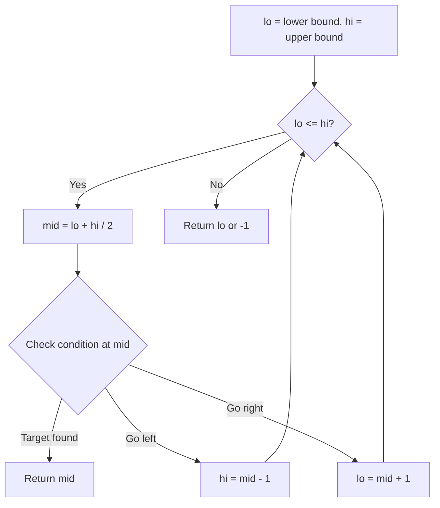
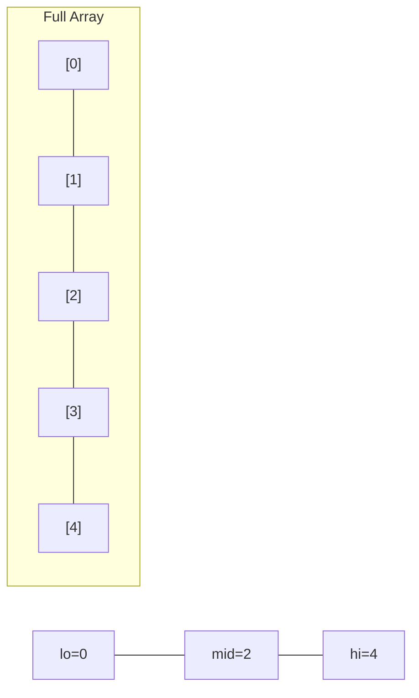
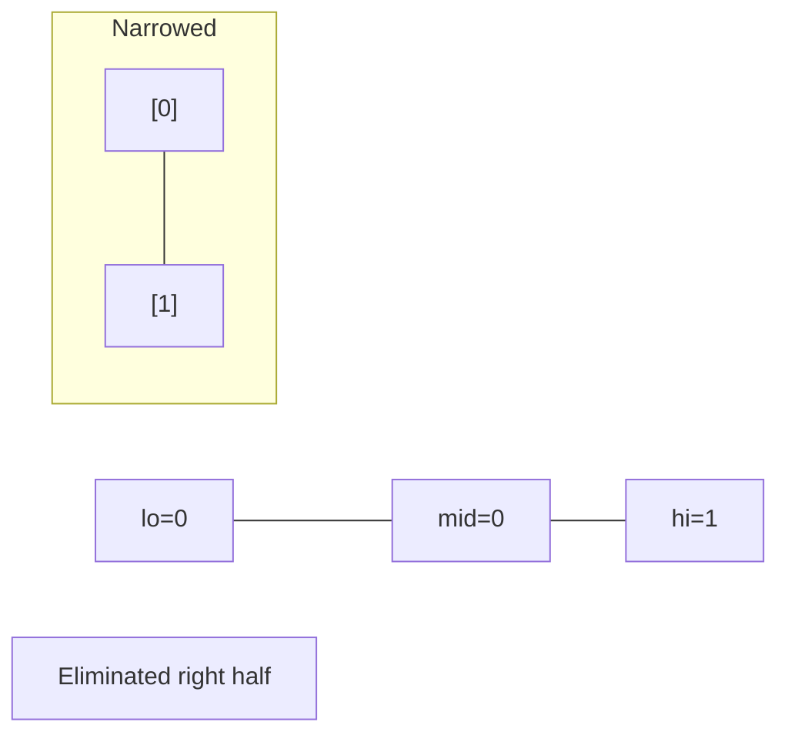
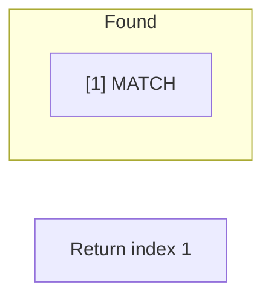

# Problem 1351: Count Negative Numbers in a Sorted Matrix

**Difficulty:** Easy  
**Tags:** Array, Binary Search, Matrix  
**Pattern:** Binary Search  
**Link:** [leetcode.com/problems/count-negative-numbers-in-a-sorted-matrix](https://leetcode.com/problems/count-negative-numbers-in-a-sorted-matrix/)

## Description

Given a `m x n` matrix `grid` which is sorted in non-increasing order both row-wise and column-wise, return *the number of **negative** numbers in* `grid`.

 

Example 1:

```

**Input:** grid = [[4,3,2,-1],[3,2,1,-1],[1,1,-1,-2],[-1,-1,-2,-3]]
**Output:** 8
**Explanation:** There are 8 negatives number in the matrix.

```

Example 2:

```

**Input:** grid = [[3,2],[1,0]]
**Output:** 0

```

 

**Constraints:**

	- `m == grid.length`
	- `n == grid[i].length`
	- `1 <= m, n <= 100`
	- `-100 <= grid[i][j] <= 100`

 

**Follow up:** Could you find an `O(n + m)` solution?

## Approach: Binary Search

Use binary search to halve the search space each iteration. Define the search range [lo, hi], compute mid, and decide which half to keep based on the problem's monotonic condition.

## Pseudocode

```
1. lo = lower_bound, hi = upper_bound
2. While lo <= hi (or lo < hi):
   a. mid = (lo + hi) // 2
   b. If condition(mid) is satisfied: record answer, search left half
   c. Else: search right half
3. Return answer
```

## Algorithm Flow



## Visual State Transitions

**Binary Search Step-by-Step:**

**Frame 1: Initial search space**


**Frame 2: Compare mid, narrow search**


**Frame 3: Found target**



## Complexity Analysis

- **Time:** O(log n)
- **Space:** O(1)

## Solution (Python3)

```python
class Solution:
    def countNegatives(self, grid: List[List[int]]) -> int:
        # Binary search - O(log n) time, O(1) space
        lo, hi = 0, len(grid) - 1
        while lo <= hi:
            mid = lo + (hi - lo) // 2
            if grid[mid] == grid:
                return mid
            elif grid[mid] < grid:
                lo = mid + 1
            else:
                hi = mid - 1
        return 0
```

## Solution (C++)

```cpp
#include <string>
#include <vector>
using namespace std;

class Solution {
public:
    int countNegatives(vector<vector<int>>& grid) {
        // Binary search - O(log n) time, O(1) space
        int lo = 0, hi = grid.size() - 1;
        while (lo <= hi) {
            int mid = lo + (hi - lo) / 2;
            if (grid[mid] == grid) {
                return mid;
            } else if (grid[mid] < grid) {
                lo = mid + 1;
            } else {
                hi = mid - 1;
            }
        }
        return 0;
    }
};
```
