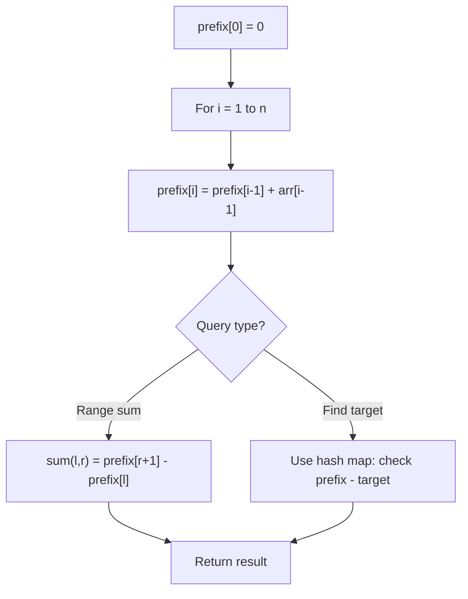

# Problem 1352: Product of the Last K Numbers

**Difficulty:** Medium  
**Tags:** Array, Math, Design, Data Stream, Prefix Sum  
**Pattern:** Prefix Sum  
**Link:** [leetcode.com/problems/product-of-the-last-k-numbers](https://leetcode.com/problems/product-of-the-last-k-numbers/)

## Description

Design an algorithm that accepts a stream of integers and retrieves the product of the last `k` integers of the stream.

Implement the `ProductOfNumbers` class:

	- `ProductOfNumbers()` Initializes the object with an empty stream.
	- `void add(int num)` Appends the integer `num` to the stream.
	- `int getProduct(int k)` Returns the product of the last `k` numbers in the current list. You can assume that always the current list has at least `k` numbers.

The test cases are generated so that, at any time, the product of any contiguous sequence of numbers will fit into a single 32-bit integer without overflowing.

 

Example:

```

**Input**
["ProductOfNumbers","add","add","add","add","add","getProduct","getProduct","getProduct","add","getProduct"]
[[],[3],[0],[2],[5],[4],[2],[3],[4],[8],[2]]

**Output**
[null,null,null,null,null,null,20,40,0,null,32]

**Explanation**
ProductOfNumbers productOfNumbers = new ProductOfNumbers();
productOfNumbers.add(3);        // [3]
productOfNumbers.add(0);        // [3,0]
productOfNumbers.add(2);        // [3,0,2]
productOfNumbers.add(5);        // [3,0,2,5]
productOfNumbers.add(4);        // [3,0,2,5,4]
productOfNumbers.getProduct(2); // return 20. The product of the last 2 numbers is 5 * 4 = 20
productOfNumbers.getProduct(3); // return 40. The product of the last 3 numbers is 2 * 5 * 4 = 40
productOfNumbers.getProduct(4); // return 0. The product of the last 4 numbers is 0 * 2 * 5 * 4 = 0
productOfNumbers.add(8);        // [3,0,2,5,4,8]
productOfNumbers.getProduct(2); // return 32. The product of the last 2 numbers is 4 * 8 = 32 

```

 

**Constraints:**

	- `0 <= num <= 100`
	- `1 <= k <= 4 * 10^4`
	- At most `4 * 10^4` calls will be made to `add` and `getProduct`.
	- The product of the stream at any point in time will fit in a **32-bit** integer.

 

**Follow-up: **Can you implement **both** `GetProduct` and `Add` to work in `O(1)` time complexity instead of `O(k)` time complexity?

## Approach: Prefix Sum

Build a prefix sum array where prefix[i] = sum of elements 0..i-1. Any subarray sum [l..r] = prefix[r+1] - prefix[l]. Combine with hash map for O(n) subarray sum queries.

## Pseudocode

```
1. Build prefix sum array: prefix[0]=0, prefix[i]=prefix[i-1]+arr[i-1]
2. Use prefix sums to answer queries:
   - Subarray sum [l..r] = prefix[r+1] - prefix[l]
   - Or use hash map to find prefix[j]-prefix[i] == target
3. Return result
```

## Algorithm Flow



## Complexity Analysis

- **Time:** O(n)
- **Space:** O(n)

## Solution (Python3)

```python
class ProductOfNumbers:
    def __init__(self):
        # Initialize data structure
        pass

    def add(self, num: int) -> None:
        return None

    def getProduct(self, k: int) -> int:
        return 0

```

## Solution (C++)

```cpp
#include <algorithm>
#include <string>
#include <unordered_map>
#include <vector>
using namespace std;

class ProductOfNumbers {
public:
    ProductOfNumbers() {
        // Initialize
    }

    void add(int num) {
        return ;
    }

    int getProduct(int k) {
        return 0;
    }

};
```
