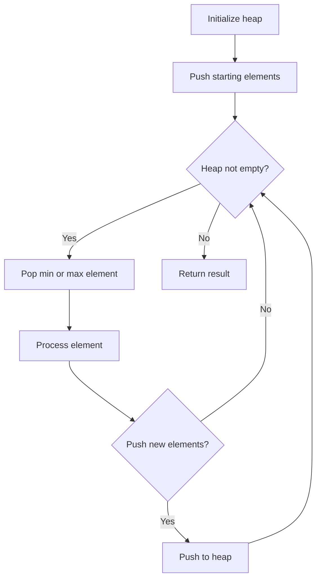
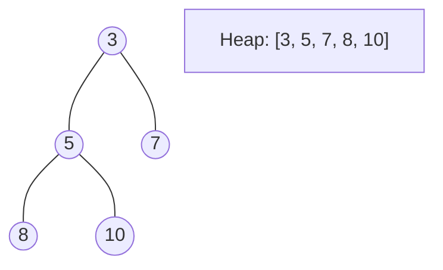
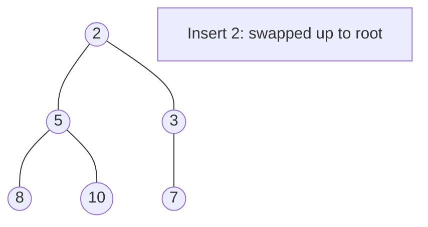
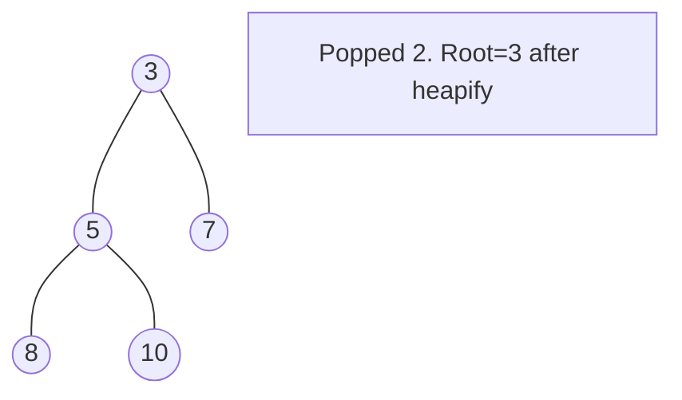

# Problem 1353: Maximum Number of Events That Can Be Attended

**Difficulty:** Medium  
**Tags:** Array, Greedy, Sorting, Heap (Priority Queue)  
**Pattern:** Heap / Priority Queue  
**Link:** [leetcode.com/problems/maximum-number-of-events-that-can-be-attended](https://leetcode.com/problems/maximum-number-of-events-that-can-be-attended/)

## Description

You are given an array of `events` where `events[i] = [startDayi, endDayi]`. Every event `i` starts at `startDayi` and ends at `endDayi`.

You can attend an event `i` at any day `d` where `startDayi <= d <= endDayi`. You can only attend one event at any time `d`.

Return *the maximum number of events you can attend*.

 

Example 1:

```

**Input:** events = [[1,2],[2,3],[3,4]]
**Output:** 3
**Explanation:** You can attend all the three events.
One way to attend them all is as shown.
Attend the first event on day 1.
Attend the second event on day 2.
Attend the third event on day 3.

```

Example 2:

```

**Input:** events= [[1,2],[2,3],[3,4],[1,2]]
**Output:** 4

```

 

**Constraints:**

	- `1 <= events.length <= 10^5`
	- `events[i].length == 2`
	- `1 <= startDayi <= endDayi <= 10^5`

## Approach: Heap / Priority Queue

Use a min-heap or max-heap to efficiently access the smallest/largest element. Push elements and pop the top to process in priority order.

## Pseudocode

```
1. Initialize heap (min or max)
2. Push initial elements onto heap
3. While heap not empty and condition:
   a. Pop top element (min or max)
   b. Process element
   c. Push new elements if needed
4. Return result
```

## Algorithm Flow



## Visual State Transitions

**Heap Operations (Min-Heap):**

**Frame 1: Initial heap**


**Frame 2: Insert 2 - bubble up**


**Frame 3: Pop minimum (2) - heapify down**



## Complexity Analysis

- **Time:** O(n log n)
- **Space:** O(n)

## Solution (Python3)

```python
class Solution:
    def maxEvents(self, events: List[List[int]]) -> int:
        # Heap/Priority Queue - O(n log k) time
        import heapq
        if not events:
            return 0
        # Min heap (negate for max heap)
        heap = []
        for val in events:
            heapq.heappush(heap, val)
            if len(heap) > (events if isinstance(events, int) else len(events)):
                heapq.heappop(heap)
        return heap[0] if heap else 0
```

## Solution (C++)

```cpp
#include <queue>
#include <string>
#include <vector>
using namespace std;

class Solution {
public:
    int maxEvents(vector<vector<int>>& events) {
        // Heap/Priority Queue - O(n log k) time
        priority_queue<int, vector<int>, greater<int>> pq;
        for (int val : events) {
            pq.push(val);
            if ((int)pq.size() > events)
                pq.pop();
        }
        return pq.empty() ? 0 : pq.top();
    }
};
```
