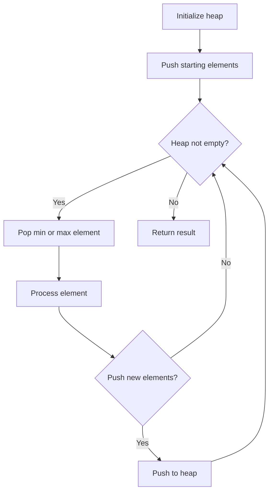
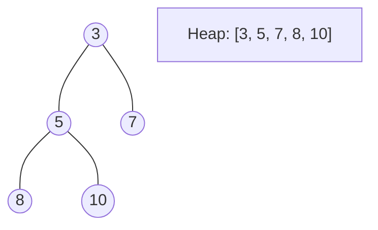
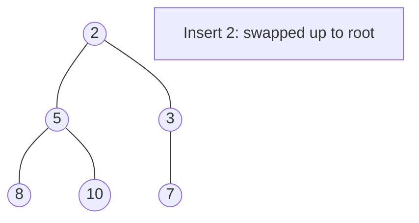
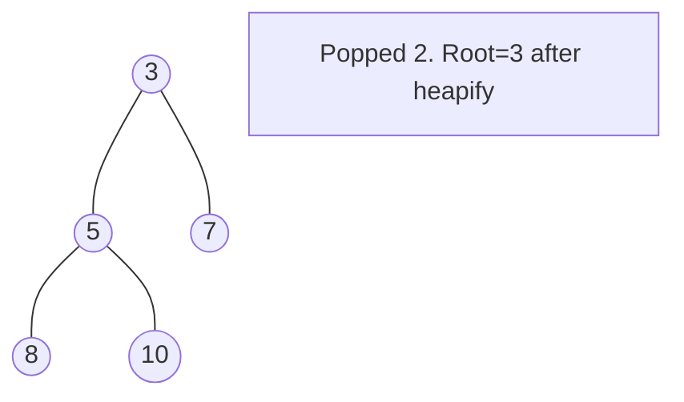

# Problem 1354: Construct Target Array With Multiple Sums

**Difficulty:** Hard  
**Tags:** Array, Heap (Priority Queue)  
**Pattern:** Heap / Priority Queue  
**Link:** [leetcode.com/problems/construct-target-array-with-multiple-sums](https://leetcode.com/problems/construct-target-array-with-multiple-sums/)

## Description

You are given an array `target` of n integers. From a starting array `arr` consisting of `n` 1's, you may perform the following procedure :

	- let `x` be the sum of all elements currently in your array.
	- choose index `i`, such that `0 <= i < n` and set the value of `arr` at index `i` to `x`.
	- You may repeat this procedure as many times as needed.

Return `true` *if it is possible to construct the* `target` *array from* `arr`*, otherwise, return* `false`.

 

Example 1:

```

**Input:** target = [9,3,5]
**Output:** true
**Explanation:** Start with arr = [1, 1, 1] 
[1, 1, 1], sum = 3 choose index 1
[1, 3, 1], sum = 5 choose index 2
[1, 3, 5], sum = 9 choose index 0
[9, 3, 5] Done

```

Example 2:

```

**Input:** target = [1,1,1,2]
**Output:** false
**Explanation:** Impossible to create target array from [1,1,1,1].

```

Example 3:

```

**Input:** target = [8,5]
**Output:** true

```

 

**Constraints:**

	- `n == target.length`
	- `1 <= n <= 5 * 10^4`
	- `1 <= target[i] <= 10^9`

## Approach: Heap / Priority Queue

Use a min-heap or max-heap to efficiently access the smallest/largest element. Push elements and pop the top to process in priority order.

## Pseudocode

```
1. Initialize heap (min or max)
2. Push initial elements onto heap
3. While heap not empty and condition:
   a. Pop top element (min or max)
   b. Process element
   c. Push new elements if needed
4. Return result
```

## Algorithm Flow



## Visual State Transitions

**Heap Operations (Min-Heap):**

**Frame 1: Initial heap**


**Frame 2: Insert 2 - bubble up**


**Frame 3: Pop minimum (2) - heapify down**



## Complexity Analysis

- **Time:** O(n log n)
- **Space:** O(n)

## Solution (Python3)

```python
class Solution:
    def isPossible(self, target: List[int]) -> bool:
        # Heap/Priority Queue - O(n log k) time
        import heapq
        if not target:
            return False
        # Min heap (negate for max heap)
        heap = []
        for val in target:
            heapq.heappush(heap, val)
            if len(heap) > (target if isinstance(target, int) else len(target)):
                heapq.heappop(heap)
        return heap[0] if heap else False
```

## Solution (C++)

```cpp
#include <queue>
#include <string>
#include <vector>
using namespace std;

class Solution {
public:
    bool isPossible(vector<int>& target) {
        // Heap/Priority Queue - O(n log k) time
        priority_queue<int, vector<int>, greater<int>> pq;
        for (int val : target) {
            pq.push(val);
            if ((int)pq.size() > target)
                pq.pop();
        }
        return pq.empty() ? false : pq.top();
    }
};
```
