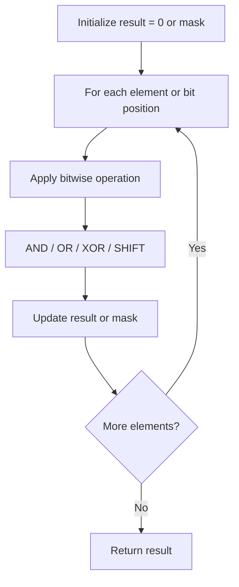

# Problem 1356: Sort Integers by The Number of 1 Bits

**Difficulty:** Easy  
**Tags:** Array, Bit Manipulation, Sorting, Counting  
**Pattern:** Bit Manipulation  
**Link:** [leetcode.com/problems/sort-integers-by-the-number-of-1-bits](https://leetcode.com/problems/sort-integers-by-the-number-of-1-bits/)

## Description

You are given an integer array `arr`. Sort the integers in the array in ascending order by the number of `1`'s in their binary representation and in case of two or more integers have the same number of `1`'s you have to sort them in ascending order.

Return *the array after sorting it*.

 

Example 1:

```

**Input:** arr = [0,1,2,3,4,5,6,7,8]
**Output:** [0,1,2,4,8,3,5,6,7]
**Explantion:** [0] is the only integer with 0 bits.
[1,2,4,8] all have 1 bit.
[3,5,6] have 2 bits.
[7] has 3 bits.
The sorted array by bits is [0,1,2,4,8,3,5,6,7]

```

Example 2:

```

**Input:** arr = [1024,512,256,128,64,32,16,8,4,2,1]
**Output:** [1,2,4,8,16,32,64,128,256,512,1024]
**Explantion:** All integers have 1 bit in the binary representation, you should just sort them in ascending order.

```

 

**Constraints:**

	- `1 <= arr.length <= 500`
	- `0 <= arr[i] <= 10^4`

## Approach: Bit Manipulation

Operate on individual bits using bitwise operators (AND, OR, XOR, shift). Common tricks: x & (x-1) removes lowest set bit, x ^ x = 0, XOR all elements to find unique.

## Pseudocode

```
1. Apply bitwise operations:
   - XOR all elements to cancel paired bits
   - Use bitmask to track state
   - Shift and mask to extract/set individual bits
2. Return result
```

## Algorithm Flow



## Complexity Analysis

- **Time:** O(n) or O(log n)
- **Space:** O(1)

## Solution (Python3)

```python
class Solution:
    def sortByBits(self, arr: List[int]) -> List[int]:
        # Bit manipulation - O(n) time, O(1) space
        result = 0
        for val in arr:
            result ^= val
        return result
```

## Solution (C++)

```cpp
#include <string>
#include <vector>
using namespace std;

class Solution {
public:
    vector<int> sortByBits(vector<int>& arr) {
        // Bit manipulation - O(n) time, O(1) space
        int result = 0;
        for (int val : arr) {
            result ^= val;
        }
        return result;
    }
};
```
