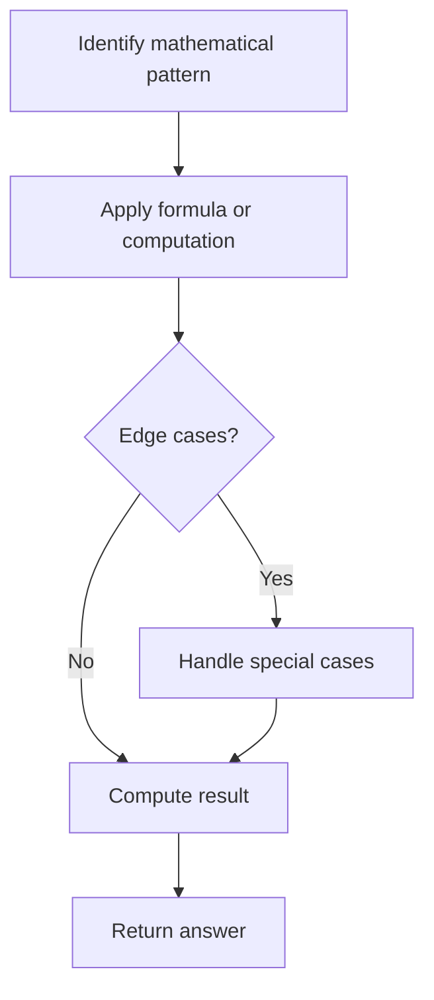

# Problem 1360: Number of Days Between Two Dates

**Difficulty:** Easy  
**Tags:** Math, String  
**Pattern:** Math  
**Link:** [leetcode.com/problems/number-of-days-between-two-dates](https://leetcode.com/problems/number-of-days-between-two-dates/)

## Description

Write a program to count the number of days between two dates.

The two dates are given as strings, their format is `YYYY-MM-DD` as shown in the examples.

 

Example 1:

```
**Input:** date1 = "2019-06-29", date2 = "2019-06-30"
**Output:** 1

```
Example 2:

```
**Input:** date1 = "2020-01-15", date2 = "2019-12-31"
**Output:** 15

```

 

**Constraints:**

	- The given dates are valid dates between the years `1971` and `2100`.

## Approach: Math

Apply mathematical properties, formulas, or number-theoretic concepts. Look for patterns, modular arithmetic, or closed-form solutions.

## Pseudocode

```
1. Identify the mathematical pattern or formula
2. Apply computation:
   - Modular arithmetic for large numbers
   - GCD/LCM for divisibility
   - Sieve for primes
3. Handle edge cases
4. Return result
```

## Algorithm Flow



## Complexity Analysis

- **Time:** O(n) or O(sqrt(n))
- **Space:** O(1)

## Solution (Python3)

```python
class Solution:
    def daysBetweenDates(self, date1: str, date2: str) -> int:
        # Mathematical approach
        result = 0
        x = date1
        while x != 0:
            result = result * 10 + x % 10
            x //= 10 if isinstance(x, int) else 1
        return result
```

## Solution (C++)

```cpp
#include <string>
#include <vector>
using namespace std;

class Solution {
public:
    int daysBetweenDates(string& date1, string& date2) {
        // Mathematical approach
        long long result = 0;
        int x = date1;
        while (x != 0) {
            result = result * 10 + x % 10;
            x /= 10;
        }
        return (int)result;
    }
};
```
