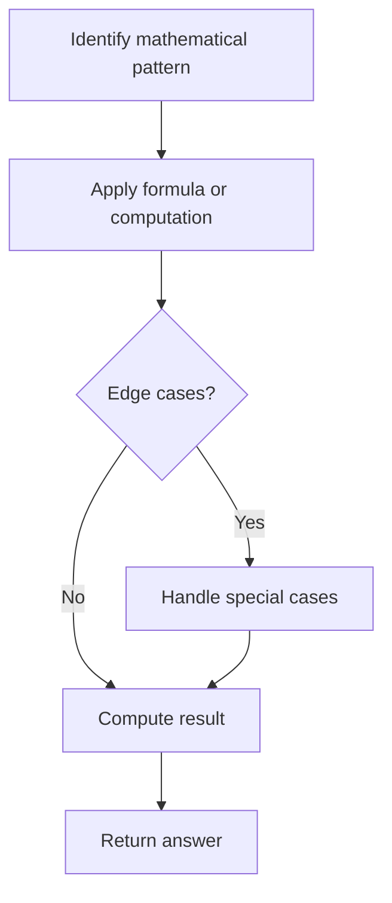

# Problem 1362: Closest Divisors

**Difficulty:** Medium  
**Tags:** Math  
**Pattern:** Math  
**Link:** [leetcode.com/problems/closest-divisors](https://leetcode.com/problems/closest-divisors/)

## Description

Given an integer `num`, find the closest two integers in absolute difference whose product equals `num + 1` or `num + 2`.

Return the two integers in any order.

 

Example 1:

```

**Input:** num = 8
**Output:** [3,3]
**Explanation:** For num + 1 = 9, the closest divisors are 3 & 3, for num + 2 = 10, the closest divisors are 2 & 5, hence 3 & 3 is chosen.

```

Example 2:

```

**Input:** num = 123
**Output:** [5,25]

```

Example 3:

```

**Input:** num = 999
**Output:** [40,25]

```

 

**Constraints:**

	- `1 <= num <= 10^9`

## Approach: Math

Apply mathematical properties, formulas, or number-theoretic concepts. Look for patterns, modular arithmetic, or closed-form solutions.

## Pseudocode

```
1. Identify the mathematical pattern or formula
2. Apply computation:
   - Modular arithmetic for large numbers
   - GCD/LCM for divisibility
   - Sieve for primes
3. Handle edge cases
4. Return result
```

## Algorithm Flow



## Complexity Analysis

- **Time:** O(n) or O(sqrt(n))
- **Space:** O(1)

## Solution (Python3)

```python
class Solution:
    def closestDivisors(self, num: int) -> List[int]:
        # Mathematical approach
        result = 0
        x = num
        while x != 0:
            result = result * 10 + x % 10
            x //= 10 if isinstance(x, int) else 1
        return result
```

## Solution (C++)

```cpp
#include <string>
#include <vector>
using namespace std;

class Solution {
public:
    vector<int> closestDivisors(int num) {
        // Mathematical approach
        long long result = 0;
        int x = num;
        while (x != 0) {
            result = result * 10 + x % 10;
            x /= 10;
        }
        return (int)result;
    }
};
```
