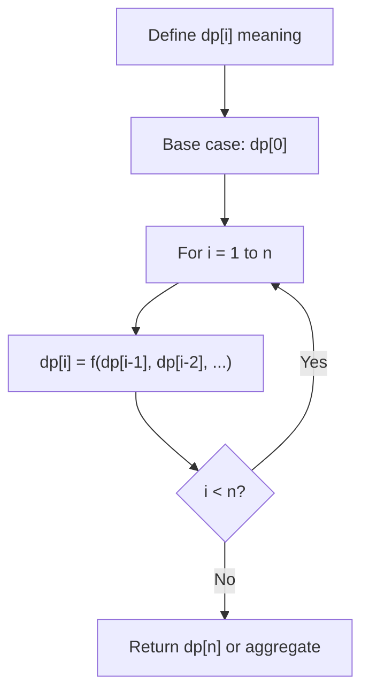
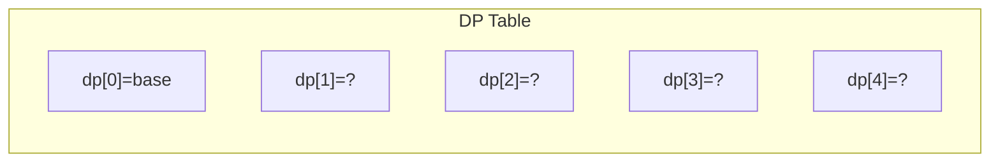
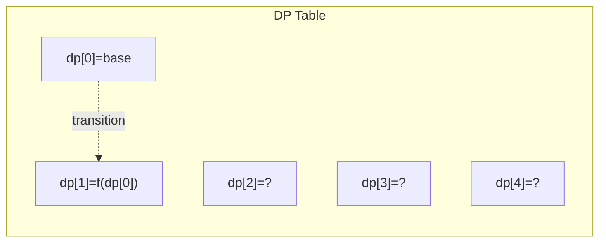
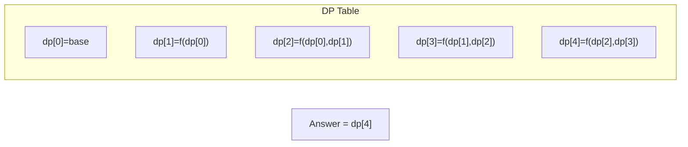

# Problem 1363: Largest Multiple of Three

**Difficulty:** Hard  
**Tags:** Array, Math, Dynamic Programming, Greedy, Sorting  
**Pattern:** Dynamic Programming (1D)  
**Link:** [leetcode.com/problems/largest-multiple-of-three](https://leetcode.com/problems/largest-multiple-of-three/)

## Description

Given an array of digits `digits`, return *the largest multiple of **three** that can be formed by concatenating some of the given digits in **any order***. If there is no answer return an empty string.

Since the answer may not fit in an integer data type, return the answer as a string. Note that the returning answer must not contain unnecessary leading zeros.

 

Example 1:

```

**Input:** digits = [8,1,9]
**Output:** "981"

```

Example 2:

```

**Input:** digits = [8,6,7,1,0]
**Output:** "8760"

```

Example 3:

```

**Input:** digits = [1]
**Output:** ""

```

 

**Constraints:**

	- `1 <= digits.length <= 10^4`
	- `0 <= digits[i] <= 9`

## Approach: Dynamic Programming (1D)

Break the problem into overlapping subproblems. Define dp[i] as the optimal value for the subproblem ending at or considering index i. Build the solution bottom-up, using previously computed dp values.

## Pseudocode

```
1. Define dp[i] = optimal value for subproblem i
2. Base case: dp[0] = initial value
3. For i from 1 to n:
   a. dp[i] = recurrence(dp[i-1], dp[i-2], ...)
4. Return dp[n] or max/min of dp
```

## Algorithm Flow



## Visual State Transitions

**1D Dynamic Programming Table Build:**

**Frame 1: Initialize base cases**


**Frame 2: Fill dp[1] from dp[0]**


**Frame 3: Fill remaining cells**



## Complexity Analysis

- **Time:** O(n)
- **Space:** O(n)

## Solution (Python3)

```python
class Solution:
    def largestMultipleOfThree(self, digits: List[int]) -> str:
        # Dynamic programming (1D) - O(n) time, O(n) space
        if not digits:
            return 0
        n = len(digits) if isinstance(digits, list) else digits
        dp = [0] * (n + 1)
        dp[0] = 1  # base case
        for i in range(1, n + 1):
            dp[i] = dp[i-1]  # transition (customize per problem)
            if i >= 2:
                dp[i] += dp[i-2]
        return dp[n]
```

## Solution (C++)

```cpp
#include <string>
#include <vector>
using namespace std;

class Solution {
public:
    string largestMultipleOfThree(vector<int>& digits) {
        // Dynamic programming (1D) - O(n) time, O(n) space
        int n = digits;
        if (n <= 0) return 0;
        vector<int> dp(n + 1, 0);
        dp[0] = 1;
        for (int i = 1; i <= n; i++) {
            dp[i] = dp[i-1];
            if (i >= 2) dp[i] += dp[i-2];
        }
        return dp[n];
    }
};
```
