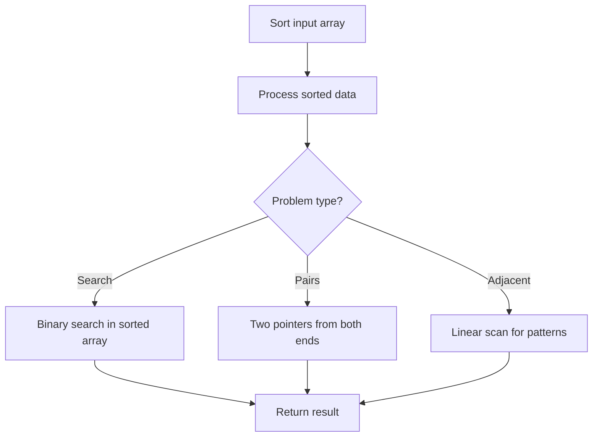

# Problem 1365: How Many Numbers Are Smaller Than the Current Number

**Difficulty:** Easy  
**Tags:** Array, Hash Table, Sorting, Counting Sort  
**Pattern:** Sorting  
**Link:** [leetcode.com/problems/how-many-numbers-are-smaller-than-the-current-number](https://leetcode.com/problems/how-many-numbers-are-smaller-than-the-current-number/)

## Description

Given the array `nums`, for each `nums[i]` find out how many numbers in the array are smaller than it. That is, for each `nums[i]` you have to count the number of valid `j's` such that `j != i` **and** `nums[j] < nums[i]`.

Return the answer in an array.

 

Example 1:

```

**Input:** nums = [8,1,2,2,3]
**Output:** [4,0,1,1,3]
**Explanation:** 
For nums[0]=8 there exist four smaller numbers than it (1, 2, 2 and 3). 
For nums[1]=1 does not exist any smaller number than it.
For nums[2]=2 there exist one smaller number than it (1). 
For nums[3]=2 there exist one smaller number than it (1). 
For nums[4]=3 there exist three smaller numbers than it (1, 2 and 2).

```

Example 2:

```

**Input:** nums = [6,5,4,8]
**Output:** [2,1,0,3]

```

Example 3:

```

**Input:** nums = [7,7,7,7]
**Output:** [0,0,0,0]

```

 

**Constraints:**

	- `2 <= nums.length <= 500`
	- `0 <= nums[i] <= 100`

## Approach: Sorting

Sort the data to enable efficient processing. After sorting, use techniques like binary search, two pointers, or linear scan to solve the problem.

## Pseudocode

```
1. Sort the input array
2. Process sorted data:
   - Use binary search for lookups
   - Use two pointers for pair finding
   - Scan for adjacent patterns
3. Return result
```

## Algorithm Flow



## Complexity Analysis

- **Time:** O(n log n)
- **Space:** O(n)

## Solution (Python3)

```python
class Solution:
    def smallerNumbersThanCurrent(self, nums: List[int]) -> List[int]:
        # Sort-based approach - O(n log n) time
        nums.sort(key=lambda x: x[0] if isinstance(x, (list, tuple)) else x)
        result = [nums[0]]
        for i in range(1, len(nums)):
            curr = nums[i]
            if isinstance(curr, (list, tuple)) and isinstance(result[-1], (list, tuple)):
                if curr[0] <= result[-1][1]:
                    result[-1] = [result[-1][0], max(result[-1][1], curr[1])]
                else:
                    result.append(curr)
            else:
                result.append(curr)
        return result
```

## Solution (C++)

```cpp
#include <algorithm>
#include <string>
#include <vector>
using namespace std;

class Solution {
public:
    vector<int> smallerNumbersThanCurrent(vector<int>& nums) {
        // Sort-based approach - O(n log n) time
        sort(nums.begin(), nums.end());
        vector<vector<int>> result;
        result.push_back(nums[0]);
        for (int i = 1; i < (int)nums.size(); i++) {
            if (nums[i][0] <= result.back()[1]) {
                result.back()[1] = max(result.back()[1], nums[i][1]);
            } else {
                result.push_back(nums[i]);
            }
        }
        return result;
    }
};
```
