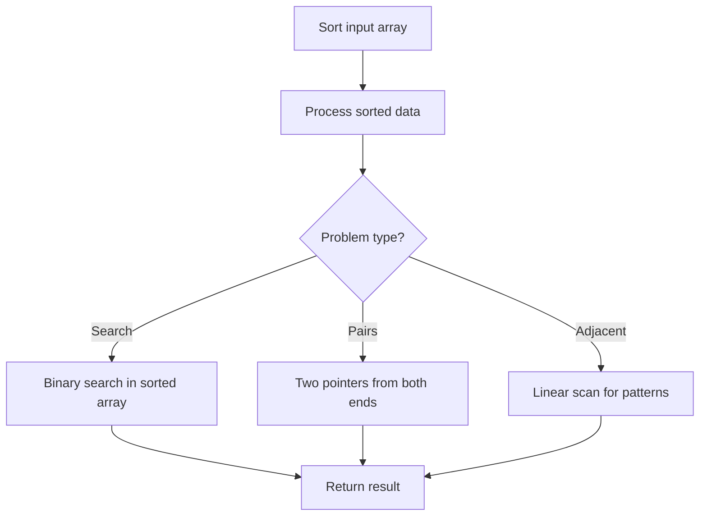

# Problem 1366: Rank Teams by Votes

**Difficulty:** Medium  
**Tags:** Array, Hash Table, String, Sorting, Counting  
**Pattern:** Sorting  
**Link:** [leetcode.com/problems/rank-teams-by-votes](https://leetcode.com/problems/rank-teams-by-votes/)

## Description

In a special ranking system, each voter gives a rank from highest to lowest to all teams participating in the competition.

The ordering of teams is decided by who received the most position-one votes. If two or more teams tie in the first position, we consider the second position to resolve the conflict, if they tie again, we continue this process until the ties are resolved. If two or more teams are still tied after considering all positions, we rank them alphabetically based on their team letter.

You are given an array of strings `votes` which is the votes of all voters in the ranking systems. Sort all teams according to the ranking system described above.

Return *a string of all teams **sorted** by the ranking system*.

 

Example 1:

```

**Input:** votes = ["ABC","ACB","ABC","ACB","ACB"]
**Output:** "ACB"
**Explanation:** 
Team A was ranked first place by 5 voters. No other team was voted as first place, so team A is the first team.
Team B was ranked second by 2 voters and ranked third by 3 voters.
Team C was ranked second by 3 voters and ranked third by 2 voters.
As most of the voters ranked C second, team C is the second team, and team B is the third.

```

Example 2:

```

**Input:** votes = ["WXYZ","XYZW"]
**Output:** "XWYZ"
**Explanation:**
X is the winner due to the tie-breaking rule. X has the same votes as W for the first position, but X has one vote in the second position, while W does not have any votes in the second position. 

```

Example 3:

```

**Input:** votes = ["ZMNAGUEDSJYLBOPHRQICWFXTVK"]
**Output:** "ZMNAGUEDSJYLBOPHRQICWFXTVK"
**Explanation:** Only one voter, so their votes are used for the ranking.

```

 

**Constraints:**

	- `1 <= votes.length <= 1000`
	- `1 <= votes[i].length <= 26`
	- `votes[i].length == votes[j].length` for `0 <= i, j < votes.length`.
	- `votes[i][j]` is an English **uppercase** letter.
	- All characters of `votes[i]` are unique.
	- All the characters that occur in `votes[0]` **also occur** in `votes[j]` where `1 <= j < votes.length`.

## Approach: Sorting

Sort the data to enable efficient processing. After sorting, use techniques like binary search, two pointers, or linear scan to solve the problem.

## Pseudocode

```
1. Sort the input array
2. Process sorted data:
   - Use binary search for lookups
   - Use two pointers for pair finding
   - Scan for adjacent patterns
3. Return result
```

## Algorithm Flow



## Complexity Analysis

- **Time:** O(n log n)
- **Space:** O(n)

## Solution (Python3)

```python
class Solution:
    def rankTeams(self, votes: List[str]) -> str:
        # Sort-based approach - O(n log n) time
        votes.sort(key=lambda x: x[0] if isinstance(x, (list, tuple)) else x)
        result = [votes[0]]
        for i in range(1, len(votes)):
            curr = votes[i]
            if isinstance(curr, (list, tuple)) and isinstance(result[-1], (list, tuple)):
                if curr[0] <= result[-1][1]:
                    result[-1] = [result[-1][0], max(result[-1][1], curr[1])]
                else:
                    result.append(curr)
            else:
                result.append(curr)
        return result
```

## Solution (C++)

```cpp
#include <algorithm>
#include <string>
#include <vector>
using namespace std;

class Solution {
public:
    string rankTeams(vector<string>& votes) {
        // Sort-based approach - O(n log n) time
        sort(votes.begin(), votes.end());
        vector<vector<int>> result;
        result.push_back(votes[0]);
        for (int i = 1; i < (int)votes.size(); i++) {
            if (votes[i][0] <= result.back()[1]) {
                result.back()[1] = max(result.back()[1], votes[i][1]);
            } else {
                result.push_back(votes[i]);
            }
        }
        return result;
    }
};
```
