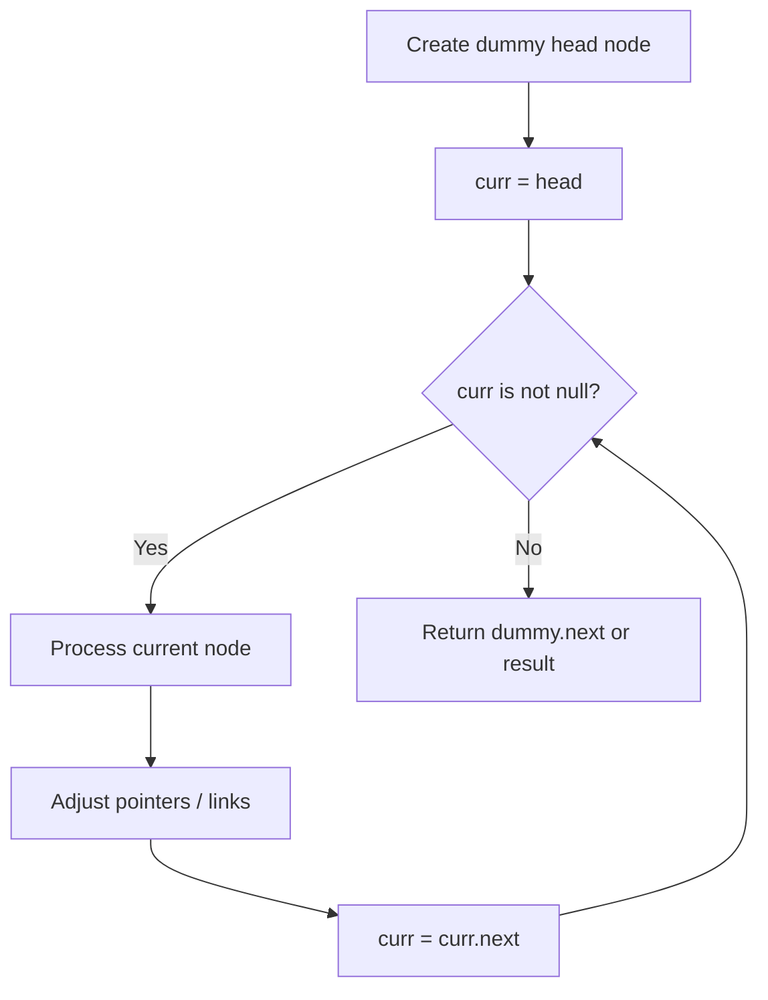
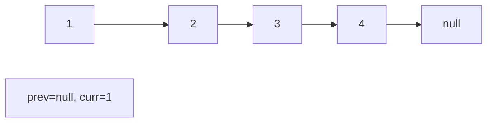
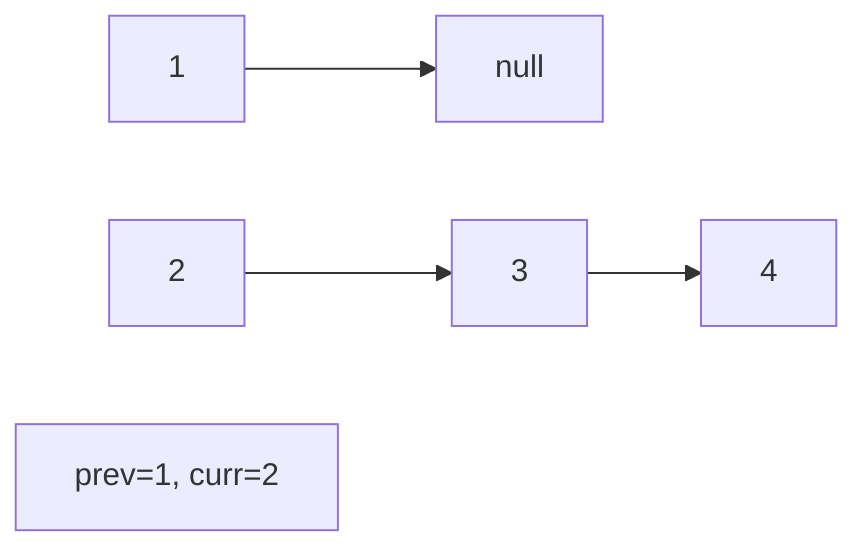
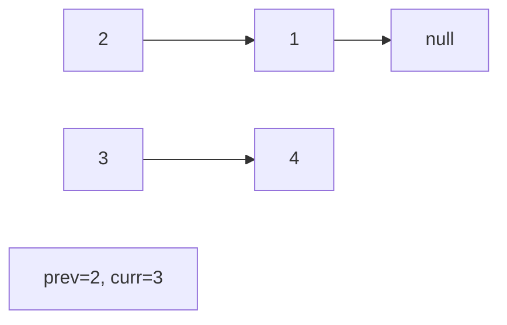
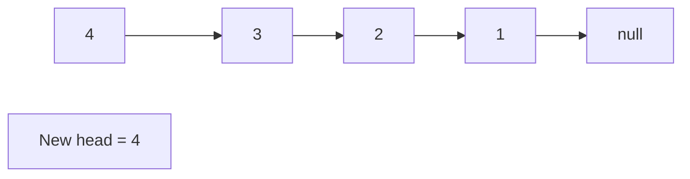

# Problem 1367: Linked List in Binary Tree

**Difficulty:** Medium  
**Tags:** Linked List, Tree, Depth-First Search, Binary Tree  
**Pattern:** Linked List  
**Link:** [leetcode.com/problems/linked-list-in-binary-tree](https://leetcode.com/problems/linked-list-in-binary-tree/)

## Description

Given a binary tree `root` and a linked list with `head` as the first node. 

Return True if all the elements in the linked list starting from the `head` correspond to some *downward path* connected in the binary tree otherwise return False.

In this context downward path means a path that starts at some node and goes downwards.

 

Example 1:

****

```

**Input:** head = [4,2,8], root = [1,4,4,null,2,2,null,1,null,6,8,null,null,null,null,1,3]
**Output:** true
**Explanation:** Nodes in blue form a subpath in the binary Tree.  

```

Example 2:

****

```

**Input:** head = [1,4,2,6], root = [1,4,4,null,2,2,null,1,null,6,8,null,null,null,null,1,3]
**Output:** true

```

Example 3:

```

**Input:** head = [1,4,2,6,8], root = [1,4,4,null,2,2,null,1,null,6,8,null,null,null,null,1,3]
**Output:** false
**Explanation:** There is no path in the binary tree that contains all the elements of the linked list from `head`.

```

 

**Constraints:**

	- The number of nodes in the tree will be in the range `[1, 2500]`.
	- The number of nodes in the list will be in the range `[1, 100]`.
	- `1 <= Node.val <= 100` for each node in the linked list and binary tree.

## Approach: Linked List

Traverse or manipulate the linked list using pointer techniques. Common patterns: dummy head node for edge cases, fast/slow pointers for cycle detection or middle finding, in-place reversal, and merge operations.

## Pseudocode

```
1. Create dummy head if needed
2. Initialize pointer(s) at head
3. Traverse / modify list:
   a. Process current node
   b. Adjust next pointers as needed
   c. Move to next node
4. Return dummy.next or result
```

## Algorithm Flow



## Visual State Transitions

**Linked List Operation (Reverse):**

**Frame 1: Initial list**


**Frame 2: Reverse first link**


**Frame 3: Reverse second link**


**Frame 4: Fully reversed**



## Complexity Analysis

- **Time:** O(n)
- **Space:** O(1)

## Solution (Python3)

```python
class Solution:
    def isSubPath(self, head: Optional[ListNode], root: Optional[TreeNode]) -> bool:
        # Linked list traversal/manipulation
        dummy = ListNode(0)
        dummy.next = head
        prev, curr = dummy, head
        while curr:
            nxt = curr.next
            # Process current node
            prev = curr
            curr = nxt
        return dummy.next
```

## Solution (C++)

```cpp
#include <string>
#include <vector>
using namespace std;

class Solution {
public:
    bool isSubPath(ListNode* head, TreeNode* root) {
        // Linked list traversal/manipulation
        ListNode dummy(0);
        dummy.next = head;
        ListNode* prev = &dummy;
        ListNode* curr = head;
        while (curr) {
            ListNode* nxt = curr->next;
            // Process current node
            prev = curr;
            curr = nxt;
        }
        return dummy.next;
    }
};
```
