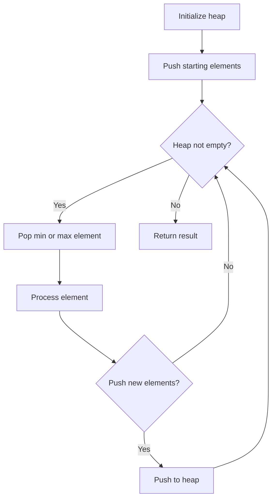
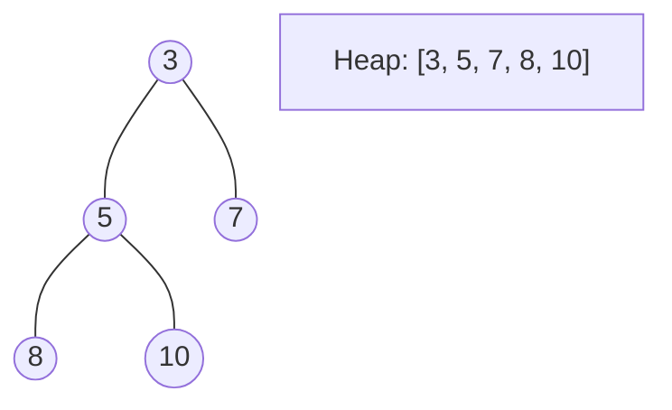
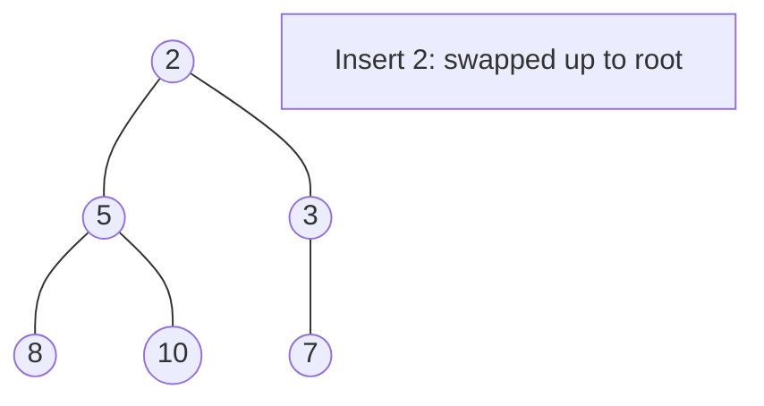
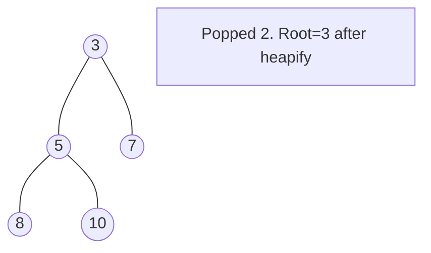

# Problem 1368: Minimum Cost to Make at Least One Valid Path in a Grid

**Difficulty:** Hard  
**Tags:** Array, Breadth-First Search, Graph Theory, Heap (Priority Queue), Matrix, Shortest Path  
**Pattern:** Heap / Priority Queue  
**Link:** [leetcode.com/problems/minimum-cost-to-make-at-least-one-valid-path-in-a-grid](https://leetcode.com/problems/minimum-cost-to-make-at-least-one-valid-path-in-a-grid/)

## Description

Given an `m x n` grid. Each cell of the grid has a sign pointing to the next cell you should visit if you are currently in this cell. The sign of `grid[i][j]` can be:

	- `1` which means go to the cell to the right. (i.e go from `grid[i][j]` to `grid[i][j + 1]`)
	- `2` which means go to the cell to the left. (i.e go from `grid[i][j]` to `grid[i][j - 1]`)
	- `3` which means go to the lower cell. (i.e go from `grid[i][j]` to `grid[i + 1][j]`)
	- `4` which means go to the upper cell. (i.e go from `grid[i][j]` to `grid[i - 1][j]`)

Notice that there could be some signs on the cells of the grid that point outside the grid.

You will initially start at the upper left cell `(0, 0)`. A valid path in the grid is a path that starts from the upper left cell `(0, 0)` and ends at the bottom-right cell `(m - 1, n - 1)` following the signs on the grid. The valid path does not have to be the shortest.

You can modify the sign on a cell with `cost = 1`. You can modify the sign on a cell **one time only**.

Return *the minimum cost to make the grid have at least one valid path*.

 

Example 1:

```

**Input:** grid = [[1,1,1,1],[2,2,2,2],[1,1,1,1],[2,2,2,2]]
**Output:** 3
**Explanation:** You will start at point (0, 0).
The path to (3, 3) is as follows. (0, 0) --> (0, 1) --> (0, 2) --> (0, 3) change the arrow to down with cost = 1 --> (1, 3) --> (1, 2) --> (1, 1) --> (1, 0) change the arrow to down with cost = 1 --> (2, 0) --> (2, 1) --> (2, 2) --> (2, 3) change the arrow to down with cost = 1 --> (3, 3)
The total cost = 3.

```

Example 2:

```

**Input:** grid = [[1,1,3],[3,2,2],[1,1,4]]
**Output:** 0
**Explanation:** You can follow the path from (0, 0) to (2, 2).

```

Example 3:

```

**Input:** grid = [[1,2],[4,3]]
**Output:** 1

```

 

**Constraints:**

	- `m == grid.length`
	- `n == grid[i].length`
	- `1 <= m, n <= 100`
	- `1 <= grid[i][j] <= 4`

## Approach: Heap / Priority Queue

Use a min-heap or max-heap to efficiently access the smallest/largest element. Push elements and pop the top to process in priority order.

## Pseudocode

```
1. Initialize heap (min or max)
2. Push initial elements onto heap
3. While heap not empty and condition:
   a. Pop top element (min or max)
   b. Process element
   c. Push new elements if needed
4. Return result
```

## Algorithm Flow



## Visual State Transitions

**Heap Operations (Min-Heap):**

**Frame 1: Initial heap**


**Frame 2: Insert 2 - bubble up**


**Frame 3: Pop minimum (2) - heapify down**



## Complexity Analysis

- **Time:** O(n log n)
- **Space:** O(n)

## Solution (Python3)

```python
class Solution:
    def minCost(self, grid: List[List[int]]) -> int:
        # Heap/Priority Queue - O(n log k) time
        import heapq
        if not grid:
            return 0
        # Min heap (negate for max heap)
        heap = []
        for val in grid:
            heapq.heappush(heap, val)
            if len(heap) > (grid if isinstance(grid, int) else len(grid)):
                heapq.heappop(heap)
        return heap[0] if heap else 0
```

## Solution (C++)

```cpp
#include <queue>
#include <string>
#include <vector>
using namespace std;

class Solution {
public:
    int minCost(vector<vector<int>>& grid) {
        // Heap/Priority Queue - O(n log k) time
        priority_queue<int, vector<int>, greater<int>> pq;
        for (int val : grid) {
            pq.push(val);
            if ((int)pq.size() > grid)
                pq.pop();
        }
        return pq.empty() ? 0 : pq.top();
    }
};
```
