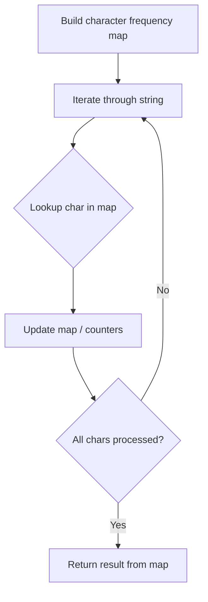

# Problem 1370: Increasing Decreasing String

**Difficulty:** Easy  
**Tags:** Hash Table, String, Counting  
**Pattern:** Hash Map String Processing  
**Link:** [leetcode.com/problems/increasing-decreasing-string](https://leetcode.com/problems/increasing-decreasing-string/)

## Description

You are given a string `s`. Reorder the string using the following algorithm:

	- Remove the **smallest** character from `s` and **append** it to the result.
	- Remove the **smallest** character from `s` that is greater than the last appended character, and **append** it to the result.
	- Repeat step 2 until no more characters can be removed.
	- Remove the **largest** character from `s` and **append** it to the result.
	- Remove the **largest** character from `s` that is smaller than the last appended character, and **append** it to the result.
	- Repeat step 5 until no more characters can be removed.
	- Repeat steps 1 through 6 until all characters from `s` have been removed.

If the smallest or largest character appears more than once, you may choose any occurrence to append to the result.

Return the resulting string after reordering `s` using this algorithm.

 

Example 1:

```

**Input:** s = "aaaabbbbcccc"
**Output:** "abccbaabccba"
**Explanation:** After steps 1, 2 and 3 of the first iteration, result = "abc"
After steps 4, 5 and 6 of the first iteration, result = "abccba"
First iteration is done. Now s = "aabbcc" and we go back to step 1
After steps 1, 2 and 3 of the second iteration, result = "abccbaabc"
After steps 4, 5 and 6 of the second iteration, result = "abccbaabccba"

```

Example 2:

```

**Input:** s = "rat"
**Output:** "art"
**Explanation:** The word "rat" becomes "art" after re-ordering it with the mentioned algorithm.

```

 

**Constraints:**

	- `1 <= s.length <= 500`
	- `s` consists of only lowercase English letters.

## Approach: Hash Map String Processing

Use a hash map to count character frequencies or map characters/strings for O(1) lookups. Process the string in one or two passes.

## Pseudocode

```
1. Build frequency map / char-to-index map
2. Iterate through string:
   a. Look up character in map
   b. Update counts or mappings
3. Return result based on map state
```

## Algorithm Flow



## Complexity Analysis

- **Time:** O(n)
- **Space:** O(n)

## Solution (Python3)

```python
class Solution:
    def sortString(self, s: str) -> str:
        # Hash map for string/character frequency - O(n) time
        freq = {}
        for ch in s:
            freq[ch] = freq.get(ch, 0) + 1
        # Process frequency map
        for ch, cnt in freq.items():
            if cnt == 1:
                return s.index(ch)
        return ""
```

## Solution (C++)

```cpp
#include <string>
#include <unordered_map>
#include <vector>
using namespace std;

class Solution {
public:
    string sortString(string& s) {
        // Hash map for string/character frequency - O(n) time
        unordered_map<char, int> freq;
        for (char ch : s) {
            freq[ch]++;
        }
        // Process frequency map
        for (int i = 0; i < s.size(); i++) {
            if (freq[s[i]] == 1) return i;
        }
        return "";
    }
};
```
