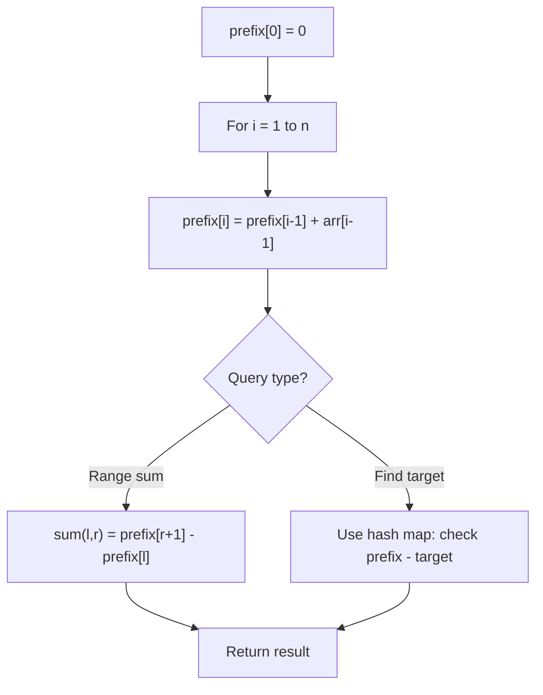

# Problem 1371: Find the Longest Substring Containing Vowels in Even Counts

**Difficulty:** Medium  
**Tags:** Hash Table, String, Bit Manipulation, Prefix Sum  
**Pattern:** Prefix Sum  
**Link:** [leetcode.com/problems/find-the-longest-substring-containing-vowels-in-even-counts](https://leetcode.com/problems/find-the-longest-substring-containing-vowels-in-even-counts/)

## Description

Given the string `s`, return the size of the longest substring containing each vowel an even number of times. That is, 'a', 'e', 'i', 'o', and 'u' must appear an even number of times.

 

Example 1:

```

**Input:** s = "eleetminicoworoep"
**Output:** 13
**Explanation: **The longest substring is "leetminicowor" which contains two each of the vowels: **e**, **i** and **o** and zero of the vowels: **a** and **u**.

```

Example 2:

```

**Input:** s = "leetcodeisgreat"
**Output:** 5
**Explanation:** The longest substring is "leetc" which contains two e's.

```

Example 3:

```

**Input:** s = "bcbcbc"
**Output:** 6
**Explanation:** In this case, the given string "bcbcbc" is the longest because all vowels: **a**, **e**, **i**, **o** and **u** appear zero times.

```

 

**Constraints:**

	- `1 <= s.length <= 5 x 10^5`
	- `s` contains only lowercase English letters.

## Approach: Prefix Sum

Build a prefix sum array where prefix[i] = sum of elements 0..i-1. Any subarray sum [l..r] = prefix[r+1] - prefix[l]. Combine with hash map for O(n) subarray sum queries.

## Pseudocode

```
1. Build prefix sum array: prefix[0]=0, prefix[i]=prefix[i-1]+arr[i-1]
2. Use prefix sums to answer queries:
   - Subarray sum [l..r] = prefix[r+1] - prefix[l]
   - Or use hash map to find prefix[j]-prefix[i] == target
3. Return result
```

## Algorithm Flow



## Complexity Analysis

- **Time:** O(n)
- **Space:** O(n)

## Solution (Python3)

```python
class Solution:
    def findTheLongestSubstring(self, s: str) -> int:
        # Prefix sum approach - O(n) time, O(n) space
        prefix = {0: -1}
        curr_sum = 0
        result = 0
        target = s if isinstance(s, int) else 0
        for i, val in enumerate(s):
            curr_sum += val
            if curr_sum - target in prefix:
                result = max(result, i - prefix[curr_sum - target])
            if curr_sum not in prefix:
                prefix[curr_sum] = i
        return result
```

## Solution (C++)

```cpp
#include <algorithm>
#include <string>
#include <unordered_map>
#include <vector>
using namespace std;

class Solution {
public:
    int findTheLongestSubstring(string& s) {
        // Prefix sum approach - O(n) time, O(n) space
        unordered_map<int, int> prefix;
        prefix[0] = -1;
        int curr_sum = 0, result = 0;
        int target = s;
        for (int i = 0; i < (int)s.size(); i++) {
            curr_sum += s[i];
            if (prefix.count(curr_sum - target)) {
                result = max(result, i - prefix[curr_sum - target]);
            }
            if (!prefix.count(curr_sum)) {
                prefix[curr_sum] = i;
            }
        }
        return result;
    }
};
```
